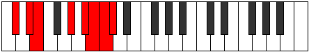

# Mode Kyrian

## Links

- [Documentation](index.md)
- [Scales Index](Scales.md)
- [Modes Index](Modes.md)
- [Chords Index](Chords.md)

## Parent Scale

[Epycrian](ScaleEpycrian.md)

## Number

[3725](https://ianring.com/musictheory/scales/3725)

## Interval Pattern

2, 1, 4, 2, 1, 1, 1

## Chord Pattern

## Perfection

- 4 Perfect notes
- 3 Perfect notes

## Perfection Profile

[true true true true false false false]

## Permutations

| Tonic | Notes | Signature | Illustration | Audio |
|-------|-------|-----------|--------------|-------|
| [C](ModeCNaturalKyrian.md) | C, D, Eb, F##, **G##**, **A#**, **B**, C | C |  | [midi](https://github.com/edipermadi/music/blob/main/docs/ModeCNaturalKyrian.mid?raw=true) |
| [C#](ModeCSharpKyrian.md) | C#, D#, E, F###, **G###**, **A##**, **B#**, C# | C |  | [midi](https://github.com/edipermadi/music/blob/main/docs/ModeCSharpKyrian.mid?raw=true) |
| [Db](ModeDFlatKyrian.md) | Db, Eb, Fb, G#, **A#**, **B**, **C**, Db | C |  | [midi](https://github.com/edipermadi/music/blob/main/docs/ModeDFlatKyrian.mid?raw=true) |
| [D](ModeDNaturalKyrian.md) | D, E, F, G##, **A##**, **B#**, **C#**, D | C |  | [midi](https://github.com/edipermadi/music/blob/main/docs/ModeDNaturalKyrian.mid?raw=true) |
| [D#](ModeDSharpKyrian.md) | D#, E#, F#, G###, **A###**, **B##**, **C##**, D# | C |  | [midi](https://github.com/edipermadi/music/blob/main/docs/ModeDSharpKyrian.mid?raw=true) |
| [Eb](ModeEFlatKyrian.md) | Eb, F, Gb, A#, **B#**, **C#**, **D**, Eb | C |  | [midi](https://github.com/edipermadi/music/blob/main/docs/ModeEFlatKyrian.mid?raw=true) |
| [E](ModeENaturalKyrian.md) | E, F#, G, A##, **B##**, **C##**, **D#**, E | C |  | [midi](https://github.com/edipermadi/music/blob/main/docs/ModeENaturalKyrian.mid?raw=true) |
| [F](ModeFNaturalKyrian.md) | F, G, Ab, B#, **C##**, **D#**, **E**, F | C |  | [midi](https://github.com/edipermadi/music/blob/main/docs/ModeFNaturalKyrian.mid?raw=true) |
| [F#](ModeFSharpKyrian.md) | F#, G#, A, B##, **C###**, **D##**, **E#**, F# | C |  | [midi](https://github.com/edipermadi/music/blob/main/docs/ModeFSharpKyrian.mid?raw=true) |
| [Gb](ModeGFlatKyrian.md) | Gb, Ab, Bbb, C#, **D#**, **E**, **F**, Gb | C |  | [midi](https://github.com/edipermadi/music/blob/main/docs/ModeGFlatKyrian.mid?raw=true) |
| [G](ModeGNaturalKyrian.md) | G, A, Bb, C##, **D##**, **E#**, **F#**, G | C |  | [midi](https://github.com/edipermadi/music/blob/main/docs/ModeGNaturalKyrian.mid?raw=true) |
| [G#](ModeGSharpKyrian.md) | G#, A#, B, C###, **D###**, **E##**, **F##**, G# | C |  | [midi](https://github.com/edipermadi/music/blob/main/docs/ModeGSharpKyrian.mid?raw=true) |
| [Ab](ModeAFlatKyrian.md) | Ab, Bb, Cb, D#, **E#**, **F#**, **G**, Ab | C |  | [midi](https://github.com/edipermadi/music/blob/main/docs/ModeAFlatKyrian.mid?raw=true) |
| [A](ModeANaturalKyrian.md) | A, B, C, D##, **E##**, **F##**, **G#**, A | C |  | [midi](https://github.com/edipermadi/music/blob/main/docs/ModeANaturalKyrian.mid?raw=true) |
| [A#](ModeASharpKyrian.md) | A#, B#, C#, D###, **E###**, **F###**, **G##**, A# | C |  | [midi](https://github.com/edipermadi/music/blob/main/docs/ModeASharpKyrian.mid?raw=true) |
| [Bb](ModeBFlatKyrian.md) | Bb, C, Db, E#, **F##**, **G#**, **A**, Bb | C |  | [midi](https://github.com/edipermadi/music/blob/main/docs/ModeBFlatKyrian.mid?raw=true) |
| [B](ModeBNaturalKyrian.md) | B, C#, D, E##, **F###**, **G##**, **A#**, B | C |  | [midi](https://github.com/edipermadi/music/blob/main/docs/ModeBNaturalKyrian.mid?raw=true) |
