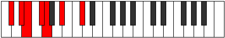

# Mode Kyrimic

## Links

- [Documentation](index.md)
- [Scales Index](Scales.md)
- [Modes Index](Modes.md)
- [Chords Index](Chords.md)

## Parent Scale

[Thoptimic](ScaleThoptimic.md)

## Number

[621](https://ianring.com/musictheory/scales/621)

## Perfection

- 2 Perfect notes
- 4 Perfect notes

## Perfection Profile

[false true false true false false]

## Permutations

| Tonic | Notes | Signature | Illustration | Audio |
|-------|-------|-----------|--------------|-------|
| [C](ModeCNaturalKyrimic.md) | **C**, D, **Eb**, F, **Gb**, **A**, **C** | C |  | [midi](ModeCNaturalKyrimic.mid) [ogg](ModeCNaturalKyrimic.ogg) |
| [C#](ModeCSharpKyrimic.md) | **C#**, D#, **E**, F#, **G**, **A#**, **C#** | C |  | [midi](ModeCSharpKyrimic.mid) [ogg](ModeCSharpKyrimic.ogg) |
| [Db](ModeDFlatKyrimic.md) | **Db**, Eb, **Fb**, Gb, **Abb**, **Bb**, **Db** | C |  | [midi](ModeDFlatKyrimic.mid) [ogg](ModeDFlatKyrimic.ogg) |
| [D](ModeDNaturalKyrimic.md) | **D**, E, **F**, G, **Ab**, **B**, **D** | C |  | [midi](ModeDNaturalKyrimic.mid) [ogg](ModeDNaturalKyrimic.ogg) |
| [D#](ModeDSharpKyrimic.md) | **D#**, E#, **F#**, G#, **A**, **B#**, **D#** | C |  | [midi](ModeDSharpKyrimic.mid) [ogg](ModeDSharpKyrimic.ogg) |
| [Eb](ModeEFlatKyrimic.md) | **Eb**, F, **Gb**, Ab, **Bbb**, **C**, **Eb** | C |  | [midi](ModeEFlatKyrimic.mid) [ogg](ModeEFlatKyrimic.ogg) |
| [E](ModeENaturalKyrimic.md) | **E**, F#, **G**, A, **Bb**, **C#**, **E** | C |  | [midi](ModeENaturalKyrimic.mid) [ogg](ModeENaturalKyrimic.ogg) |
| [F](ModeFNaturalKyrimic.md) | **F**, G, **Ab**, Bb, **Cb**, **D**, **F** | C |  | [midi](ModeFNaturalKyrimic.mid) [ogg](ModeFNaturalKyrimic.ogg) |
| [F#](ModeFSharpKyrimic.md) | **F#**, G#, **A**, B, **C**, **D#**, **F#** | C |  | [midi](ModeFSharpKyrimic.mid) [ogg](ModeFSharpKyrimic.ogg) |
| [Gb](ModeGFlatKyrimic.md) | **Gb**, Ab, **Bbb**, Cb, **Dbb**, **Eb**, **Gb** | C |  | [midi](ModeGFlatKyrimic.mid) [ogg](ModeGFlatKyrimic.ogg) |
| [G](ModeGNaturalKyrimic.md) | **G**, A, **Bb**, C, **Db**, **E**, **G** | C |  | [midi](ModeGNaturalKyrimic.mid) [ogg](ModeGNaturalKyrimic.ogg) |
| [G#](ModeGSharpKyrimic.md) | **G#**, A#, **B**, C#, **D**, **E#**, **G#** | C |  | [midi](ModeGSharpKyrimic.mid) [ogg](ModeGSharpKyrimic.ogg) |
| [Ab](ModeAFlatKyrimic.md) | **Ab**, Bb, **Cb**, Db, **Ebb**, **F**, **Ab** | C |  | [midi](ModeAFlatKyrimic.mid) [ogg](ModeAFlatKyrimic.ogg) |
| [A](ModeANaturalKyrimic.md) | **A**, B, **C**, D, **Eb**, **F#**, **A** | C |  | [midi](ModeANaturalKyrimic.mid) [ogg](ModeANaturalKyrimic.ogg) |
| [A#](ModeASharpKyrimic.md) | **A#**, B#, **C#**, D#, **E**, **F##**, **A#** | C |  | [midi](ModeASharpKyrimic.mid) [ogg](ModeASharpKyrimic.ogg) |
| [Bb](ModeBFlatKyrimic.md) | **Bb**, C, **Db**, Eb, **Fb**, **G**, **Bb** | C |  | [midi](ModeBFlatKyrimic.mid) [ogg](ModeBFlatKyrimic.ogg) |
| [B](ModeBNaturalKyrimic.md) | **B**, C#, **D**, E, **F**, **G#**, **B** | C |  | [midi](ModeBNaturalKyrimic.mid) [ogg](ModeBNaturalKyrimic.ogg) |
