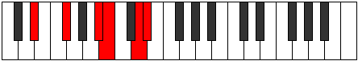
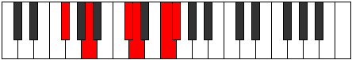
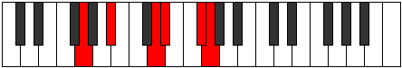

# Mode Kyritonic

## Links

- [Documentation](index.md)
- [Scales Index](Scales.md)
- [Modes Index](Modes.md)
- [Chords Index](Chords.md)

## Parent Scale

[Zothitonic](ScaleZothitonic.md)

## Number

[2441](https://ianring.com/musictheory/scales/2441)

## Perfection

- 2 Perfect notes
- 3 Perfect notes

## Perfection Profile

[true false false true false]

## Permutations

| Tonic | Notes | Signature | Illustration | Audio |
|-------|-------|-----------|--------------|-------|
| [C](ModeCNaturalKyritonic.md) | C, **D#**, **G**, G#, **B**, C | C |  | [midi](ModeCNaturalKyritonic.mid) [ogg](ModeCNaturalKyritonic.ogg) |
| [C#](ModeCSharpKyritonic.md) | C#, **E**, **G#**, A, **C**, C# | C |  | [midi](ModeCSharpKyritonic.mid) [ogg](ModeCSharpKyritonic.ogg) |
| [Db](ModeDFlatKyritonic.md) | Db, **E**, **Ab**, A, **C**, Db | C |  | [midi](ModeDFlatKyritonic.mid) [ogg](ModeDFlatKyritonic.ogg) |
| [D](ModeDNaturalKyritonic.md) | D, **F**, **A**, A#, **C#**, D | C |  | [midi](ModeDNaturalKyritonic.mid) [ogg](ModeDNaturalKyritonic.ogg) |
| [D#](ModeDSharpKyritonic.md) | D#, **F#**, **A#**, B, **D**, D# | C |  | [midi](ModeDSharpKyritonic.mid) [ogg](ModeDSharpKyritonic.ogg) |
| [Eb](ModeEFlatKyritonic.md) | Eb, **Gb**, **Bb**, B, **D**, Eb | C |  | [midi](ModeEFlatKyritonic.mid) [ogg](ModeEFlatKyritonic.ogg) |
| [E](ModeENaturalKyritonic.md) | E, **G**, **B**, C, **D#**, E | C |  | [midi](ModeENaturalKyritonic.mid) [ogg](ModeENaturalKyritonic.ogg) |
| [F](ModeFNaturalKyritonic.md) | F, **G#**, **C**, C#, **E**, F | C |  | [midi](ModeFNaturalKyritonic.mid) [ogg](ModeFNaturalKyritonic.ogg) |
| [F#](ModeFSharpKyritonic.md) | F#, **A**, **C#**, D, **F**, F# | C |  | [midi](ModeFSharpKyritonic.mid) [ogg](ModeFSharpKyritonic.ogg) |
| [Gb](ModeGFlatKyritonic.md) | Gb, **A**, **Db**, D, **F**, Gb | C |  | [midi](ModeGFlatKyritonic.mid) [ogg](ModeGFlatKyritonic.ogg) |
| [G](ModeGNaturalKyritonic.md) | G, **A#**, **D**, D#, **F#**, G | C |  | [midi](ModeGNaturalKyritonic.mid) [ogg](ModeGNaturalKyritonic.ogg) |
| [G#](ModeGSharpKyritonic.md) | G#, **B**, **D#**, E, **G**, G# | C |  | [midi](ModeGSharpKyritonic.mid) [ogg](ModeGSharpKyritonic.ogg) |
| [Ab](ModeAFlatKyritonic.md) | Ab, **B**, **Eb**, E, **G**, Ab | C |  | [midi](ModeAFlatKyritonic.mid) [ogg](ModeAFlatKyritonic.ogg) |
| [A](ModeANaturalKyritonic.md) | A, **C**, **E**, F, **G#**, A | C |  | [midi](ModeANaturalKyritonic.mid) [ogg](ModeANaturalKyritonic.ogg) |
| [A#](ModeASharpKyritonic.md) | A#, **C#**, **F**, F#, **A**, A# | C |  | [midi](ModeASharpKyritonic.mid) [ogg](ModeASharpKyritonic.ogg) |
| [Bb](ModeBFlatKyritonic.md) | Bb, **Db**, **F**, Gb, **A**, Bb | C |  | [midi](ModeBFlatKyritonic.mid) [ogg](ModeBFlatKyritonic.ogg) |
| [B](ModeBNaturalKyritonic.md) | B, **D**, **F#**, G, **A#**, B | C |  | [midi](ModeBNaturalKyritonic.mid) [ogg](ModeBNaturalKyritonic.ogg) |
