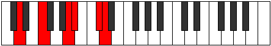
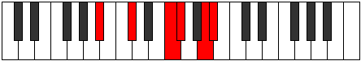

# Mode Kyritonic

## Links

- [Documentation](README.md)
- [Scales Index](Scales.md)
- [Modes Index](Modes.md)
- [Chords Index](Chords.md)

## Parent Scale

[Zothitonic](ScaleZothitonic.md)

## Number

[2441](https://ianring.com/musictheory/scales/2441)

## Transposition

3, 4, 1, 3, 1

## Chord Pattern

III⁺

## Perfection

- 2 Perfect notes
- 3 Perfect notes

## Perfection Profile

true, false, false, true, false

## Permutations

| Tonic | Notes | Signature | Illustration | Audio |
|-------|-------|-----------|--------------|-------|
| [C](ModeCNaturalKyritonic.md) | C, **D#**, **G**, G#, **B**, C | C |  | [midi](https://github.com/edipermadi/music/blob/main/docs/ModeCNaturalKyritonic.mid?raw=true) |
| [C#](ModeCSharpKyritonic.md) | C#, **E**, **G#**, A, **C**, C# | C |  | [midi](https://github.com/edipermadi/music/blob/main/docs/ModeCSharpKyritonic.mid?raw=true) |
| [Db](ModeDFlatKyritonic.md) | Db, **E**, **Ab**, A, **C**, Db | C |  | [midi](https://github.com/edipermadi/music/blob/main/docs/ModeDFlatKyritonic.mid?raw=true) |
| [D](ModeDNaturalKyritonic.md) | D, **F**, **A**, A#, **C#**, D | C |  | [midi](https://github.com/edipermadi/music/blob/main/docs/ModeDNaturalKyritonic.mid?raw=true) |
| [D#](ModeDSharpKyritonic.md) | D#, **F#**, **A#**, B, **D**, D# | C |  | [midi](https://github.com/edipermadi/music/blob/main/docs/ModeDSharpKyritonic.mid?raw=true) |
| [Eb](ModeEFlatKyritonic.md) | Eb, **Gb**, **Bb**, B, **D**, Eb | C |  | [midi](https://github.com/edipermadi/music/blob/main/docs/ModeEFlatKyritonic.mid?raw=true) |
| [E](ModeENaturalKyritonic.md) | E, **G**, **B**, C, **D#**, E | C |  | [midi](https://github.com/edipermadi/music/blob/main/docs/ModeENaturalKyritonic.mid?raw=true) |
| [F](ModeFNaturalKyritonic.md) | F, **G#**, **C**, C#, **E**, F | C |  | [midi](https://github.com/edipermadi/music/blob/main/docs/ModeFNaturalKyritonic.mid?raw=true) |
| [F#](ModeFSharpKyritonic.md) | F#, **A**, **C#**, D, **F**, F# | C |  | [midi](https://github.com/edipermadi/music/blob/main/docs/ModeFSharpKyritonic.mid?raw=true) |
| [Gb](ModeGFlatKyritonic.md) | Gb, **A**, **Db**, D, **F**, Gb | C |  | [midi](https://github.com/edipermadi/music/blob/main/docs/ModeGFlatKyritonic.mid?raw=true) |
| [G](ModeGNaturalKyritonic.md) | G, **A#**, **D**, D#, **F#**, G | C |  | [midi](https://github.com/edipermadi/music/blob/main/docs/ModeGNaturalKyritonic.mid?raw=true) |
| [G#](ModeGSharpKyritonic.md) | G#, **B**, **D#**, E, **G**, G# | C |  | [midi](https://github.com/edipermadi/music/blob/main/docs/ModeGSharpKyritonic.mid?raw=true) |
| [Ab](ModeAFlatKyritonic.md) | Ab, **B**, **Eb**, E, **G**, Ab | C |  | [midi](https://github.com/edipermadi/music/blob/main/docs/ModeAFlatKyritonic.mid?raw=true) |
| [A](ModeANaturalKyritonic.md) | A, **C**, **E**, F, **G#**, A | C |  | [midi](https://github.com/edipermadi/music/blob/main/docs/ModeANaturalKyritonic.mid?raw=true) |
| [A#](ModeASharpKyritonic.md) | A#, **C#**, **F**, F#, **A**, A# | C |  | [midi](https://github.com/edipermadi/music/blob/main/docs/ModeASharpKyritonic.mid?raw=true) |
| [Bb](ModeBFlatKyritonic.md) | Bb, **Db**, **F**, Gb, **A**, Bb | C |  | [midi](https://github.com/edipermadi/music/blob/main/docs/ModeBFlatKyritonic.mid?raw=true) |
| [B](ModeBNaturalKyritonic.md) | B, **D**, **F#**, G, **A#**, B | C |  | [midi](https://github.com/edipermadi/music/blob/main/docs/ModeBNaturalKyritonic.mid?raw=true) |
