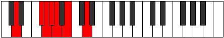
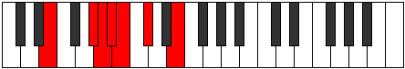
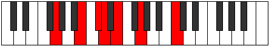
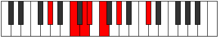
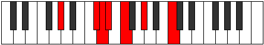
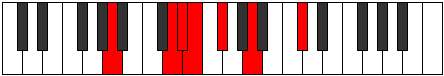
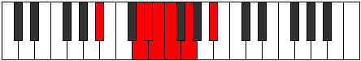
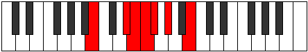

# Mode Kytrimic

## Links

- [Documentation](index.md)
- [Scales Index](Scales.md)
- [Modes Index](Modes.md)
- [Chords Index](Chords.md)

## Parent Scale

[Kytrimic](ScaleKytrimic.md)

## Number

[753](https://ianring.com/musictheory/scales/753)

## Interval Pattern

4, 1, 1, 1, 2, 3

## Chord Pattern

## Perfection

- 3 Perfect notes
- 3 Perfect notes

## Perfection Profile

[true false true false false true]

## Permutations

| Tonic | Notes | Signature | Illustration | Audio |
|-------|-------|-----------|--------------|-------|
| [C](ModeCNaturalKytrimic.md) | C, **D##**, E#, **F#**, **G**, A, C | C |  | [midi](https://github.com/edipermadi/music/blob/main/docs/ModeCNaturalKytrimic.mid?raw=true) |
| [C#](ModeCSharpKytrimic.md) | C#, **D###**, E##, **F##**, **G#**, A#, C# | C |  | [midi](https://github.com/edipermadi/music/blob/main/docs/ModeCSharpKytrimic.mid?raw=true) |
| [Db](ModeDFlatKytrimic.md) | Db, **E#**, F#, **G**, **Ab**, Bb, Db | C |  | [midi](https://github.com/edipermadi/music/blob/main/docs/ModeDFlatKytrimic.mid?raw=true) |
| [D](ModeDNaturalKytrimic.md) | D, **E##**, F##, **G#**, **A**, B, D | C |  | [midi](https://github.com/edipermadi/music/blob/main/docs/ModeDNaturalKytrimic.mid?raw=true) |
| [D#](ModeDSharpKytrimic.md) | D#, **E###**, F###, **G##**, **A#**, B#, D# | C |  | [midi](https://github.com/edipermadi/music/blob/main/docs/ModeDSharpKytrimic.mid?raw=true) |
| [Eb](ModeEFlatKytrimic.md) | Eb, **F##**, G#, **A**, **Bb**, C, Eb | C |  | [midi](https://github.com/edipermadi/music/blob/main/docs/ModeEFlatKytrimic.mid?raw=true) |
| [E](ModeENaturalKytrimic.md) | E, **F###**, G##, **A#**, **B**, C#, E | C |  | [midi](https://github.com/edipermadi/music/blob/main/docs/ModeENaturalKytrimic.mid?raw=true) |
| [F](ModeFNaturalKytrimic.md) | F, **G##**, A#, **B**, **C**, D, F | C |  | [midi](https://github.com/edipermadi/music/blob/main/docs/ModeFNaturalKytrimic.mid?raw=true) |
| [F#](ModeFSharpKytrimic.md) | F#, **G###**, A##, **B#**, **C#**, D#, F# | C |  | [midi](https://github.com/edipermadi/music/blob/main/docs/ModeFSharpKytrimic.mid?raw=true) |
| [Gb](ModeGFlatKytrimic.md) | Gb, **A#**, B, **C**, **Db**, Eb, Gb | C |  | [midi](https://github.com/edipermadi/music/blob/main/docs/ModeGFlatKytrimic.mid?raw=true) |
| [G](ModeGNaturalKytrimic.md) | G, **A##**, B#, **C#**, **D**, E, G | C |  | [midi](https://github.com/edipermadi/music/blob/main/docs/ModeGNaturalKytrimic.mid?raw=true) |
| [G#](ModeGSharpKytrimic.md) | G#, **A###**, B##, **C##**, **D#**, E#, G# | C |  | [midi](https://github.com/edipermadi/music/blob/main/docs/ModeGSharpKytrimic.mid?raw=true) |
| [Ab](ModeAFlatKytrimic.md) | Ab, **B#**, C#, **D**, **Eb**, F, Ab | C |  | [midi](https://github.com/edipermadi/music/blob/main/docs/ModeAFlatKytrimic.mid?raw=true) |
| [A](ModeANaturalKytrimic.md) | A, **B##**, C##, **D#**, **E**, F#, A | C |  | [midi](https://github.com/edipermadi/music/blob/main/docs/ModeANaturalKytrimic.mid?raw=true) |
| [A#](ModeASharpKytrimic.md) | A#, **B###**, C###, **D##**, **E#**, F##, A# | C |  | [midi](https://github.com/edipermadi/music/blob/main/docs/ModeASharpKytrimic.mid?raw=true) |
| [Bb](ModeBFlatKytrimic.md) | Bb, **C##**, D#, **E**, **F**, G, Bb | C |  | [midi](https://github.com/edipermadi/music/blob/main/docs/ModeBFlatKytrimic.mid?raw=true) |
| [B](ModeBNaturalKytrimic.md) | B, **C###**, D##, **E#**, **F#**, G#, B | C |  | [midi](https://github.com/edipermadi/music/blob/main/docs/ModeBNaturalKytrimic.mid?raw=true) |
