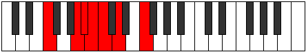
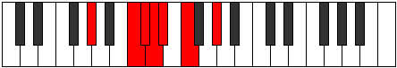

# Mode Kytrimic

## Links

- [Documentation](index.md)
- [Scales Index](Scales.md)
- [Modes Index](Modes.md)
- [Chords Index](Chords.md)

## Parent Scale

[Kytrimic](ScaleKytrimic.md)

## Number

[753](https://ianring.com/musictheory/scales/753)

## Perfection

- 3 Perfect notes
- 3 Perfect notes

## Perfection Profile

[true false true false false true]

## Permutations

| Tonic | Notes | Signature | Illustration | Audio |
|-------|-------|-----------|--------------|-------|
| [C](ModeCNaturalKytrimic.md) | C, **D##**, E#, **F#**, **G**, A, C | C |  | [midi](ModeCNaturalKytrimic.mid) [ogg](ModeCNaturalKytrimic.ogg) |
| [C#](ModeCSharpKytrimic.md) | C#, **D###**, E##, **F##**, **G#**, A#, C# | C |  | [midi](ModeCSharpKytrimic.mid) [ogg](ModeCSharpKytrimic.ogg) |
| [Db](ModeDFlatKytrimic.md) | Db, **E#**, F#, **G**, **Ab**, Bb, Db | C |  | [midi](ModeDFlatKytrimic.mid) [ogg](ModeDFlatKytrimic.ogg) |
| [D](ModeDNaturalKytrimic.md) | D, **E##**, F##, **G#**, **A**, B, D | C |  | [midi](ModeDNaturalKytrimic.mid) [ogg](ModeDNaturalKytrimic.ogg) |
| [D#](ModeDSharpKytrimic.md) | D#, **E###**, F###, **G##**, **A#**, B#, D# | C |  | [midi](ModeDSharpKytrimic.mid) [ogg](ModeDSharpKytrimic.ogg) |
| [Eb](ModeEFlatKytrimic.md) | Eb, **F##**, G#, **A**, **Bb**, C, Eb | C |  | [midi](ModeEFlatKytrimic.mid) [ogg](ModeEFlatKytrimic.ogg) |
| [E](ModeENaturalKytrimic.md) | E, **F###**, G##, **A#**, **B**, C#, E | C |  | [midi](ModeENaturalKytrimic.mid) [ogg](ModeENaturalKytrimic.ogg) |
| [F](ModeFNaturalKytrimic.md) | F, **G##**, A#, **B**, **C**, D, F | C |  | [midi](ModeFNaturalKytrimic.mid) [ogg](ModeFNaturalKytrimic.ogg) |
| [F#](ModeFSharpKytrimic.md) | F#, **G###**, A##, **B#**, **C#**, D#, F# | C |  | [midi](ModeFSharpKytrimic.mid) [ogg](ModeFSharpKytrimic.ogg) |
| [Gb](ModeGFlatKytrimic.md) | Gb, **A#**, B, **C**, **Db**, Eb, Gb | C |  | [midi](ModeGFlatKytrimic.mid) [ogg](ModeGFlatKytrimic.ogg) |
| [G](ModeGNaturalKytrimic.md) | G, **A##**, B#, **C#**, **D**, E, G | C |  | [midi](ModeGNaturalKytrimic.mid) [ogg](ModeGNaturalKytrimic.ogg) |
| [G#](ModeGSharpKytrimic.md) | G#, **A###**, B##, **C##**, **D#**, E#, G# | C |  | [midi](ModeGSharpKytrimic.mid) [ogg](ModeGSharpKytrimic.ogg) |
| [Ab](ModeAFlatKytrimic.md) | Ab, **B#**, C#, **D**, **Eb**, F, Ab | C |  | [midi](ModeAFlatKytrimic.mid) [ogg](ModeAFlatKytrimic.ogg) |
| [A](ModeANaturalKytrimic.md) | A, **B##**, C##, **D#**, **E**, F#, A | C |  | [midi](ModeANaturalKytrimic.mid) [ogg](ModeANaturalKytrimic.ogg) |
| [A#](ModeASharpKytrimic.md) | A#, **B###**, C###, **D##**, **E#**, F##, A# | C |  | [midi](ModeASharpKytrimic.mid) [ogg](ModeASharpKytrimic.ogg) |
| [Bb](ModeBFlatKytrimic.md) | Bb, **C##**, D#, **E**, **F**, G, Bb | C |  | [midi](ModeBFlatKytrimic.mid) [ogg](ModeBFlatKytrimic.ogg) |
| [B](ModeBNaturalKytrimic.md) | B, **C###**, D##, **E#**, **F#**, G#, B | C |  | [midi](ModeBNaturalKytrimic.mid) [ogg](ModeBNaturalKytrimic.ogg) |
