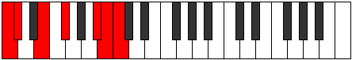

# Mode Ladimic

## Links

- [Documentation](index.md)
- [Scales Index](Scales.md)
- [Modes Index](Modes.md)
- [Chords Index](Chords.md)

## Parent Scale

[Pynimic](ScalePynimic.md)

## Number

[3155](https://ianring.com/musictheory/scales/3155)

## Perfection

- 3 Perfect notes
- 3 Perfect notes

## Perfection Profile

[false false true true false true]

## Permutations

| Tonic | Notes | Signature | Illustration | Audio |
|-------|-------|-----------|--------------|-------|
| [C](ModeCNaturalLadimic.md) | **C**, **Db**, E, F#, **G###**, A##, **C** | C |  | [midi](ModeCNaturalLadimic.mid) [ogg](ModeCNaturalLadimic.ogg) |
| [C#](ModeCSharpLadimic.md) | **C#**, **D**, E#, F##, **Cb**, Dbb, **C#** | C |  | [midi](ModeCSharpLadimic.mid) [ogg](ModeCSharpLadimic.ogg) |
| [Db](ModeDFlatLadimic.md) | **Db**, **Ebb**, F, G, **A##**, B#, **Db** | C |  | [midi](ModeDFlatLadimic.mid) [ogg](ModeDFlatLadimic.ogg) |
| [D](ModeDNaturalLadimic.md) | **D**, **Eb**, F#, G#, **A###**, B##, **D** | C |  | [midi](ModeDNaturalLadimic.mid) [ogg](ModeDNaturalLadimic.ogg) |
| [D#](ModeDSharpLadimic.md) | **D#**, **E**, F##, G##, **Db**, Ebb, **D#** | C |  | [midi](ModeDSharpLadimic.mid) [ogg](ModeDSharpLadimic.ogg) |
| [Eb](ModeEFlatLadimic.md) | **Eb**, **Fb**, G, A, **B##**, C##, **Eb** | C |  | [midi](ModeEFlatLadimic.mid) [ogg](ModeEFlatLadimic.ogg) |
| [E](ModeENaturalLadimic.md) | **E**, **F**, G#, A#, **B###**, C###, **E** | C |  | [midi](ModeENaturalLadimic.mid) [ogg](ModeENaturalLadimic.ogg) |
| [F](ModeFNaturalLadimic.md) | **F**, **Gb**, A, B, **C###**, D##, **F** | C |  | [midi](ModeFNaturalLadimic.mid) [ogg](ModeFNaturalLadimic.ogg) |
| [F#](ModeFSharpLadimic.md) | **F#**, **G**, A#, B#, **D##**, E#, **F#** | C |  | [midi](ModeFSharpLadimic.mid) [ogg](ModeFSharpLadimic.ogg) |
| [Gb](ModeGFlatLadimic.md) | **Gb**, **Abb**, Bb, C, **D##**, E#, **Gb** | C |  | [midi](ModeGFlatLadimic.mid) [ogg](ModeGFlatLadimic.ogg) |
| [G](ModeGNaturalLadimic.md) | **G**, **Ab**, B, C#, **D###**, E##, **G** | C |  | [midi](ModeGNaturalLadimic.mid) [ogg](ModeGNaturalLadimic.ogg) |
| [G#](ModeGSharpLadimic.md) | **G#**, **A**, B#, C##, **E##**, F##, **G#** | C |  | [midi](ModeGSharpLadimic.mid) [ogg](ModeGSharpLadimic.ogg) |
| [Ab](ModeAFlatLadimic.md) | **Ab**, **Bbb**, C, D, **E##**, F##, **Ab** | C |  | [midi](ModeAFlatLadimic.mid) [ogg](ModeAFlatLadimic.ogg) |
| [A](ModeANaturalLadimic.md) | **A**, **Bb**, C#, D#, **E###**, F###, **A** | C |  | [midi](ModeANaturalLadimic.mid) [ogg](ModeANaturalLadimic.ogg) |
| [A#](ModeASharpLadimic.md) | **A#**, **B**, C##, D##, **F###**, G##, **A#** | C |  | [midi](ModeASharpLadimic.mid) [ogg](ModeASharpLadimic.ogg) |
| [Bb](ModeBFlatLadimic.md) | **Bb**, **Cb**, D, E, **F###**, G##, **Bb** | C |  | [midi](ModeBFlatLadimic.mid) [ogg](ModeBFlatLadimic.ogg) |
| [B](ModeBNaturalLadimic.md) | **B**, **C**, D#, E#, **Cbbb**, Cbb, **B** | C |  | [midi](ModeBNaturalLadimic.mid) [ogg](ModeBNaturalLadimic.ogg) |
