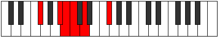
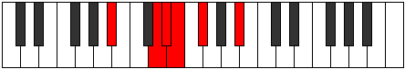

# Mode Laditonic

## Links

- [Documentation](README.md)
- [Scales Index](Scales.md)
- [Modes Index](Modes.md)
- [Chords Index](Chords.md)

## Parent Scale

[Ranitonic](ScaleRanitonic.md)

## Number

[369](https://ianring.com/musictheory/scales/369)

## Transposition

4, 1, 1, 2, 4

## Chord Pattern

## Perfection

- 1 Perfect notes
- 4 Perfect notes

## Perfection Profile

false, false, true, false, false

## Permutations

| Tonic | Notes | Signature | Illustration | Audio |
|-------|-------|-----------|--------------|-------|
| [C](ModeCNaturalLaditonic.md) | **C**, **E**, F, **F#**, **G#**, **C** | C |  | [midi](https://github.com/edipermadi/music/blob/main/docs/ModeCNaturalLaditonic.mid?raw=true) |
| [C#](ModeCSharpLaditonic.md) | **C#**, **F**, F#, **G**, **A**, **C#** | C |  | [midi](https://github.com/edipermadi/music/blob/main/docs/ModeCSharpLaditonic.mid?raw=true) |
| [Db](ModeDFlatLaditonic.md) | **Db**, **F**, Gb, **G**, **A**, **Db** | C |  | [midi](https://github.com/edipermadi/music/blob/main/docs/ModeDFlatLaditonic.mid?raw=true) |
| [D](ModeDNaturalLaditonic.md) | **D**, **F#**, G, **G#**, **A#**, **D** | C |  | [midi](https://github.com/edipermadi/music/blob/main/docs/ModeDNaturalLaditonic.mid?raw=true) |
| [D#](ModeDSharpLaditonic.md) | **D#**, **G**, G#, **A**, **B**, **D#** | C |  | [midi](https://github.com/edipermadi/music/blob/main/docs/ModeDSharpLaditonic.mid?raw=true) |
| [Eb](ModeEFlatLaditonic.md) | **Eb**, **G**, Ab, **A**, **B**, **Eb** | C |  | [midi](https://github.com/edipermadi/music/blob/main/docs/ModeEFlatLaditonic.mid?raw=true) |
| [E](ModeENaturalLaditonic.md) | **E**, **G#**, A, **A#**, **C**, **E** | C |  | [midi](https://github.com/edipermadi/music/blob/main/docs/ModeENaturalLaditonic.mid?raw=true) |
| [F](ModeFNaturalLaditonic.md) | **F**, **A**, A#, **B**, **C#**, **F** | C |  | [midi](https://github.com/edipermadi/music/blob/main/docs/ModeFNaturalLaditonic.mid?raw=true) |
| [F#](ModeFSharpLaditonic.md) | **F#**, **A#**, B, **C**, **D**, **F#** | C |  | [midi](https://github.com/edipermadi/music/blob/main/docs/ModeFSharpLaditonic.mid?raw=true) |
| [Gb](ModeGFlatLaditonic.md) | **Gb**, **Bb**, B, **C**, **D**, **Gb** | C |  | [midi](https://github.com/edipermadi/music/blob/main/docs/ModeGFlatLaditonic.mid?raw=true) |
| [G](ModeGNaturalLaditonic.md) | **G**, **B**, C, **C#**, **D#**, **G** | C |  | [midi](https://github.com/edipermadi/music/blob/main/docs/ModeGNaturalLaditonic.mid?raw=true) |
| [G#](ModeGSharpLaditonic.md) | **G#**, **C**, C#, **D**, **E**, **G#** | C |  | [midi](https://github.com/edipermadi/music/blob/main/docs/ModeGSharpLaditonic.mid?raw=true) |
| [Ab](ModeAFlatLaditonic.md) | **Ab**, **C**, Db, **D**, **E**, **Ab** | C |  | [midi](https://github.com/edipermadi/music/blob/main/docs/ModeAFlatLaditonic.mid?raw=true) |
| [A](ModeANaturalLaditonic.md) | **A**, **C#**, D, **D#**, **F**, **A** | C |  | [midi](https://github.com/edipermadi/music/blob/main/docs/ModeANaturalLaditonic.mid?raw=true) |
| [A#](ModeASharpLaditonic.md) | **A#**, **D**, D#, **E**, **F#**, **A#** | C |  | [midi](https://github.com/edipermadi/music/blob/main/docs/ModeASharpLaditonic.mid?raw=true) |
| [Bb](ModeBFlatLaditonic.md) | **Bb**, **D**, Eb, **E**, **Gb**, **Bb** | C |  | [midi](https://github.com/edipermadi/music/blob/main/docs/ModeBFlatLaditonic.mid?raw=true) |
| [B](ModeBNaturalLaditonic.md) | **B**, **D#**, E, **F**, **G**, **B** | C |  | [midi](https://github.com/edipermadi/music/blob/main/docs/ModeBNaturalLaditonic.mid?raw=true) |
