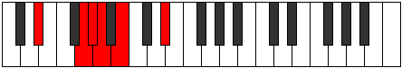
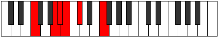

# Mode Laditonic

## Links

- [Documentation](index.md)
- [Scales Index](Scales.md)
- [Modes Index](Modes.md)
- [Chords Index](Chords.md)

## Parent Scale

[Ranitonic](ScaleRanitonic.md)

## Number

[369](https://ianring.com/musictheory/scales/369)

## Perfection

- 1 Perfect notes
- 4 Perfect notes

## Perfection Profile

[false false true false false]

## Permutations

| Tonic | Notes | Signature | Illustration | Audio |
|-------|-------|-----------|--------------|-------|
| [C](ModeCNaturalLaditonic.md) | **C**, **E**, F, **F#**, **G#**, **C** | C |  | [midi](ModeCNaturalLaditonic.mid) [ogg](ModeCNaturalLaditonic.ogg) |
| [C#](ModeCSharpLaditonic.md) | **C#**, **F**, F#, **G**, **A**, **C#** | C |  | [midi](ModeCSharpLaditonic.mid) [ogg](ModeCSharpLaditonic.ogg) |
| [Db](ModeDFlatLaditonic.md) | **Db**, **F**, Gb, **G**, **A**, **Db** | C |  | [midi](ModeDFlatLaditonic.mid) [ogg](ModeDFlatLaditonic.ogg) |
| [D](ModeDNaturalLaditonic.md) | **D**, **F#**, G, **G#**, **A#**, **D** | C |  | [midi](ModeDNaturalLaditonic.mid) [ogg](ModeDNaturalLaditonic.ogg) |
| [D#](ModeDSharpLaditonic.md) | **D#**, **G**, G#, **A**, **B**, **D#** | C |  | [midi](ModeDSharpLaditonic.mid) [ogg](ModeDSharpLaditonic.ogg) |
| [Eb](ModeEFlatLaditonic.md) | **Eb**, **G**, Ab, **A**, **B**, **Eb** | C |  | [midi](ModeEFlatLaditonic.mid) [ogg](ModeEFlatLaditonic.ogg) |
| [E](ModeENaturalLaditonic.md) | **E**, **G#**, A, **A#**, **C**, **E** | C |  | [midi](ModeENaturalLaditonic.mid) [ogg](ModeENaturalLaditonic.ogg) |
| [F](ModeFNaturalLaditonic.md) | **F**, **A**, A#, **B**, **C#**, **F** | C |  | [midi](ModeFNaturalLaditonic.mid) [ogg](ModeFNaturalLaditonic.ogg) |
| [F#](ModeFSharpLaditonic.md) | **F#**, **A#**, B, **C**, **D**, **F#** | C |  | [midi](ModeFSharpLaditonic.mid) [ogg](ModeFSharpLaditonic.ogg) |
| [Gb](ModeGFlatLaditonic.md) | **Gb**, **Bb**, B, **C**, **D**, **Gb** | C |  | [midi](ModeGFlatLaditonic.mid) [ogg](ModeGFlatLaditonic.ogg) |
| [G](ModeGNaturalLaditonic.md) | **G**, **B**, C, **C#**, **D#**, **G** | C |  | [midi](ModeGNaturalLaditonic.mid) [ogg](ModeGNaturalLaditonic.ogg) |
| [G#](ModeGSharpLaditonic.md) | **G#**, **C**, C#, **D**, **E**, **G#** | C |  | [midi](ModeGSharpLaditonic.mid) [ogg](ModeGSharpLaditonic.ogg) |
| [Ab](ModeAFlatLaditonic.md) | **Ab**, **C**, Db, **D**, **E**, **Ab** | C |  | [midi](ModeAFlatLaditonic.mid) [ogg](ModeAFlatLaditonic.ogg) |
| [A](ModeANaturalLaditonic.md) | **A**, **C#**, D, **D#**, **F**, **A** | C |  | [midi](ModeANaturalLaditonic.mid) [ogg](ModeANaturalLaditonic.ogg) |
| [A#](ModeASharpLaditonic.md) | **A#**, **D**, D#, **E**, **F#**, **A#** | C |  | [midi](ModeASharpLaditonic.mid) [ogg](ModeASharpLaditonic.ogg) |
| [Bb](ModeBFlatLaditonic.md) | **Bb**, **D**, Eb, **E**, **Gb**, **Bb** | C |  | [midi](ModeBFlatLaditonic.mid) [ogg](ModeBFlatLaditonic.ogg) |
| [B](ModeBNaturalLaditonic.md) | **B**, **D#**, E, **F**, **G**, **B** | C |  | [midi](ModeBNaturalLaditonic.mid) [ogg](ModeBNaturalLaditonic.ogg) |
