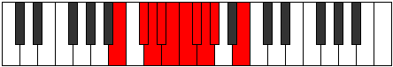

# Mode Ladygic

## Links

- [Documentation](index.md)
- [Scales Index](Scales.md)
- [Modes Index](Modes.md)
- [Chords Index](Chords.md)

## Parent Scale

[Sathygic](ScaleSathygic.md)

## Number

[1021](https://ianring.com/musictheory/scales/1021)

## Perfection

- 6 Perfect notes
- 3 Perfect notes

## Perfection Profile

[true true false false true false true true true]

## Permutations

| Tonic | Notes | Signature | Illustration | Audio |
|-------|-------|-----------|--------------|-------|
| [C](ModeCNaturalLadygic.md) | C, D, **D#**, **E**, F, **F#**, G, G#, A, C | C |  | [midi](ModeCNaturalLadygic.mid) [ogg](ModeCNaturalLadygic.ogg) |
| [C#](ModeCSharpLadygic.md) | C#, D#, **E**, **F**, F#, **G**, G#, A, A#, C# | C |  | [midi](ModeCSharpLadygic.mid) [ogg](ModeCSharpLadygic.ogg) |
| [Db](ModeDFlatLadygic.md) | Db, Eb, **E**, **F**, Gb, **G**, Ab, A, Bb, Db | C |  | [midi](ModeDFlatLadygic.mid) [ogg](ModeDFlatLadygic.ogg) |
| [D](ModeDNaturalLadygic.md) | D, E, **F**, **F#**, G, **G#**, A, A#, B, D | C |  | [midi](ModeDNaturalLadygic.mid) [ogg](ModeDNaturalLadygic.ogg) |
| [D#](ModeDSharpLadygic.md) | D#, F, **F#**, **G**, G#, **A**, A#, B, C, D# | C |  | [midi](ModeDSharpLadygic.mid) [ogg](ModeDSharpLadygic.ogg) |
| [Eb](ModeEFlatLadygic.md) | Eb, F, **Gb**, **G**, Ab, **A**, Bb, B, C, Eb | C |  | [midi](ModeEFlatLadygic.mid) [ogg](ModeEFlatLadygic.ogg) |
| [E](ModeENaturalLadygic.md) | E, F#, **G**, **G#**, A, **A#**, B, C, C#, E | C |  | [midi](ModeENaturalLadygic.mid) [ogg](ModeENaturalLadygic.ogg) |
| [F](ModeFNaturalLadygic.md) | F, G, **G#**, **A**, A#, **B**, C, C#, D, F | C |  | [midi](ModeFNaturalLadygic.mid) [ogg](ModeFNaturalLadygic.ogg) |
| [F#](ModeFSharpLadygic.md) | F#, G#, **A**, **A#**, B, **C**, C#, D, D#, F# | C |  | [midi](ModeFSharpLadygic.mid) [ogg](ModeFSharpLadygic.ogg) |
| [Gb](ModeGFlatLadygic.md) | Gb, Ab, **A**, **Bb**, B, **C**, Db, D, Eb, Gb | C |  | [midi](ModeGFlatLadygic.mid) [ogg](ModeGFlatLadygic.ogg) |
| [G](ModeGNaturalLadygic.md) | G, A, **A#**, **B**, C, **C#**, D, D#, E, G | C |  | [midi](ModeGNaturalLadygic.mid) [ogg](ModeGNaturalLadygic.ogg) |
| [G#](ModeGSharpLadygic.md) | G#, A#, **B**, **C**, C#, **D**, D#, E, F, G# | C |  | [midi](ModeGSharpLadygic.mid) [ogg](ModeGSharpLadygic.ogg) |
| [Ab](ModeAFlatLadygic.md) | Ab, Bb, **B**, **C**, Db, **D**, Eb, E, F, Ab | C |  | [midi](ModeAFlatLadygic.mid) [ogg](ModeAFlatLadygic.ogg) |
| [A](ModeANaturalLadygic.md) | A, B, **C**, **C#**, D, **D#**, E, F, F#, A | C |  | [midi](ModeANaturalLadygic.mid) [ogg](ModeANaturalLadygic.ogg) |
| [A#](ModeASharpLadygic.md) | A#, C, **C#**, **D**, D#, **E**, F, F#, G, A# | C |  | [midi](ModeASharpLadygic.mid) [ogg](ModeASharpLadygic.ogg) |
| [Bb](ModeBFlatLadygic.md) | Bb, C, **Db**, **D**, Eb, **E**, F, Gb, G, Bb | C |  | [midi](ModeBFlatLadygic.mid) [ogg](ModeBFlatLadygic.ogg) |
| [B](ModeBNaturalLadygic.md) | B, C#, **D**, **D#**, E, **F**, F#, G, G#, B | C |  | [midi](ModeBNaturalLadygic.mid) [ogg](ModeBNaturalLadygic.ogg) |
