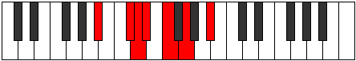

# Mode Lagimic

## Links

- [Documentation](README.md)
- [Scales Index](Scales.md)
- [Modes Index](Modes.md)
- [Chords Index](Chords.md)

## Parent Scale

[Zagimic](ScaleZagimic.md)

## Number

[697](https://ianring.com/musictheory/scales/697)

## Luminosity

-1

## Transposition

3, 1, 1, 2, 2, 3

## Chord Pattern

I, ii⁰b3

## Perfection

- 3 Perfect notes
- 3 Perfect notes

## Perfection Profile

true, false, false, true, false, true

## Permutations

| Tonic | Notes | Signature | Illustration | Audio |
|-------|-------|-----------|--------------|-------|
| [C](ModeCNaturalLagimic.md) | C, **D#**, **E**, F, **G**, A, C | C |  | [midi](https://github.com/edipermadi/music/blob/main/docs/ModeCNaturalLagimic.mid?raw=true) |
| [C#](ModeCSharpLagimic.md) | C#, **D##**, **E#**, F#, **G#**, A#, C# | C |  | [midi](https://github.com/edipermadi/music/blob/main/docs/ModeCSharpLagimic.mid?raw=true) |
| [Db](ModeDFlatLagimic.md) | Db, **E**, **F**, Gb, **Ab**, Bb, Db | C |  | [midi](https://github.com/edipermadi/music/blob/main/docs/ModeDFlatLagimic.mid?raw=true) |
| [D](ModeDNaturalLagimic.md) | D, **E#**, **F#**, G, **A**, B, D | C |  | [midi](https://github.com/edipermadi/music/blob/main/docs/ModeDNaturalLagimic.mid?raw=true) |
| [D#](ModeDSharpLagimic.md) | D#, **E##**, **F##**, G#, **A#**, B#, D# | C |  | [midi](https://github.com/edipermadi/music/blob/main/docs/ModeDSharpLagimic.mid?raw=true) |
| [Eb](ModeEFlatLagimic.md) | Eb, **F#**, **G**, Ab, **Bb**, C, Eb | C |  | [midi](https://github.com/edipermadi/music/blob/main/docs/ModeEFlatLagimic.mid?raw=true) |
| [E](ModeENaturalLagimic.md) | E, **F##**, **G#**, A, **B**, C#, E | C |  | [midi](https://github.com/edipermadi/music/blob/main/docs/ModeENaturalLagimic.mid?raw=true) |
| [F](ModeFNaturalLagimic.md) | F, **G#**, **A**, Bb, **C**, D, F | C |  | [midi](https://github.com/edipermadi/music/blob/main/docs/ModeFNaturalLagimic.mid?raw=true) |
| [F#](ModeFSharpLagimic.md) | F#, **G##**, **A#**, B, **C#**, D#, F# | C |  | [midi](https://github.com/edipermadi/music/blob/main/docs/ModeFSharpLagimic.mid?raw=true) |
| [Gb](ModeGFlatLagimic.md) | Gb, **A**, **Bb**, Cb, **Db**, Eb, Gb | C |  | [midi](https://github.com/edipermadi/music/blob/main/docs/ModeGFlatLagimic.mid?raw=true) |
| [G](ModeGNaturalLagimic.md) | G, **A#**, **B**, C, **D**, E, G | C |  | [midi](https://github.com/edipermadi/music/blob/main/docs/ModeGNaturalLagimic.mid?raw=true) |
| [G#](ModeGSharpLagimic.md) | G#, **A##**, **B#**, C#, **D#**, E#, G# | C |  | [midi](https://github.com/edipermadi/music/blob/main/docs/ModeGSharpLagimic.mid?raw=true) |
| [Ab](ModeAFlatLagimic.md) | Ab, **B**, **C**, Db, **Eb**, F, Ab | C |  | [midi](https://github.com/edipermadi/music/blob/main/docs/ModeAFlatLagimic.mid?raw=true) |
| [A](ModeANaturalLagimic.md) | A, **B#**, **C#**, D, **E**, F#, A | C |  | [midi](https://github.com/edipermadi/music/blob/main/docs/ModeANaturalLagimic.mid?raw=true) |
| [A#](ModeASharpLagimic.md) | A#, **B##**, **C##**, D#, **E#**, F##, A# | C |  | [midi](https://github.com/edipermadi/music/blob/main/docs/ModeASharpLagimic.mid?raw=true) |
| [Bb](ModeBFlatLagimic.md) | Bb, **C#**, **D**, Eb, **F**, G, Bb | C |  | [midi](https://github.com/edipermadi/music/blob/main/docs/ModeBFlatLagimic.mid?raw=true) |
| [B](ModeBNaturalLagimic.md) | B, **C##**, **D#**, E, **F#**, G#, B | C |  | [midi](https://github.com/edipermadi/music/blob/main/docs/ModeBNaturalLagimic.mid?raw=true) |
