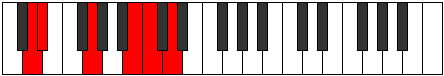

# Mode Lagitonic

## Links

- [Documentation](index.md)
- [Scales Index](Scales.md)
- [Modes Index](Modes.md)
- [Chords Index](Chords.md)

## Parent Scale

[Dolitonic](ScaleDolitonic.md)

## Number

[1571](https://ianring.com/musictheory/scales/1571)

## Perfection

- 2 Perfect notes
- 3 Perfect notes

## Perfection Profile

[false false true false true]

## Permutations

| Tonic | Notes | Signature | Illustration | Audio |
|-------|-------|-----------|--------------|-------|
| [C](ModeCNaturalLagitonic.md) | **C**, **C#**, F, **A**, A#, **C** | C |  | [midi](ModeCNaturalLagitonic.mid) [ogg](ModeCNaturalLagitonic.ogg) |
| [C#](ModeCSharpLagitonic.md) | **C#**, **D**, F#, **A#**, B, **C#** | C |  | [midi](ModeCSharpLagitonic.mid) [ogg](ModeCSharpLagitonic.ogg) |
| [Db](ModeDFlatLagitonic.md) | **Db**, **D**, Gb, **Bb**, B, **Db** | C |  | [midi](ModeDFlatLagitonic.mid) [ogg](ModeDFlatLagitonic.ogg) |
| [D](ModeDNaturalLagitonic.md) | **D**, **D#**, G, **B**, C, **D** | C |  | [midi](ModeDNaturalLagitonic.mid) [ogg](ModeDNaturalLagitonic.ogg) |
| [D#](ModeDSharpLagitonic.md) | **D#**, **E**, G#, **C**, C#, **D#** | C |  | [midi](ModeDSharpLagitonic.mid) [ogg](ModeDSharpLagitonic.ogg) |
| [Eb](ModeEFlatLagitonic.md) | **Eb**, **E**, Ab, **C**, Db, **Eb** | C |  | [midi](ModeEFlatLagitonic.mid) [ogg](ModeEFlatLagitonic.ogg) |
| [E](ModeENaturalLagitonic.md) | **E**, **F**, A, **C#**, D, **E** | C |  | [midi](ModeENaturalLagitonic.mid) [ogg](ModeENaturalLagitonic.ogg) |
| [F](ModeFNaturalLagitonic.md) | **F**, **F#**, A#, **D**, D#, **F** | C |  | [midi](ModeFNaturalLagitonic.mid) [ogg](ModeFNaturalLagitonic.ogg) |
| [F#](ModeFSharpLagitonic.md) | **F#**, **G**, B, **D#**, E, **F#** | C |  | [midi](ModeFSharpLagitonic.mid) [ogg](ModeFSharpLagitonic.ogg) |
| [Gb](ModeGFlatLagitonic.md) | **Gb**, **G**, B, **Eb**, E, **Gb** | C |  | [midi](ModeGFlatLagitonic.mid) [ogg](ModeGFlatLagitonic.ogg) |
| [G](ModeGNaturalLagitonic.md) | **G**, **G#**, C, **E**, F, **G** | C |  | [midi](ModeGNaturalLagitonic.mid) [ogg](ModeGNaturalLagitonic.ogg) |
| [G#](ModeGSharpLagitonic.md) | **G#**, **A**, C#, **F**, F#, **G#** | C |  | [midi](ModeGSharpLagitonic.mid) [ogg](ModeGSharpLagitonic.ogg) |
| [Ab](ModeAFlatLagitonic.md) | **Ab**, **A**, Db, **F**, Gb, **Ab** | C |  | [midi](ModeAFlatLagitonic.mid) [ogg](ModeAFlatLagitonic.ogg) |
| [A](ModeANaturalLagitonic.md) | **A**, **A#**, D, **F#**, G, **A** | C |  | [midi](ModeANaturalLagitonic.mid) [ogg](ModeANaturalLagitonic.ogg) |
| [A#](ModeASharpLagitonic.md) | **A#**, **B**, D#, **G**, G#, **A#** | C |  | [midi](ModeASharpLagitonic.mid) [ogg](ModeASharpLagitonic.ogg) |
| [Bb](ModeBFlatLagitonic.md) | **Bb**, **B**, Eb, **G**, Ab, **Bb** | C |  | [midi](ModeBFlatLagitonic.mid) [ogg](ModeBFlatLagitonic.ogg) |
| [B](ModeBNaturalLagitonic.md) | **B**, **C**, E, **G#**, A, **B** | C |  | [midi](ModeBNaturalLagitonic.mid) [ogg](ModeBNaturalLagitonic.ogg) |
