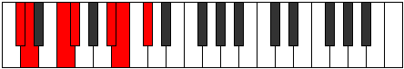

# Mode Lalimic

## Links

- [Documentation](README.md)
- [Scales Index](Scales.md)
- [Modes Index](Modes.md)
- [Chords Index](Chords.md)

## Parent Scale

[Laptimic](ScaleLaptimic.md)

## Number

[1587](https://ianring.com/musictheory/scales/1587)

## Transposition

1, 3, 1, 4, 1, 2

## Chord Pattern

v, vi, vi

## Perfection

- 3 Perfect notes
- 3 Perfect notes

## Perfection Profile

[false false false true true true]

## Permutations

| Tonic | Notes | Signature | Illustration | Audio |
|-------|-------|-----------|--------------|-------|
| [C](ModeCNaturalLalimic.md) | **C**, **Db**, **E**, F, G##, A#, **C** | C |  | [midi](https://github.com/edipermadi/music/blob/main/docs/ModeCNaturalLalimic.mid?raw=true) |
| [C#](ModeCSharpLalimic.md) | **C#**, **D**, **E#**, F#, G###, A##, **C#** | C |  | [midi](https://github.com/edipermadi/music/blob/main/docs/ModeCSharpLalimic.mid?raw=true) |
| [Db](ModeDFlatLalimic.md) | **Db**, **Ebb**, **F**, Gb, A#, B, **Db** | C |  | [midi](https://github.com/edipermadi/music/blob/main/docs/ModeDFlatLalimic.mid?raw=true) |
| [D](ModeDNaturalLalimic.md) | **D**, **Eb**, **F#**, G, A##, B#, **D** | C |  | [midi](https://github.com/edipermadi/music/blob/main/docs/ModeDNaturalLalimic.mid?raw=true) |
| [D#](ModeDSharpLalimic.md) | **D#**, **E**, **F##**, G#, A###, B##, **D#** | C |  | [midi](https://github.com/edipermadi/music/blob/main/docs/ModeDSharpLalimic.mid?raw=true) |
| [Eb](ModeEFlatLalimic.md) | **Eb**, **Fb**, **G**, Ab, B#, C#, **Eb** | C |  | [midi](https://github.com/edipermadi/music/blob/main/docs/ModeEFlatLalimic.mid?raw=true) |
| [E](ModeENaturalLalimic.md) | **E**, **F**, **G#**, A, B##, C##, **E** | C |  | [midi](https://github.com/edipermadi/music/blob/main/docs/ModeENaturalLalimic.mid?raw=true) |
| [F](ModeFNaturalLalimic.md) | **F**, **Gb**, **A**, Bb, C##, D#, **F** | C |  | [midi](https://github.com/edipermadi/music/blob/main/docs/ModeFNaturalLalimic.mid?raw=true) |
| [F#](ModeFSharpLalimic.md) | **F#**, **G**, **A#**, B, C###, D##, **F#** | C |  | [midi](https://github.com/edipermadi/music/blob/main/docs/ModeFSharpLalimic.mid?raw=true) |
| [Gb](ModeGFlatLalimic.md) | **Gb**, **Abb**, **Bb**, Cb, D#, E, **Gb** | C |  | [midi](https://github.com/edipermadi/music/blob/main/docs/ModeGFlatLalimic.mid?raw=true) |
| [G](ModeGNaturalLalimic.md) | **G**, **Ab**, **B**, C, D##, E#, **G** | C |  | [midi](https://github.com/edipermadi/music/blob/main/docs/ModeGNaturalLalimic.mid?raw=true) |
| [G#](ModeGSharpLalimic.md) | **G#**, **A**, **B#**, C#, D###, E##, **G#** | C |  | [midi](https://github.com/edipermadi/music/blob/main/docs/ModeGSharpLalimic.mid?raw=true) |
| [Ab](ModeAFlatLalimic.md) | **Ab**, **Bbb**, **C**, Db, E#, F#, **Ab** | C |  | [midi](https://github.com/edipermadi/music/blob/main/docs/ModeAFlatLalimic.mid?raw=true) |
| [A](ModeANaturalLalimic.md) | **A**, **Bb**, **C#**, D, E##, F##, **A** | C |  | [midi](https://github.com/edipermadi/music/blob/main/docs/ModeANaturalLalimic.mid?raw=true) |
| [A#](ModeASharpLalimic.md) | **A#**, **B**, **C##**, D#, E###, F###, **A#** | C |  | [midi](https://github.com/edipermadi/music/blob/main/docs/ModeASharpLalimic.mid?raw=true) |
| [Bb](ModeBFlatLalimic.md) | **Bb**, **Cb**, **D**, Eb, F##, G#, **Bb** | C |  | [midi](https://github.com/edipermadi/music/blob/main/docs/ModeBFlatLalimic.mid?raw=true) |
| [B](ModeBNaturalLalimic.md) | **B**, **C**, **D#**, E, F###, G##, **B** | C |  | [midi](https://github.com/edipermadi/music/blob/main/docs/ModeBNaturalLalimic.mid?raw=true) |
