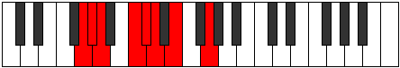
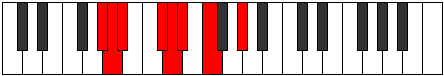

# Mode Lanian

## Links

- [Documentation](index.md)
- [Scales Index](Scales.md)
- [Modes Index](Modes.md)
- [Chords Index](Chords.md)

## Parent Scale

[Epogian](ScaleEpogian.md)

## Number

[743](https://ianring.com/musictheory/scales/743)

## Interval Pattern

1, 1, 3, 1, 1, 2, 3

## Chord Pattern

III, v, VII⁺

## Perfection

- 5 Perfect notes
- 2 Perfect notes

## Perfection Profile

[true false true true true true false]

## Permutations

| Tonic | Notes | Signature | Illustration | Audio |
|-------|-------|-----------|--------------|-------|
| [C](ModeCNaturalLanian.md) | C, **Db**, Ebb, F, Gb, Abb, **Bbb**, C | C |  | [midi](https://github.com/edipermadi/music/blob/main/docs/ModeCNaturalLanian.mid?raw=true) |
| [C#](ModeCSharpLanian.md) | C#, **D**, Eb, F#, G, Ab, **Bb**, C# | C |  | [midi](https://github.com/edipermadi/music/blob/main/docs/ModeCSharpLanian.mid?raw=true) |
| [Db](ModeDFlatLanian.md) | Db, **Ebb**, Fbb, Gb, Abb, Bbbb, **Cbb**, Db | C |  | [midi](https://github.com/edipermadi/music/blob/main/docs/ModeDFlatLanian.mid?raw=true) |
| [D](ModeDNaturalLanian.md) | D, **Eb**, Fb, G, Ab, Bbb, **Cb**, D | C |  | [midi](https://github.com/edipermadi/music/blob/main/docs/ModeDNaturalLanian.mid?raw=true) |
| [D#](ModeDSharpLanian.md) | D#, **E**, F, G#, A, Bb, **C**, D# | C |  | [midi](https://github.com/edipermadi/music/blob/main/docs/ModeDSharpLanian.mid?raw=true) |
| [Eb](ModeEFlatLanian.md) | Eb, **Fb**, Gbb, Ab, Bbb, Cbb, **Dbb**, Eb | C |  | [midi](https://github.com/edipermadi/music/blob/main/docs/ModeEFlatLanian.mid?raw=true) |
| [E](ModeENaturalLanian.md) | E, **F**, Gb, A, Bb, Cb, **Db**, E | C |  | [midi](https://github.com/edipermadi/music/blob/main/docs/ModeENaturalLanian.mid?raw=true) |
| [F](ModeFNaturalLanian.md) | F, **Gb**, Abb, Bb, Cb, Dbb, **Ebb**, F | C |  | [midi](https://github.com/edipermadi/music/blob/main/docs/ModeFNaturalLanian.mid?raw=true) |
| [F#](ModeFSharpLanian.md) | F#, **G**, Ab, B, C, Db, **Eb**, F# | C |  | [midi](https://github.com/edipermadi/music/blob/main/docs/ModeFSharpLanian.mid?raw=true) |
| [Gb](ModeGFlatLanian.md) | Gb, **Abb**, Bbbb, Cb, Dbb, Ebbb, **Fbb**, Gb | C |  | [midi](https://github.com/edipermadi/music/blob/main/docs/ModeGFlatLanian.mid?raw=true) |
| [G](ModeGNaturalLanian.md) | G, **Ab**, Bbb, C, Db, Ebb, **Fb**, G | C |  | [midi](https://github.com/edipermadi/music/blob/main/docs/ModeGNaturalLanian.mid?raw=true) |
| [G#](ModeGSharpLanian.md) | G#, **A**, Bb, C#, D, Eb, **F**, G# | C |  | [midi](https://github.com/edipermadi/music/blob/main/docs/ModeGSharpLanian.mid?raw=true) |
| [Ab](ModeAFlatLanian.md) | Ab, **Bbb**, Cbb, Db, Ebb, Fbb, **Gbb**, Ab | C |  | [midi](https://github.com/edipermadi/music/blob/main/docs/ModeAFlatLanian.mid?raw=true) |
| [A](ModeANaturalLanian.md) | A, **Bb**, Cb, D, Eb, Fb, **Gb**, A | C |  | [midi](https://github.com/edipermadi/music/blob/main/docs/ModeANaturalLanian.mid?raw=true) |
| [A#](ModeASharpLanian.md) | A#, **B**, C, D#, E, F, **G**, A# | C |  | [midi](https://github.com/edipermadi/music/blob/main/docs/ModeASharpLanian.mid?raw=true) |
| [Bb](ModeBFlatLanian.md) | Bb, **Cb**, Dbb, Eb, Fb, Gbb, **Abb**, Bb | C |  | [midi](https://github.com/edipermadi/music/blob/main/docs/ModeBFlatLanian.mid?raw=true) |
| [B](ModeBNaturalLanian.md) | B, **C**, Db, E, F, Gb, **Ab**, B | C |  | [midi](https://github.com/edipermadi/music/blob/main/docs/ModeBNaturalLanian.mid?raw=true) |
