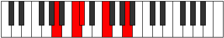

# Mode Lanic

## Links

- [Documentation](README.md)
- [Scales Index](Scales.md)
- [Modes Index](Modes.md)
- [Chords Index](Chords.md)

## Parent Scale

[Zyphic](ScaleZyphic.md)

## Number

[281](https://ianring.com/musictheory/scales/281)

## Transposition

3, 1, 4, 4

## Chord Pattern

## Perfection

- 1 Perfect notes
- 3 Perfect notes

## Perfection Profile

false, false, false, true

## Permutations

| Tonic | Notes | Signature | Illustration | Audio |
|-------|-------|-----------|--------------|-------|
| [C](ModeCNaturalLanic.md) | **C**, **D#**, **E**, G#, **C** | C |  | [midi](https://github.com/edipermadi/music/blob/main/docs/ModeCNaturalLanic.mid?raw=true) |
| [C#](ModeCSharpLanic.md) | **C#**, **E**, **F**, A, **C#** | C |  | [midi](https://github.com/edipermadi/music/blob/main/docs/ModeCSharpLanic.mid?raw=true) |
| [Db](ModeDFlatLanic.md) | **Db**, **E**, **F**, A, **Db** | C |  | [midi](https://github.com/edipermadi/music/blob/main/docs/ModeDFlatLanic.mid?raw=true) |
| [D](ModeDNaturalLanic.md) | **D**, **F**, **F#**, A#, **D** | C |  | [midi](https://github.com/edipermadi/music/blob/main/docs/ModeDNaturalLanic.mid?raw=true) |
| [D#](ModeDSharpLanic.md) | **D#**, **F#**, **G**, B, **D#** | C |  | [midi](https://github.com/edipermadi/music/blob/main/docs/ModeDSharpLanic.mid?raw=true) |
| [Eb](ModeEFlatLanic.md) | **Eb**, **Gb**, **G**, B, **Eb** | C |  | [midi](https://github.com/edipermadi/music/blob/main/docs/ModeEFlatLanic.mid?raw=true) |
| [E](ModeENaturalLanic.md) | **E**, **G**, **G#**, C, **E** | C |  | [midi](https://github.com/edipermadi/music/blob/main/docs/ModeENaturalLanic.mid?raw=true) |
| [F](ModeFNaturalLanic.md) | **F**, **G#**, **A**, C#, **F** | C |  | [midi](https://github.com/edipermadi/music/blob/main/docs/ModeFNaturalLanic.mid?raw=true) |
| [F#](ModeFSharpLanic.md) | **F#**, **A**, **A#**, D, **F#** | C |  | [midi](https://github.com/edipermadi/music/blob/main/docs/ModeFSharpLanic.mid?raw=true) |
| [Gb](ModeGFlatLanic.md) | **Gb**, **A**, **Bb**, D, **Gb** | C |  | [midi](https://github.com/edipermadi/music/blob/main/docs/ModeGFlatLanic.mid?raw=true) |
| [G](ModeGNaturalLanic.md) | **G**, **A#**, **B**, D#, **G** | C |  | [midi](https://github.com/edipermadi/music/blob/main/docs/ModeGNaturalLanic.mid?raw=true) |
| [G#](ModeGSharpLanic.md) | **G#**, **B**, **C**, E, **G#** | C |  | [midi](https://github.com/edipermadi/music/blob/main/docs/ModeGSharpLanic.mid?raw=true) |
| [Ab](ModeAFlatLanic.md) | **Ab**, **B**, **C**, E, **Ab** | C |  | [midi](https://github.com/edipermadi/music/blob/main/docs/ModeAFlatLanic.mid?raw=true) |
| [A](ModeANaturalLanic.md) | **A**, **C**, **C#**, F, **A** | C |  | [midi](https://github.com/edipermadi/music/blob/main/docs/ModeANaturalLanic.mid?raw=true) |
| [A#](ModeASharpLanic.md) | **A#**, **C#**, **D**, F#, **A#** | C |  | [midi](https://github.com/edipermadi/music/blob/main/docs/ModeASharpLanic.mid?raw=true) |
| [Bb](ModeBFlatLanic.md) | **Bb**, **Db**, **D**, Gb, **Bb** | C |  | [midi](https://github.com/edipermadi/music/blob/main/docs/ModeBFlatLanic.mid?raw=true) |
| [B](ModeBNaturalLanic.md) | **B**, **D**, **D#**, G, **B** | C |  | [midi](https://github.com/edipermadi/music/blob/main/docs/ModeBNaturalLanic.mid?raw=true) |
