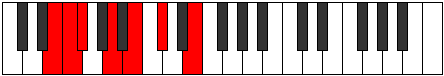

# Mode Lanimic

## Links

- [Documentation](index.md)
- [Scales Index](Scales.md)
- [Modes Index](Modes.md)
- [Chords Index](Chords.md)

## Parent Scale

[Dalimic](ScaleDalimic.md)

## Number

[679](https://ianring.com/musictheory/scales/679)

## Perfection

- 4 Perfect notes
- 2 Perfect notes

## Perfection Profile

[true false true true true false]

## Permutations

| Tonic | Notes | Signature | Illustration | Audio |
|-------|-------|-----------|--------------|-------|
| [C](ModeCNaturalLanimic.md) | C, **Db**, Ebb, F, G, **A**, C | C |  | [midi](ModeCNaturalLanimic.mid) [ogg](ModeCNaturalLanimic.ogg) |
| [C#](ModeCSharpLanimic.md) | C#, **D**, Eb, F#, G#, **A#**, C# | C |  | [midi](ModeCSharpLanimic.mid) [ogg](ModeCSharpLanimic.ogg) |
| [Db](ModeDFlatLanimic.md) | Db, **Ebb**, Fbb, Gb, Ab, **Bb**, Db | C |  | [midi](ModeDFlatLanimic.mid) [ogg](ModeDFlatLanimic.ogg) |
| [D](ModeDNaturalLanimic.md) | D, **Eb**, Fb, G, A, **B**, D | C |  | [midi](ModeDNaturalLanimic.mid) [ogg](ModeDNaturalLanimic.ogg) |
| [D#](ModeDSharpLanimic.md) | D#, **E**, F, G#, A#, **B#**, D# | C |  | [midi](ModeDSharpLanimic.mid) [ogg](ModeDSharpLanimic.ogg) |
| [Eb](ModeEFlatLanimic.md) | Eb, **Fb**, Gbb, Ab, Bb, **C**, Eb | C |  | [midi](ModeEFlatLanimic.mid) [ogg](ModeEFlatLanimic.ogg) |
| [E](ModeENaturalLanimic.md) | E, **F**, Gb, A, B, **C#**, E | C |  | [midi](ModeENaturalLanimic.mid) [ogg](ModeENaturalLanimic.ogg) |
| [F](ModeFNaturalLanimic.md) | F, **Gb**, Abb, Bb, C, **D**, F | C |  | [midi](ModeFNaturalLanimic.mid) [ogg](ModeFNaturalLanimic.ogg) |
| [F#](ModeFSharpLanimic.md) | F#, **G**, Ab, B, C#, **D#**, F# | C |  | [midi](ModeFSharpLanimic.mid) [ogg](ModeFSharpLanimic.ogg) |
| [Gb](ModeGFlatLanimic.md) | Gb, **Abb**, Bbbb, Cb, Db, **Eb**, Gb | C |  | [midi](ModeGFlatLanimic.mid) [ogg](ModeGFlatLanimic.ogg) |
| [G](ModeGNaturalLanimic.md) | G, **Ab**, Bbb, C, D, **E**, G | C |  | [midi](ModeGNaturalLanimic.mid) [ogg](ModeGNaturalLanimic.ogg) |
| [G#](ModeGSharpLanimic.md) | G#, **A**, Bb, C#, D#, **E#**, G# | C |  | [midi](ModeGSharpLanimic.mid) [ogg](ModeGSharpLanimic.ogg) |
| [Ab](ModeAFlatLanimic.md) | Ab, **Bbb**, Cbb, Db, Eb, **F**, Ab | C |  | [midi](ModeAFlatLanimic.mid) [ogg](ModeAFlatLanimic.ogg) |
| [A](ModeANaturalLanimic.md) | A, **Bb**, Cb, D, E, **F#**, A | C |  | [midi](ModeANaturalLanimic.mid) [ogg](ModeANaturalLanimic.ogg) |
| [A#](ModeASharpLanimic.md) | A#, **B**, C, D#, E#, **F##**, A# | C |  | [midi](ModeASharpLanimic.mid) [ogg](ModeASharpLanimic.ogg) |
| [Bb](ModeBFlatLanimic.md) | Bb, **Cb**, Dbb, Eb, F, **G**, Bb | C |  | [midi](ModeBFlatLanimic.mid) [ogg](ModeBFlatLanimic.ogg) |
| [B](ModeBNaturalLanimic.md) | B, **C**, Db, E, F#, **G#**, B | C |  | [midi](ModeBNaturalLanimic.mid) [ogg](ModeBNaturalLanimic.ogg) |
