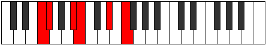

# Mode Lanitonic

## Links

- [Documentation](index.md)
- [Scales Index](Scales.md)
- [Modes Index](Modes.md)
- [Chords Index](Chords.md)

## Parent Scale

[Zolitonic](ScaleZolitonic.md)

## Number

[1123](https://ianring.com/musictheory/scales/1123)

## Perfection

- 3 Perfect notes
- 2 Perfect notes

## Perfection Profile

[false false true true true]

## Permutations

| Tonic | Notes | Signature | Illustration | Audio |
|-------|-------|-----------|--------------|-------|
| [C](ModeCNaturalLanitonic.md) | **C**, **C#**, F, F#, A#, **C** | C |  | [midi](ModeCNaturalLanitonic.mid) [ogg](ModeCNaturalLanitonic.ogg) |
| [C#](ModeCSharpLanitonic.md) | **C#**, **D**, F#, G, B, **C#** | C |  | [midi](ModeCSharpLanitonic.mid) [ogg](ModeCSharpLanitonic.ogg) |
| [Db](ModeDFlatLanitonic.md) | **Db**, **D**, Gb, G, B, **Db** | C |  | [midi](ModeDFlatLanitonic.mid) [ogg](ModeDFlatLanitonic.ogg) |
| [D](ModeDNaturalLanitonic.md) | **D**, **D#**, G, G#, C, **D** | C |  | [midi](ModeDNaturalLanitonic.mid) [ogg](ModeDNaturalLanitonic.ogg) |
| [D#](ModeDSharpLanitonic.md) | **D#**, **E**, G#, A, C#, **D#** | C |  | [midi](ModeDSharpLanitonic.mid) [ogg](ModeDSharpLanitonic.ogg) |
| [Eb](ModeEFlatLanitonic.md) | **Eb**, **E**, Ab, A, Db, **Eb** | C |  | [midi](ModeEFlatLanitonic.mid) [ogg](ModeEFlatLanitonic.ogg) |
| [E](ModeENaturalLanitonic.md) | **E**, **F**, A, A#, D, **E** | C |  | [midi](ModeENaturalLanitonic.mid) [ogg](ModeENaturalLanitonic.ogg) |
| [F](ModeFNaturalLanitonic.md) | **F**, **F#**, A#, B, D#, **F** | C |  | [midi](ModeFNaturalLanitonic.mid) [ogg](ModeFNaturalLanitonic.ogg) |
| [F#](ModeFSharpLanitonic.md) | **F#**, **G**, B, C, E, **F#** | C |  | [midi](ModeFSharpLanitonic.mid) [ogg](ModeFSharpLanitonic.ogg) |
| [Gb](ModeGFlatLanitonic.md) | **Gb**, **G**, B, C, E, **Gb** | C |  | [midi](ModeGFlatLanitonic.mid) [ogg](ModeGFlatLanitonic.ogg) |
| [G](ModeGNaturalLanitonic.md) | **G**, **G#**, C, C#, F, **G** | C |  | [midi](ModeGNaturalLanitonic.mid) [ogg](ModeGNaturalLanitonic.ogg) |
| [G#](ModeGSharpLanitonic.md) | **G#**, **A**, C#, D, F#, **G#** | C |  | [midi](ModeGSharpLanitonic.mid) [ogg](ModeGSharpLanitonic.ogg) |
| [Ab](ModeAFlatLanitonic.md) | **Ab**, **A**, Db, D, Gb, **Ab** | C |  | [midi](ModeAFlatLanitonic.mid) [ogg](ModeAFlatLanitonic.ogg) |
| [A](ModeANaturalLanitonic.md) | **A**, **A#**, D, D#, G, **A** | C |  | [midi](ModeANaturalLanitonic.mid) [ogg](ModeANaturalLanitonic.ogg) |
| [A#](ModeASharpLanitonic.md) | **A#**, **B**, D#, E, G#, **A#** | C |  | [midi](ModeASharpLanitonic.mid) [ogg](ModeASharpLanitonic.ogg) |
| [Bb](ModeBFlatLanitonic.md) | **Bb**, **B**, Eb, E, Ab, **Bb** | C |  | [midi](ModeBFlatLanitonic.mid) [ogg](ModeBFlatLanitonic.ogg) |
| [B](ModeBNaturalLanitonic.md) | **B**, **C**, E, F, A, **B** | C |  | [midi](ModeBNaturalLanitonic.mid) [ogg](ModeBNaturalLanitonic.ogg) |
