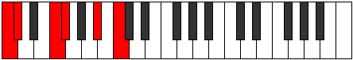

# Mode Lanitonic

## Links

- [Documentation](index.md)
- [Scales Index](Scales.md)
- [Modes Index](Modes.md)
- [Chords Index](Chords.md)

## Parent Scale

[Zolitonic](ScaleZolitonic.md)

## Number

[1123](https://ianring.com/musictheory/scales/1123)

## Interval Pattern

1, 4, 1, 4, 2

## Chord Pattern

## Perfection

- 3 Perfect notes
- 2 Perfect notes

## Perfection Profile

[false false true true true]

## Permutations

| Tonic | Notes | Signature | Illustration | Audio |
|-------|-------|-----------|--------------|-------|
| [C](ModeCNaturalLanitonic.md) | **C**, **C#**, F, F#, A#, **C** | C |  | [midi](https://github.com/edipermadi/music/blob/main/docs/ModeCNaturalLanitonic.mid?raw=true) |
| [C#](ModeCSharpLanitonic.md) | **C#**, **D**, F#, G, B, **C#** | C |  | [midi](https://github.com/edipermadi/music/blob/main/docs/ModeCSharpLanitonic.mid?raw=true) |
| [Db](ModeDFlatLanitonic.md) | **Db**, **D**, Gb, G, B, **Db** | C |  | [midi](https://github.com/edipermadi/music/blob/main/docs/ModeDFlatLanitonic.mid?raw=true) |
| [D](ModeDNaturalLanitonic.md) | **D**, **D#**, G, G#, C, **D** | C |  | [midi](https://github.com/edipermadi/music/blob/main/docs/ModeDNaturalLanitonic.mid?raw=true) |
| [D#](ModeDSharpLanitonic.md) | **D#**, **E**, G#, A, C#, **D#** | C |  | [midi](https://github.com/edipermadi/music/blob/main/docs/ModeDSharpLanitonic.mid?raw=true) |
| [Eb](ModeEFlatLanitonic.md) | **Eb**, **E**, Ab, A, Db, **Eb** | C |  | [midi](https://github.com/edipermadi/music/blob/main/docs/ModeEFlatLanitonic.mid?raw=true) |
| [E](ModeENaturalLanitonic.md) | **E**, **F**, A, A#, D, **E** | C |  | [midi](https://github.com/edipermadi/music/blob/main/docs/ModeENaturalLanitonic.mid?raw=true) |
| [F](ModeFNaturalLanitonic.md) | **F**, **F#**, A#, B, D#, **F** | C |  | [midi](https://github.com/edipermadi/music/blob/main/docs/ModeFNaturalLanitonic.mid?raw=true) |
| [F#](ModeFSharpLanitonic.md) | **F#**, **G**, B, C, E, **F#** | C |  | [midi](https://github.com/edipermadi/music/blob/main/docs/ModeFSharpLanitonic.mid?raw=true) |
| [Gb](ModeGFlatLanitonic.md) | **Gb**, **G**, B, C, E, **Gb** | C |  | [midi](https://github.com/edipermadi/music/blob/main/docs/ModeGFlatLanitonic.mid?raw=true) |
| [G](ModeGNaturalLanitonic.md) | **G**, **G#**, C, C#, F, **G** | C |  | [midi](https://github.com/edipermadi/music/blob/main/docs/ModeGNaturalLanitonic.mid?raw=true) |
| [G#](ModeGSharpLanitonic.md) | **G#**, **A**, C#, D, F#, **G#** | C |  | [midi](https://github.com/edipermadi/music/blob/main/docs/ModeGSharpLanitonic.mid?raw=true) |
| [Ab](ModeAFlatLanitonic.md) | **Ab**, **A**, Db, D, Gb, **Ab** | C |  | [midi](https://github.com/edipermadi/music/blob/main/docs/ModeAFlatLanitonic.mid?raw=true) |
| [A](ModeANaturalLanitonic.md) | **A**, **A#**, D, D#, G, **A** | C |  | [midi](https://github.com/edipermadi/music/blob/main/docs/ModeANaturalLanitonic.mid?raw=true) |
| [A#](ModeASharpLanitonic.md) | **A#**, **B**, D#, E, G#, **A#** | C |  | [midi](https://github.com/edipermadi/music/blob/main/docs/ModeASharpLanitonic.mid?raw=true) |
| [Bb](ModeBFlatLanitonic.md) | **Bb**, **B**, Eb, E, Ab, **Bb** | C |  | [midi](https://github.com/edipermadi/music/blob/main/docs/ModeBFlatLanitonic.mid?raw=true) |
| [B](ModeBNaturalLanitonic.md) | **B**, **C**, E, F, A, **B** | C |  | [midi](https://github.com/edipermadi/music/blob/main/docs/ModeBNaturalLanitonic.mid?raw=true) |
