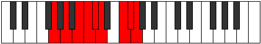

# Mode Lanyllic

## Links

- [Documentation](README.md)
- [Scales Index](Scales.md)
- [Modes Index](Modes.md)
- [Chords Index](Chords.md)

## Parent Scale

[Aeracryllic](ScaleAeracryllic.md)

## Number

[3317](https://ianring.com/musictheory/scales/3317)

## Transposition

2, 2, 1, 1, 1, 3, 1, 1

## Chord Pattern

Ib5, iii⁰b3, iv⁰b3, Vb5, VI, vii⁰b3, viii⁰

## Perfection

- 6 Perfect notes
- 2 Perfect notes

## Perfection Profile

[true false true true false true true true]

## Permutations

| Tonic | Notes | Signature | Illustration | Audio |
|-------|-------|-----------|--------------|-------|
| [C](ModeCNaturalLanyllic.md) | C, **D**, E, F, **F#**, G, A#, B, C | C |  | [midi](https://github.com/edipermadi/music/blob/main/docs/ModeCNaturalLanyllic.mid?raw=true) |
| [C#](ModeCSharpLanyllic.md) | C#, **D#**, F, F#, **G**, G#, B, C, C# | C |  | [midi](https://github.com/edipermadi/music/blob/main/docs/ModeCSharpLanyllic.mid?raw=true) |
| [Db](ModeDFlatLanyllic.md) | Db, **Eb**, F, Gb, **G**, Ab, B, C, Db | C |  | [midi](https://github.com/edipermadi/music/blob/main/docs/ModeDFlatLanyllic.mid?raw=true) |
| [D](ModeDNaturalLanyllic.md) | D, **E**, F#, G, **G#**, A, C, C#, D | C |  | [midi](https://github.com/edipermadi/music/blob/main/docs/ModeDNaturalLanyllic.mid?raw=true) |
| [D#](ModeDSharpLanyllic.md) | D#, **F**, G, G#, **A**, A#, C#, D, D# | C |  | [midi](https://github.com/edipermadi/music/blob/main/docs/ModeDSharpLanyllic.mid?raw=true) |
| [Eb](ModeEFlatLanyllic.md) | Eb, **F**, G, Ab, **A**, Bb, Db, D, Eb | C |  | [midi](https://github.com/edipermadi/music/blob/main/docs/ModeEFlatLanyllic.mid?raw=true) |
| [E](ModeENaturalLanyllic.md) | E, **F#**, G#, A, **A#**, B, D, D#, E | C |  | [midi](https://github.com/edipermadi/music/blob/main/docs/ModeENaturalLanyllic.mid?raw=true) |
| [F](ModeFNaturalLanyllic.md) | F, **G**, A, A#, **B**, C, D#, E, F | C |  | [midi](https://github.com/edipermadi/music/blob/main/docs/ModeFNaturalLanyllic.mid?raw=true) |
| [F#](ModeFSharpLanyllic.md) | F#, **G#**, A#, B, **C**, C#, E, F, F# | C |  | [midi](https://github.com/edipermadi/music/blob/main/docs/ModeFSharpLanyllic.mid?raw=true) |
| [Gb](ModeGFlatLanyllic.md) | Gb, **Ab**, Bb, B, **C**, Db, E, F, Gb | C |  | [midi](https://github.com/edipermadi/music/blob/main/docs/ModeGFlatLanyllic.mid?raw=true) |
| [G](ModeGNaturalLanyllic.md) | G, **A**, B, C, **C#**, D, F, F#, G | C |  | [midi](https://github.com/edipermadi/music/blob/main/docs/ModeGNaturalLanyllic.mid?raw=true) |
| [G#](ModeGSharpLanyllic.md) | G#, **A#**, C, C#, **D**, D#, F#, G, G# | C |  | [midi](https://github.com/edipermadi/music/blob/main/docs/ModeGSharpLanyllic.mid?raw=true) |
| [Ab](ModeAFlatLanyllic.md) | Ab, **Bb**, C, Db, **D**, Eb, Gb, G, Ab | C |  | [midi](https://github.com/edipermadi/music/blob/main/docs/ModeAFlatLanyllic.mid?raw=true) |
| [A](ModeANaturalLanyllic.md) | A, **B**, C#, D, **D#**, E, G, G#, A | C |  | [midi](https://github.com/edipermadi/music/blob/main/docs/ModeANaturalLanyllic.mid?raw=true) |
| [A#](ModeASharpLanyllic.md) | A#, **C**, D, D#, **E**, F, G#, A, A# | C |  | [midi](https://github.com/edipermadi/music/blob/main/docs/ModeASharpLanyllic.mid?raw=true) |
| [Bb](ModeBFlatLanyllic.md) | Bb, **C**, D, Eb, **E**, F, Ab, A, Bb | C |  | [midi](https://github.com/edipermadi/music/blob/main/docs/ModeBFlatLanyllic.mid?raw=true) |
| [B](ModeBNaturalLanyllic.md) | B, **C#**, D#, E, **F**, F#, A, A#, B | C |  | [midi](https://github.com/edipermadi/music/blob/main/docs/ModeBNaturalLanyllic.mid?raw=true) |
