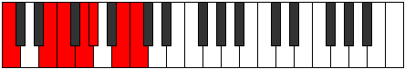
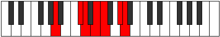

# Mode Laptimic

## Links

- [Documentation](index.md)
- [Scales Index](Scales.md)
- [Modes Index](Modes.md)
- [Chords Index](Chords.md)

## Parent Scale

[Laptimic](ScaleLaptimic.md)

## Number

[2481](https://ianring.com/musictheory/scales/2481)

## Perfection

- 3 Perfect notes
- 3 Perfect notes

## Perfection Profile

[true true true false false false]

## Permutations

| Tonic | Notes | Signature | Illustration | Audio |
|-------|-------|-----------|--------------|-------|
| [C](ModeCNaturalLaptimic.md) | C, D##, E#, **F##**, **G#**, **A##**, C | C |  | [midi](ModeCNaturalLaptimic.mid) [ogg](ModeCNaturalLaptimic.ogg) |
| [C#](ModeCSharpLaptimic.md) | C#, D###, E##, **F###**, **G##**, **A###**, C# | C |  | [midi](ModeCSharpLaptimic.mid) [ogg](ModeCSharpLaptimic.ogg) |
| [Db](ModeDFlatLaptimic.md) | Db, E#, F#, **G#**, **A**, **B#**, Db | C |  | [midi](ModeDFlatLaptimic.mid) [ogg](ModeDFlatLaptimic.ogg) |
| [D](ModeDNaturalLaptimic.md) | D, E##, F##, **G##**, **A#**, **B##**, D | C |  | [midi](ModeDNaturalLaptimic.mid) [ogg](ModeDNaturalLaptimic.ogg) |
| [D#](ModeDSharpLaptimic.md) | D#, E###, F###, **G###**, **A##**, **B###**, D# | C |  | [midi](ModeDSharpLaptimic.mid) [ogg](ModeDSharpLaptimic.ogg) |
| [Eb](ModeEFlatLaptimic.md) | Eb, F##, G#, **A#**, **B**, **C##**, Eb | C |  | [midi](ModeEFlatLaptimic.mid) [ogg](ModeEFlatLaptimic.ogg) |
| [E](ModeENaturalLaptimic.md) | E, F###, G##, **A##**, **B#**, **C###**, E | C |  | [midi](ModeENaturalLaptimic.mid) [ogg](ModeENaturalLaptimic.ogg) |
| [F](ModeFNaturalLaptimic.md) | F, G##, A#, **B#**, **C#**, **D##**, F | C |  | [midi](ModeFNaturalLaptimic.mid) [ogg](ModeFNaturalLaptimic.ogg) |
| [F#](ModeFSharpLaptimic.md) | F#, G###, A##, **B##**, **C##**, **D###**, F# | C |  | [midi](ModeFSharpLaptimic.mid) [ogg](ModeFSharpLaptimic.ogg) |
| [Gb](ModeGFlatLaptimic.md) | Gb, A#, B, **C#**, **D**, **E#**, Gb | C |  | [midi](ModeGFlatLaptimic.mid) [ogg](ModeGFlatLaptimic.ogg) |
| [G](ModeGNaturalLaptimic.md) | G, A##, B#, **C##**, **D#**, **E##**, G | C |  | [midi](ModeGNaturalLaptimic.mid) [ogg](ModeGNaturalLaptimic.ogg) |
| [G#](ModeGSharpLaptimic.md) | G#, A###, B##, **C###**, **D##**, **E###**, G# | C |  | [midi](ModeGSharpLaptimic.mid) [ogg](ModeGSharpLaptimic.ogg) |
| [Ab](ModeAFlatLaptimic.md) | Ab, B#, C#, **D#**, **E**, **F##**, Ab | C |  | [midi](ModeAFlatLaptimic.mid) [ogg](ModeAFlatLaptimic.ogg) |
| [A](ModeANaturalLaptimic.md) | A, B##, C##, **D##**, **E#**, **F###**, A | C |  | [midi](ModeANaturalLaptimic.mid) [ogg](ModeANaturalLaptimic.ogg) |
| [A#](ModeASharpLaptimic.md) | A#, B###, C###, **D###**, **E##**, **Cbbb**, A# | C |  | [midi](ModeASharpLaptimic.mid) [ogg](ModeASharpLaptimic.ogg) |
| [Bb](ModeBFlatLaptimic.md) | Bb, C##, D#, **E#**, **F#**, **G##**, Bb | C |  | [midi](ModeBFlatLaptimic.mid) [ogg](ModeBFlatLaptimic.ogg) |
| [B](ModeBNaturalLaptimic.md) | B, C###, D##, **E##**, **F##**, **G###**, B | C |  | [midi](ModeBNaturalLaptimic.mid) [ogg](ModeBNaturalLaptimic.ogg) |
