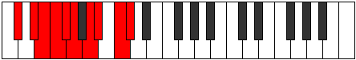

# Mode Laptygic

## Links

- [Documentation](README.md)
- [Scales Index](Scales.md)
- [Modes Index](Modes.md)
- [Chords Index](Chords.md)

## Parent Scale

[Koptygic](ScaleKoptygic.md)

## Number

[2941](https://ianring.com/musictheory/scales/2941)

## Transposition

2, 1, 1, 1, 1, 2, 1, 2, 1

## Chord Pattern

v⁰, vi⁰, vi⁰, vii⁰, vii⁰, viii⁰

## Perfection

- 6 Perfect notes
- 3 Perfect notes

## Perfection Profile

[false true false true true false true true true]

## Permutations

| Tonic | Notes | Signature | Illustration | Audio |
|-------|-------|-----------|--------------|-------|
| [C](ModeCNaturalLaptygic.md) | **C**, D, **D#**, E, F, **F#**, G#, A, B, **C** | C |  | [midi](https://github.com/edipermadi/music/blob/main/docs/ModeCNaturalLaptygic.mid?raw=true) |
| [C#](ModeCSharpLaptygic.md) | **C#**, D#, **E**, F, F#, **G**, A, A#, C, **C#** | C |  | [midi](https://github.com/edipermadi/music/blob/main/docs/ModeCSharpLaptygic.mid?raw=true) |
| [Db](ModeDFlatLaptygic.md) | **Db**, Eb, **E**, F, Gb, **G**, A, Bb, C, **Db** | C |  | [midi](https://github.com/edipermadi/music/blob/main/docs/ModeDFlatLaptygic.mid?raw=true) |
| [D](ModeDNaturalLaptygic.md) | **D**, E, **F**, F#, G, **G#**, A#, B, C#, **D** | C |  | [midi](https://github.com/edipermadi/music/blob/main/docs/ModeDNaturalLaptygic.mid?raw=true) |
| [D#](ModeDSharpLaptygic.md) | **D#**, F, **F#**, G, G#, **A**, B, C, D, **D#** | C |  | [midi](https://github.com/edipermadi/music/blob/main/docs/ModeDSharpLaptygic.mid?raw=true) |
| [Eb](ModeEFlatLaptygic.md) | **Eb**, F, **Gb**, G, Ab, **A**, B, C, D, **Eb** | C |  | [midi](https://github.com/edipermadi/music/blob/main/docs/ModeEFlatLaptygic.mid?raw=true) |
| [E](ModeENaturalLaptygic.md) | **E**, F#, **G**, G#, A, **A#**, C, C#, D#, **E** | C |  | [midi](https://github.com/edipermadi/music/blob/main/docs/ModeENaturalLaptygic.mid?raw=true) |
| [F](ModeFNaturalLaptygic.md) | **F**, G, **G#**, A, A#, **B**, C#, D, E, **F** | C |  | [midi](https://github.com/edipermadi/music/blob/main/docs/ModeFNaturalLaptygic.mid?raw=true) |
| [F#](ModeFSharpLaptygic.md) | **F#**, G#, **A**, A#, B, **C**, D, D#, F, **F#** | C |  | [midi](https://github.com/edipermadi/music/blob/main/docs/ModeFSharpLaptygic.mid?raw=true) |
| [Gb](ModeGFlatLaptygic.md) | **Gb**, Ab, **A**, Bb, B, **C**, D, Eb, F, **Gb** | C |  | [midi](https://github.com/edipermadi/music/blob/main/docs/ModeGFlatLaptygic.mid?raw=true) |
| [G](ModeGNaturalLaptygic.md) | **G**, A, **A#**, B, C, **C#**, D#, E, F#, **G** | C |  | [midi](https://github.com/edipermadi/music/blob/main/docs/ModeGNaturalLaptygic.mid?raw=true) |
| [G#](ModeGSharpLaptygic.md) | **G#**, A#, **B**, C, C#, **D**, E, F, G, **G#** | C |  | [midi](https://github.com/edipermadi/music/blob/main/docs/ModeGSharpLaptygic.mid?raw=true) |
| [Ab](ModeAFlatLaptygic.md) | **Ab**, Bb, **B**, C, Db, **D**, E, F, G, **Ab** | C |  | [midi](https://github.com/edipermadi/music/blob/main/docs/ModeAFlatLaptygic.mid?raw=true) |
| [A](ModeANaturalLaptygic.md) | **A**, B, **C**, C#, D, **D#**, F, F#, G#, **A** | C |  | [midi](https://github.com/edipermadi/music/blob/main/docs/ModeANaturalLaptygic.mid?raw=true) |
| [A#](ModeASharpLaptygic.md) | **A#**, C, **C#**, D, D#, **E**, F#, G, A, **A#** | C |  | [midi](https://github.com/edipermadi/music/blob/main/docs/ModeASharpLaptygic.mid?raw=true) |
| [Bb](ModeBFlatLaptygic.md) | **Bb**, C, **Db**, D, Eb, **E**, Gb, G, A, **Bb** | C |  | [midi](https://github.com/edipermadi/music/blob/main/docs/ModeBFlatLaptygic.mid?raw=true) |
| [B](ModeBNaturalLaptygic.md) | **B**, C#, **D**, D#, E, **F**, G, G#, A#, **B** | C |  | [midi](https://github.com/edipermadi/music/blob/main/docs/ModeBNaturalLaptygic.mid?raw=true) |
