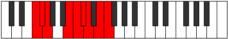

# Mode Laptyllic

## Links

- [Documentation](index.md)
- [Scales Index](Scales.md)
- [Modes Index](Modes.md)
- [Chords Index](Chords.md)

## Parent Scale

[Pynyllic](ScalePynyllic.md)

## Number

[3015](https://ianring.com/musictheory/scales/3015)

## Perfection

- 6 Perfect notes
- 2 Perfect notes

## Perfection Profile

[true true true true true false false true]

## Permutations

| Tonic | Notes | Signature | Illustration | Audio |
|-------|-------|-----------|--------------|-------|
| [C](ModeCNaturalLaptyllic.md) | C, C#, D, F#, G, **G#**, **A**, B, C | C |  | [midi](ModeCNaturalLaptyllic.mid) [ogg](ModeCNaturalLaptyllic.ogg) |
| [C#](ModeCSharpLaptyllic.md) | C#, D, D#, G, G#, **A**, **A#**, C, C# | C |  | [midi](ModeCSharpLaptyllic.mid) [ogg](ModeCSharpLaptyllic.ogg) |
| [Db](ModeDFlatLaptyllic.md) | Db, D, Eb, G, Ab, **A**, **Bb**, C, Db | C |  | [midi](ModeDFlatLaptyllic.mid) [ogg](ModeDFlatLaptyllic.ogg) |
| [D](ModeDNaturalLaptyllic.md) | D, D#, E, G#, A, **A#**, **B**, C#, D | C |  | [midi](ModeDNaturalLaptyllic.mid) [ogg](ModeDNaturalLaptyllic.ogg) |
| [D#](ModeDSharpLaptyllic.md) | D#, E, F, A, A#, **B**, **C**, D, D# | C |  | [midi](ModeDSharpLaptyllic.mid) [ogg](ModeDSharpLaptyllic.ogg) |
| [Eb](ModeEFlatLaptyllic.md) | Eb, E, F, A, Bb, **B**, **C**, D, Eb | C |  | [midi](ModeEFlatLaptyllic.mid) [ogg](ModeEFlatLaptyllic.ogg) |
| [E](ModeENaturalLaptyllic.md) | E, F, F#, A#, B, **C**, **C#**, D#, E | C |  | [midi](ModeENaturalLaptyllic.mid) [ogg](ModeENaturalLaptyllic.ogg) |
| [F](ModeFNaturalLaptyllic.md) | F, F#, G, B, C, **C#**, **D**, E, F | C |  | [midi](ModeFNaturalLaptyllic.mid) [ogg](ModeFNaturalLaptyllic.ogg) |
| [F#](ModeFSharpLaptyllic.md) | F#, G, G#, C, C#, **D**, **D#**, F, F# | C |  | [midi](ModeFSharpLaptyllic.mid) [ogg](ModeFSharpLaptyllic.ogg) |
| [Gb](ModeGFlatLaptyllic.md) | Gb, G, Ab, C, Db, **D**, **Eb**, F, Gb | C |  | [midi](ModeGFlatLaptyllic.mid) [ogg](ModeGFlatLaptyllic.ogg) |
| [G](ModeGNaturalLaptyllic.md) | G, G#, A, C#, D, **D#**, **E**, F#, G | C |  | [midi](ModeGNaturalLaptyllic.mid) [ogg](ModeGNaturalLaptyllic.ogg) |
| [G#](ModeGSharpLaptyllic.md) | G#, A, A#, D, D#, **E**, **F**, G, G# | C |  | [midi](ModeGSharpLaptyllic.mid) [ogg](ModeGSharpLaptyllic.ogg) |
| [Ab](ModeAFlatLaptyllic.md) | Ab, A, Bb, D, Eb, **E**, **F**, G, Ab | C |  | [midi](ModeAFlatLaptyllic.mid) [ogg](ModeAFlatLaptyllic.ogg) |
| [A](ModeANaturalLaptyllic.md) | A, A#, B, D#, E, **F**, **F#**, G#, A | C |  | [midi](ModeANaturalLaptyllic.mid) [ogg](ModeANaturalLaptyllic.ogg) |
| [A#](ModeASharpLaptyllic.md) | A#, B, C, E, F, **F#**, **G**, A, A# | C |  | [midi](ModeASharpLaptyllic.mid) [ogg](ModeASharpLaptyllic.ogg) |
| [Bb](ModeBFlatLaptyllic.md) | Bb, B, C, E, F, **Gb**, **G**, A, Bb | C |  | [midi](ModeBFlatLaptyllic.mid) [ogg](ModeBFlatLaptyllic.ogg) |
| [B](ModeBNaturalLaptyllic.md) | B, C, C#, F, F#, **G**, **G#**, A#, B | C |  | [midi](ModeBNaturalLaptyllic.mid) [ogg](ModeBNaturalLaptyllic.ogg) |
