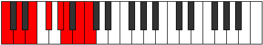
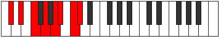
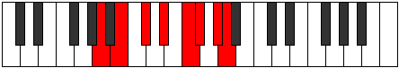

# Mode Larian

## Links

- [Documentation](index.md)
- [Scales Index](Scales.md)
- [Modes Index](Modes.md)
- [Chords Index](Chords.md)

## Parent Scale

[Larian](ScaleLarian.md)

## Number

[2901](https://ianring.com/musictheory/scales/2901)

## Perfection

- 4 Perfect notes
- 3 Perfect notes

## Interval Pattern

2, 2, 2, 2, 1, 2, 1

## Perfection Profile

[false true true false false true true]

## Permutations

| Tonic | Notes | Signature | Illustration | Audio |
|-------|-------|-----------|--------------|-------|
| [C](ModeCNaturalLarian.md) | **C**, D, E, **F#**, **G#**, A, B, **C** | C |  | [midi](https://github.com/edipermadi/music/blob/main/docs/ModeCNaturalLarian.mid?raw=true) |
| [C#](ModeCSharpLarian.md) | **C#**, D#, E#, **F##**, **G##**, A#, B#, **C#** | C |  | [midi](https://github.com/edipermadi/music/blob/main/docs/ModeCSharpLarian.mid?raw=true) |
| [Db](ModeDFlatLarian.md) | **Db**, Eb, F, **G**, **A**, Bb, C, **Db** | C |  | [midi](https://github.com/edipermadi/music/blob/main/docs/ModeDFlatLarian.mid?raw=true) |
| [D](ModeDNaturalLarian.md) | **D**, E, F#, **G#**, **A#**, B, C#, **D** | C |  | [midi](https://github.com/edipermadi/music/blob/main/docs/ModeDNaturalLarian.mid?raw=true) |
| [D#](ModeDSharpLarian.md) | **D#**, E#, F##, **G##**, **A##**, B#, C##, **D#** | C |  | [midi](https://github.com/edipermadi/music/blob/main/docs/ModeDSharpLarian.mid?raw=true) |
| [Eb](ModeEFlatLarian.md) | **Eb**, F, G, **A**, **B**, C, D, **Eb** | C |  | [midi](https://github.com/edipermadi/music/blob/main/docs/ModeEFlatLarian.mid?raw=true) |
| [E](ModeENaturalLarian.md) | **E**, F#, G#, **A#**, **B#**, C#, D#, **E** | C |  | [midi](https://github.com/edipermadi/music/blob/main/docs/ModeENaturalLarian.mid?raw=true) |
| [F](ModeFNaturalLarian.md) | **F**, G, A, **B**, **C#**, D, E, **F** | C |  | [midi](https://github.com/edipermadi/music/blob/main/docs/ModeFNaturalLarian.mid?raw=true) |
| [F#](ModeFSharpLarian.md) | **F#**, G#, A#, **B#**, **C##**, D#, E#, **F#** | C |  | [midi](https://github.com/edipermadi/music/blob/main/docs/ModeFSharpLarian.mid?raw=true) |
| [Gb](ModeGFlatLarian.md) | **Gb**, Ab, Bb, **C**, **D**, Eb, F, **Gb** | C |  | [midi](https://github.com/edipermadi/music/blob/main/docs/ModeGFlatLarian.mid?raw=true) |
| [G](ModeGNaturalLarian.md) | **G**, A, B, **C#**, **D#**, E, F#, **G** | C |  | [midi](https://github.com/edipermadi/music/blob/main/docs/ModeGNaturalLarian.mid?raw=true) |
| [G#](ModeGSharpLarian.md) | **G#**, A#, B#, **C##**, **D##**, E#, F##, **G#** | C |  | [midi](https://github.com/edipermadi/music/blob/main/docs/ModeGSharpLarian.mid?raw=true) |
| [Ab](ModeAFlatLarian.md) | **Ab**, Bb, C, **D**, **E**, F, G, **Ab** | C |  | [midi](https://github.com/edipermadi/music/blob/main/docs/ModeAFlatLarian.mid?raw=true) |
| [A](ModeANaturalLarian.md) | **A**, B, C#, **D#**, **E#**, F#, G#, **A** | C |  | [midi](https://github.com/edipermadi/music/blob/main/docs/ModeANaturalLarian.mid?raw=true) |
| [A#](ModeASharpLarian.md) | **A#**, B#, C##, **D##**, **E##**, F##, G##, **A#** | C |  | [midi](https://github.com/edipermadi/music/blob/main/docs/ModeASharpLarian.mid?raw=true) |
| [Bb](ModeBFlatLarian.md) | **Bb**, C, D, **E**, **F#**, G, A, **Bb** | C |  | [midi](https://github.com/edipermadi/music/blob/main/docs/ModeBFlatLarian.mid?raw=true) |
| [B](ModeBNaturalLarian.md) | **B**, C#, D#, **E#**, **F##**, G#, A#, **B** | C |  | [midi](https://github.com/edipermadi/music/blob/main/docs/ModeBNaturalLarian.mid?raw=true) |
