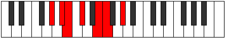

# Mode Larimic

## Links

- [Documentation](index.md)
- [Scales Index](Scales.md)
- [Modes Index](Modes.md)
- [Chords Index](Chords.md)

## Parent Scale

[Zacrimic](ScaleZacrimic.md)

## Number

[813](https://ianring.com/musictheory/scales/813)

## Perfection

- 3 Perfect notes
- 3 Perfect notes

## Perfection Profile

[false true false true true false]

## Permutations

| Tonic | Notes | Signature | Illustration | Audio |
|-------|-------|-----------|--------------|-------|
| [C](ModeCNaturalLarimic.md) | **C**, D, **Eb**, F, G#, **A**, **C** | C |  | [midi](ModeCNaturalLarimic.mid) [ogg](ModeCNaturalLarimic.ogg) |
| [C#](ModeCSharpLarimic.md) | **C#**, D#, **E**, F#, G##, **A#**, **C#** | C |  | [midi](ModeCSharpLarimic.mid) [ogg](ModeCSharpLarimic.ogg) |
| [Db](ModeDFlatLarimic.md) | **Db**, Eb, **Fb**, Gb, A, **Bb**, **Db** | C |  | [midi](ModeDFlatLarimic.mid) [ogg](ModeDFlatLarimic.ogg) |
| [D](ModeDNaturalLarimic.md) | **D**, E, **F**, G, A#, **B**, **D** | C |  | [midi](ModeDNaturalLarimic.mid) [ogg](ModeDNaturalLarimic.ogg) |
| [D#](ModeDSharpLarimic.md) | **D#**, E#, **F#**, G#, A##, **B#**, **D#** | C |  | [midi](ModeDSharpLarimic.mid) [ogg](ModeDSharpLarimic.ogg) |
| [Eb](ModeEFlatLarimic.md) | **Eb**, F, **Gb**, Ab, B, **C**, **Eb** | C |  | [midi](ModeEFlatLarimic.mid) [ogg](ModeEFlatLarimic.ogg) |
| [E](ModeENaturalLarimic.md) | **E**, F#, **G**, A, B#, **C#**, **E** | C |  | [midi](ModeENaturalLarimic.mid) [ogg](ModeENaturalLarimic.ogg) |
| [F](ModeFNaturalLarimic.md) | **F**, G, **Ab**, Bb, C#, **D**, **F** | C |  | [midi](ModeFNaturalLarimic.mid) [ogg](ModeFNaturalLarimic.ogg) |
| [F#](ModeFSharpLarimic.md) | **F#**, G#, **A**, B, C##, **D#**, **F#** | C |  | [midi](ModeFSharpLarimic.mid) [ogg](ModeFSharpLarimic.ogg) |
| [Gb](ModeGFlatLarimic.md) | **Gb**, Ab, **Bbb**, Cb, D, **Eb**, **Gb** | C |  | [midi](ModeGFlatLarimic.mid) [ogg](ModeGFlatLarimic.ogg) |
| [G](ModeGNaturalLarimic.md) | **G**, A, **Bb**, C, D#, **E**, **G** | C |  | [midi](ModeGNaturalLarimic.mid) [ogg](ModeGNaturalLarimic.ogg) |
| [G#](ModeGSharpLarimic.md) | **G#**, A#, **B**, C#, D##, **E#**, **G#** | C |  | [midi](ModeGSharpLarimic.mid) [ogg](ModeGSharpLarimic.ogg) |
| [Ab](ModeAFlatLarimic.md) | **Ab**, Bb, **Cb**, Db, E, **F**, **Ab** | C |  | [midi](ModeAFlatLarimic.mid) [ogg](ModeAFlatLarimic.ogg) |
| [A](ModeANaturalLarimic.md) | **A**, B, **C**, D, E#, **F#**, **A** | C |  | [midi](ModeANaturalLarimic.mid) [ogg](ModeANaturalLarimic.ogg) |
| [A#](ModeASharpLarimic.md) | **A#**, B#, **C#**, D#, E##, **F##**, **A#** | C |  | [midi](ModeASharpLarimic.mid) [ogg](ModeASharpLarimic.ogg) |
| [Bb](ModeBFlatLarimic.md) | **Bb**, C, **Db**, Eb, F#, **G**, **Bb** | C |  | [midi](ModeBFlatLarimic.mid) [ogg](ModeBFlatLarimic.ogg) |
| [B](ModeBNaturalLarimic.md) | **B**, C#, **D**, E, F##, **G#**, **B** | C |  | [midi](ModeBNaturalLarimic.mid) [ogg](ModeBNaturalLarimic.ogg) |
