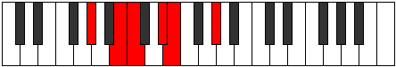
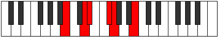

# Mode Laritonic

## Links

- [Documentation](index.md)
- [Scales Index](Scales.md)
- [Modes Index](Modes.md)
- [Chords Index](Chords.md)

## Parent Scale

[Zacritonic](ScaleZacritonic.md)

## Number

[409](https://ianring.com/musictheory/scales/409)

## Perfection

- 2 Perfect notes
- 3 Perfect notes

## Perfection Profile

[true false false false true]

## Permutations

| Tonic | Notes | Signature | Illustration | Audio |
|-------|-------|-----------|--------------|-------|
| [C](ModeCNaturalLaritonic.md) | C, **D#**, **E**, **G**, G#, C | C |  | [midi](ModeCNaturalLaritonic.mid) [ogg](ModeCNaturalLaritonic.ogg) |
| [C#](ModeCSharpLaritonic.md) | C#, **E**, **F**, **G#**, A, C# | C |  | [midi](ModeCSharpLaritonic.mid) [ogg](ModeCSharpLaritonic.ogg) |
| [Db](ModeDFlatLaritonic.md) | Db, **E**, **F**, **Ab**, A, Db | C |  | [midi](ModeDFlatLaritonic.mid) [ogg](ModeDFlatLaritonic.ogg) |
| [D](ModeDNaturalLaritonic.md) | D, **F**, **F#**, **A**, A#, D | C |  | [midi](ModeDNaturalLaritonic.mid) [ogg](ModeDNaturalLaritonic.ogg) |
| [D#](ModeDSharpLaritonic.md) | D#, **F#**, **G**, **A#**, B, D# | C |  | [midi](ModeDSharpLaritonic.mid) [ogg](ModeDSharpLaritonic.ogg) |
| [Eb](ModeEFlatLaritonic.md) | Eb, **Gb**, **G**, **Bb**, B, Eb | C |  | [midi](ModeEFlatLaritonic.mid) [ogg](ModeEFlatLaritonic.ogg) |
| [E](ModeENaturalLaritonic.md) | E, **G**, **G#**, **B**, C, E | C |  | [midi](ModeENaturalLaritonic.mid) [ogg](ModeENaturalLaritonic.ogg) |
| [F](ModeFNaturalLaritonic.md) | F, **G#**, **A**, **C**, C#, F | C |  | [midi](ModeFNaturalLaritonic.mid) [ogg](ModeFNaturalLaritonic.ogg) |
| [F#](ModeFSharpLaritonic.md) | F#, **A**, **A#**, **C#**, D, F# | C |  | [midi](ModeFSharpLaritonic.mid) [ogg](ModeFSharpLaritonic.ogg) |
| [Gb](ModeGFlatLaritonic.md) | Gb, **A**, **Bb**, **Db**, D, Gb | C |  | [midi](ModeGFlatLaritonic.mid) [ogg](ModeGFlatLaritonic.ogg) |
| [G](ModeGNaturalLaritonic.md) | G, **A#**, **B**, **D**, D#, G | C |  | [midi](ModeGNaturalLaritonic.mid) [ogg](ModeGNaturalLaritonic.ogg) |
| [G#](ModeGSharpLaritonic.md) | G#, **B**, **C**, **D#**, E, G# | C |  | [midi](ModeGSharpLaritonic.mid) [ogg](ModeGSharpLaritonic.ogg) |
| [Ab](ModeAFlatLaritonic.md) | Ab, **B**, **C**, **Eb**, E, Ab | C |  | [midi](ModeAFlatLaritonic.mid) [ogg](ModeAFlatLaritonic.ogg) |
| [A](ModeANaturalLaritonic.md) | A, **C**, **C#**, **E**, F, A | C |  | [midi](ModeANaturalLaritonic.mid) [ogg](ModeANaturalLaritonic.ogg) |
| [A#](ModeASharpLaritonic.md) | A#, **C#**, **D**, **F**, F#, A# | C |  | [midi](ModeASharpLaritonic.mid) [ogg](ModeASharpLaritonic.ogg) |
| [Bb](ModeBFlatLaritonic.md) | Bb, **Db**, **D**, **F**, Gb, Bb | C |  | [midi](ModeBFlatLaritonic.mid) [ogg](ModeBFlatLaritonic.ogg) |
| [B](ModeBNaturalLaritonic.md) | B, **D**, **D#**, **F#**, G, B | C |  | [midi](ModeBNaturalLaritonic.mid) [ogg](ModeBNaturalLaritonic.ogg) |
