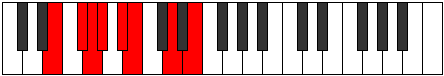

# Mode Lathian

## Links

- [Documentation](README.md)
- [Scales Index](Scales.md)
- [Modes Index](Modes.md)
- [Chords Index](Chords.md)

## Parent Scale

[Epacrian](ScaleEpacrian.md)

## Number

[1245](https://ianring.com/musictheory/scales/1245)

## Transposition

2, 1, 1, 2, 1, 3, 2

## Chord Pattern

i⁰, iii, iii, V⁺, V⁺, VIIb5, VIIb5

## Perfection

- 3 Perfect notes
- 4 Perfect notes

## Perfection Profile

[true false true false false true false]

## Permutations

| Tonic | Notes | Signature | Illustration | Audio |
|-------|-------|-----------|--------------|-------|
| [C](ModeCNaturalLathian.md) | C, **D**, Eb, **Fb**, **Gb**, Abb, **Bb**, C | C |  | [midi](https://github.com/edipermadi/music/blob/main/docs/ModeCNaturalLathian.mid?raw=true) |
| [C#](ModeCSharpLathian.md) | C#, **D#**, E, **F**, **G**, Ab, **B**, C# | C |  | [midi](https://github.com/edipermadi/music/blob/main/docs/ModeCSharpLathian.mid?raw=true) |
| [Db](ModeDFlatLathian.md) | Db, **Eb**, Fb, **Gbb**, **Abb**, Bbbb, **Cb**, Db | C |  | [midi](https://github.com/edipermadi/music/blob/main/docs/ModeDFlatLathian.mid?raw=true) |
| [D](ModeDNaturalLathian.md) | D, **E**, F, **Gb**, **Ab**, Bbb, **C**, D | C |  | [midi](https://github.com/edipermadi/music/blob/main/docs/ModeDNaturalLathian.mid?raw=true) |
| [D#](ModeDSharpLathian.md) | D#, **E#**, F#, **G**, **A**, Bb, **C#**, D# | C |  | [midi](https://github.com/edipermadi/music/blob/main/docs/ModeDSharpLathian.mid?raw=true) |
| [Eb](ModeEFlatLathian.md) | Eb, **F**, Gb, **Abb**, **Bbb**, Cbb, **Db**, Eb | C |  | [midi](https://github.com/edipermadi/music/blob/main/docs/ModeEFlatLathian.mid?raw=true) |
| [E](ModeENaturalLathian.md) | E, **F#**, G, **Ab**, **Bb**, Cb, **D**, E | C |  | [midi](https://github.com/edipermadi/music/blob/main/docs/ModeENaturalLathian.mid?raw=true) |
| [F](ModeFNaturalLathian.md) | F, **G**, Ab, **Bbb**, **Cb**, Dbb, **Eb**, F | C |  | [midi](https://github.com/edipermadi/music/blob/main/docs/ModeFNaturalLathian.mid?raw=true) |
| [F#](ModeFSharpLathian.md) | F#, **G#**, A, **Bb**, **C**, Db, **E**, F# | C |  | [midi](https://github.com/edipermadi/music/blob/main/docs/ModeFSharpLathian.mid?raw=true) |
| [Gb](ModeGFlatLathian.md) | Gb, **Ab**, Bbb, **Cbb**, **Dbb**, Ebbb, **Fb**, Gb | C |  | [midi](https://github.com/edipermadi/music/blob/main/docs/ModeGFlatLathian.mid?raw=true) |
| [G](ModeGNaturalLathian.md) | G, **A**, Bb, **Cb**, **Db**, Ebb, **F**, G | C |  | [midi](https://github.com/edipermadi/music/blob/main/docs/ModeGNaturalLathian.mid?raw=true) |
| [G#](ModeGSharpLathian.md) | G#, **A#**, B, **C**, **D**, Eb, **F#**, G# | C |  | [midi](https://github.com/edipermadi/music/blob/main/docs/ModeGSharpLathian.mid?raw=true) |
| [Ab](ModeAFlatLathian.md) | Ab, **Bb**, Cb, **Dbb**, **Ebb**, Fbb, **Gb**, Ab | C |  | [midi](https://github.com/edipermadi/music/blob/main/docs/ModeAFlatLathian.mid?raw=true) |
| [A](ModeANaturalLathian.md) | A, **B**, C, **Db**, **Eb**, Fb, **G**, A | C |  | [midi](https://github.com/edipermadi/music/blob/main/docs/ModeANaturalLathian.mid?raw=true) |
| [A#](ModeASharpLathian.md) | A#, **B#**, C#, **D**, **E**, F, **G#**, A# | C |  | [midi](https://github.com/edipermadi/music/blob/main/docs/ModeASharpLathian.mid?raw=true) |
| [Bb](ModeBFlatLathian.md) | Bb, **C**, Db, **Ebb**, **Fb**, Gbb, **Ab**, Bb | C |  | [midi](https://github.com/edipermadi/music/blob/main/docs/ModeBFlatLathian.mid?raw=true) |
| [B](ModeBNaturalLathian.md) | B, **C#**, D, **Eb**, **F**, Gb, **A**, B | C |  | [midi](https://github.com/edipermadi/music/blob/main/docs/ModeBNaturalLathian.mid?raw=true) |
