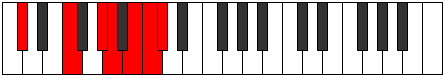
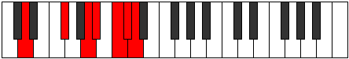
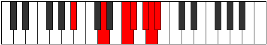

# Mode Lathimic

## Links

- [Documentation](index.md)
- [Scales Index](Scales.md)
- [Modes Index](Modes.md)
- [Chords Index](Chords.md)

## Parent Scale

[Lathimic](ScaleLathimic.md)

## Number

[3473](https://ianring.com/musictheory/scales/3473)

## Perfection

- 2 Perfect notes
- 4 Perfect notes

## Perfection Profile

[true true false false false false]

## Permutations

| Tonic | Notes | Signature | Illustration | Audio |
|-------|-------|-----------|--------------|-------|
| [C](ModeCNaturalLathimic.md) | C, D##, **E###**, **F###**, **G###**, **A##**, C | C |  | [midi](ModeCNaturalLathimic.mid) [ogg](ModeCNaturalLathimic.ogg) |
| [C#](ModeCSharpLathimic.md) | C#, D###, **F###**, **G##**, **A##**, **B#**, C# | C |  | [midi](ModeCSharpLathimic.mid) [ogg](ModeCSharpLathimic.ogg) |
| [Db](ModeDFlatLathimic.md) | Db, E#, **F###**, **G##**, **A##**, **B#**, Db | C |  | [midi](ModeDFlatLathimic.mid) [ogg](ModeDFlatLathimic.ogg) |
| [D](ModeDNaturalLathimic.md) | D, E##, **Cbbb**, **Cbb**, **Dbb**, **Ebbb**, D | C |  | [midi](ModeDNaturalLathimic.mid) [ogg](ModeDNaturalLathimic.ogg) |
| [D#](ModeDSharpLathimic.md) | D#, E###, **Cbb**, **Dbbb**, **Ebbb**, **Fbbb**, D# | C |  | [midi](ModeDSharpLathimic.mid) [ogg](ModeDSharpLathimic.ogg) |
| [Eb](ModeEFlatLathimic.md) | Eb, F##, **G###**, **A##**, **B##**, **C##**, Eb | C |  | [midi](ModeEFlatLathimic.mid) [ogg](ModeEFlatLathimic.ogg) |
| [E](ModeENaturalLathimic.md) | E, F###, **Cb**, **Dbb**, **Ebb**, **Fbb**, E | C |  | [midi](ModeENaturalLathimic.mid) [ogg](ModeENaturalLathimic.ogg) |
| [F](ModeFNaturalLathimic.md) | F, G##, **A###**, **B##**, **C###**, **D##**, F | C |  | [midi](ModeFNaturalLathimic.mid) [ogg](ModeFNaturalLathimic.ogg) |
| [F#](ModeFSharpLathimic.md) | F#, G###, **Db**, **Ebb**, **Fb**, **Gbb**, F# | C |  | [midi](ModeFSharpLathimic.mid) [ogg](ModeFSharpLathimic.ogg) |
| [Gb](ModeGFlatLathimic.md) | Gb, A#, **B##**, **C##**, **D##**, **E#**, Gb | C |  | [midi](ModeGFlatLathimic.mid) [ogg](ModeGFlatLathimic.ogg) |
| [G](ModeGNaturalLathimic.md) | G, A##, **B###**, **C###**, **D###**, **E##**, G | C |  | [midi](ModeGNaturalLathimic.mid) [ogg](ModeGNaturalLathimic.ogg) |
| [G#](ModeGSharpLathimic.md) | G#, A###, **C###**, **D##**, **E##**, **F##**, G# | C |  | [midi](ModeGSharpLathimic.mid) [ogg](ModeGSharpLathimic.ogg) |
| [Ab](ModeAFlatLathimic.md) | Ab, B#, **C###**, **D##**, **E##**, **F##**, Ab | C |  | [midi](ModeAFlatLathimic.mid) [ogg](ModeAFlatLathimic.ogg) |
| [A](ModeANaturalLathimic.md) | A, B##, **D##**, **E#**, **F##**, **G#**, A | C |  | [midi](ModeANaturalLathimic.mid) [ogg](ModeANaturalLathimic.ogg) |
| [A#](ModeASharpLathimic.md) | A#, B###, **D###**, **E##**, **F###**, **G##**, A# | C |  | [midi](ModeASharpLathimic.mid) [ogg](ModeASharpLathimic.ogg) |
| [Bb](ModeBFlatLathimic.md) | Bb, C##, **D###**, **E##**, **F###**, **G##**, Bb | C |  | [midi](ModeBFlatLathimic.mid) [ogg](ModeBFlatLathimic.ogg) |
| [B](ModeBNaturalLathimic.md) | B, C###, **E##**, **F##**, **G##**, **A#**, B | C |  | [midi](ModeBNaturalLathimic.mid) [ogg](ModeBNaturalLathimic.ogg) |
