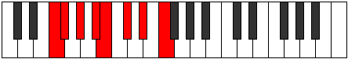

# Mode Locrian

## Links

- [Documentation](README.md)
- [Scales Index](Scales.md)
- [Modes Index](Modes.md)
- [Chords Index](Chords.md)

## Parent Scale

[Lydian](ScaleLydian.md)

## Number

[1387](https://ianring.com/musictheory/scales/1387)

## Transposition

1, 2, 2, 1, 2, 2, 2

## Chord Pattern

i⁰, II, iii, iv, V, VI, vii

## Perfection

- 6 Perfect notes
- 1 Perfect notes

## Perfection Profile

false, true, true, true, true, true, true

## Permutations

| Tonic | Notes | Signature | Illustration | Audio |
|-------|-------|-----------|--------------|-------|
| [C](ModeCNaturalLocrian.md) | **C**, Db, Eb, F, Gb, Ab, Bb, **C** | Db, C# |  | [midi](https://github.com/edipermadi/music/blob/main/docs/ModeCNaturalLocrian.mid?raw=true) |
| [C#](ModeCSharpLocrian.md) | **C#**, D, E, F#, G, A, B, **C#** | D |  | [midi](https://github.com/edipermadi/music/blob/main/docs/ModeCSharpLocrian.mid?raw=true) |
| [Db](ModeDFlatLocrian.md) | **Db**, Ebb, Fb, Gb, Abb, Bbb, Cb, **Db** | D |  | [midi](https://github.com/edipermadi/music/blob/main/docs/ModeDFlatLocrian.mid?raw=true) |
| [D](ModeDNaturalLocrian.md) | **D**, Eb, F, G, Ab, Bb, C, **D** | Eb |  | [midi](https://github.com/edipermadi/music/blob/main/docs/ModeDNaturalLocrian.mid?raw=true) |
| [D#](ModeDSharpLocrian.md) | **D#**, E, F#, G#, A, B, C#, **D#** | E |  | [midi](https://github.com/edipermadi/music/blob/main/docs/ModeDSharpLocrian.mid?raw=true) |
| [Eb](ModeEFlatLocrian.md) | **Eb**, Fb, Gb, Ab, Bbb, Cb, Db, **Eb** | E |  | [midi](https://github.com/edipermadi/music/blob/main/docs/ModeEFlatLocrian.mid?raw=true) |
| [E](ModeENaturalLocrian.md) | **E**, F, G, A, Bb, C, D, **E** | F |  | [midi](https://github.com/edipermadi/music/blob/main/docs/ModeENaturalLocrian.mid?raw=true) |
| [F](ModeFNaturalLocrian.md) | **F**, Gb, Ab, Bb, Cb, Db, Eb, **F** | F#, Gb |  | [midi](https://github.com/edipermadi/music/blob/main/docs/ModeFNaturalLocrian.mid?raw=true) |
| [F#](ModeFSharpLocrian.md) | **F#**, G, A, B, C, D, E, **F#** | G |  | [midi](https://github.com/edipermadi/music/blob/main/docs/ModeFSharpLocrian.mid?raw=true) |
| [Gb](ModeGFlatLocrian.md) | **Gb**, Abb, Bbb, Cb, Dbb, Ebb, Fb, **Gb** | G |  | [midi](https://github.com/edipermadi/music/blob/main/docs/ModeGFlatLocrian.mid?raw=true) |
| [G](ModeGNaturalLocrian.md) | **G**, Ab, Bb, C, Db, Eb, F, **G** | Ab |  | [midi](https://github.com/edipermadi/music/blob/main/docs/ModeGNaturalLocrian.mid?raw=true) |
| [G#](ModeGSharpLocrian.md) | **G#**, A, B, C#, D, E, F#, **G#** | A |  | [midi](https://github.com/edipermadi/music/blob/main/docs/ModeGSharpLocrian.mid?raw=true) |
| [Ab](ModeAFlatLocrian.md) | **Ab**, Bbb, Cb, Db, Ebb, Fb, Gb, **Ab** | A |  | [midi](https://github.com/edipermadi/music/blob/main/docs/ModeAFlatLocrian.mid?raw=true) |
| [A](ModeANaturalLocrian.md) | **A**, Bb, C, D, Eb, F, G, **A** | Bb |  | [midi](https://github.com/edipermadi/music/blob/main/docs/ModeANaturalLocrian.mid?raw=true) |
| [A#](ModeASharpLocrian.md) | **A#**, B, C#, D#, E, F#, G#, **A#** | B |  | [midi](https://github.com/edipermadi/music/blob/main/docs/ModeASharpLocrian.mid?raw=true) |
| [Bb](ModeBFlatLocrian.md) | **Bb**, Cb, Db, Eb, Fb, Gb, Ab, **Bb** | B |  | [midi](https://github.com/edipermadi/music/blob/main/docs/ModeBFlatLocrian.mid?raw=true) |
| [B](ModeBNaturalLocrian.md) | **B**, C, D, E, F, G, A, **B** | C |  | [midi](https://github.com/edipermadi/music/blob/main/docs/ModeBNaturalLocrian.mid?raw=true) |
