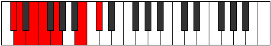
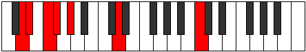
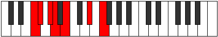
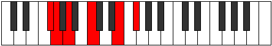
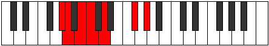
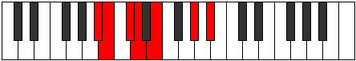
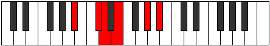
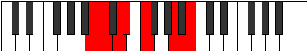

# Mode Locrimic

## Links

- [Documentation](README.md)
- [Scales Index](Scales.md)
- [Modes Index](Modes.md)
- [Chords Index](Chords.md)

## Parent Scale

[Manimic](ScaleManimic.md)

## Number

[1115](https://ianring.com/musictheory/scales/1115)

## Transposition

1, 2, 1, 2, 4, 2

## Chord Pattern

i⁰, vi⁰

## Perfection

- 2 Perfect notes
- 4 Perfect notes

## Perfection Profile

[false false true false true false]

## Permutations

| Tonic | Notes | Signature | Illustration | Audio |
|-------|-------|-----------|--------------|-------|
| [C](ModeCNaturalLocrimic.md) | **C**, **Db**, Eb, **Fb**, Gb, **A#**, **C** | C |  | [midi](https://github.com/edipermadi/music/blob/main/docs/ModeCNaturalLocrimic.mid?raw=true) |
| [C#](ModeCSharpLocrimic.md) | **C#**, **D**, E, **F**, G, **A##**, **C#** | C |  | [midi](https://github.com/edipermadi/music/blob/main/docs/ModeCSharpLocrimic.mid?raw=true) |
| [Db](ModeDFlatLocrimic.md) | **Db**, **Ebb**, Fb, **Gbb**, Abb, **B**, **Db** | C |  | [midi](https://github.com/edipermadi/music/blob/main/docs/ModeDFlatLocrimic.mid?raw=true) |
| [D](ModeDNaturalLocrimic.md) | **D**, **Eb**, F, **Gb**, Ab, **B#**, **D** | C |  | [midi](https://github.com/edipermadi/music/blob/main/docs/ModeDNaturalLocrimic.mid?raw=true) |
| [D#](ModeDSharpLocrimic.md) | **D#**, **E**, F#, **G**, A, **B##**, **D#** | C |  | [midi](https://github.com/edipermadi/music/blob/main/docs/ModeDSharpLocrimic.mid?raw=true) |
| [Eb](ModeEFlatLocrimic.md) | **Eb**, **Fb**, Gb, **Abb**, Bbb, **C#**, **Eb** | C |  | [midi](https://github.com/edipermadi/music/blob/main/docs/ModeEFlatLocrimic.mid?raw=true) |
| [E](ModeENaturalLocrimic.md) | **E**, **F**, G, **Ab**, Bb, **C##**, **E** | C |  | [midi](https://github.com/edipermadi/music/blob/main/docs/ModeENaturalLocrimic.mid?raw=true) |
| [F](ModeFNaturalLocrimic.md) | **F**, **Gb**, Ab, **Bbb**, Cb, **D#**, **F** | C |  | [midi](https://github.com/edipermadi/music/blob/main/docs/ModeFNaturalLocrimic.mid?raw=true) |
| [F#](ModeFSharpLocrimic.md) | **F#**, **G**, A, **Bb**, C, **D##**, **F#** | C |  | [midi](https://github.com/edipermadi/music/blob/main/docs/ModeFSharpLocrimic.mid?raw=true) |
| [Gb](ModeGFlatLocrimic.md) | **Gb**, **Abb**, Bbb, **Cbb**, Dbb, **E**, **Gb** | C |  | [midi](https://github.com/edipermadi/music/blob/main/docs/ModeGFlatLocrimic.mid?raw=true) |
| [G](ModeGNaturalLocrimic.md) | **G**, **Ab**, Bb, **Cb**, Db, **E#**, **G** | C |  | [midi](https://github.com/edipermadi/music/blob/main/docs/ModeGNaturalLocrimic.mid?raw=true) |
| [G#](ModeGSharpLocrimic.md) | **G#**, **A**, B, **C**, D, **E##**, **G#** | C |  | [midi](https://github.com/edipermadi/music/blob/main/docs/ModeGSharpLocrimic.mid?raw=true) |
| [Ab](ModeAFlatLocrimic.md) | **Ab**, **Bbb**, Cb, **Dbb**, Ebb, **F#**, **Ab** | C |  | [midi](https://github.com/edipermadi/music/blob/main/docs/ModeAFlatLocrimic.mid?raw=true) |
| [A](ModeANaturalLocrimic.md) | **A**, **Bb**, C, **Db**, Eb, **F##**, **A** | C |  | [midi](https://github.com/edipermadi/music/blob/main/docs/ModeANaturalLocrimic.mid?raw=true) |
| [A#](ModeASharpLocrimic.md) | **A#**, **B**, C#, **D**, E, **F###**, **A#** | C |  | [midi](https://github.com/edipermadi/music/blob/main/docs/ModeASharpLocrimic.mid?raw=true) |
| [Bb](ModeBFlatLocrimic.md) | **Bb**, **Cb**, Db, **Ebb**, Fb, **G#**, **Bb** | C |  | [midi](https://github.com/edipermadi/music/blob/main/docs/ModeBFlatLocrimic.mid?raw=true) |
| [B](ModeBNaturalLocrimic.md) | **B**, **C**, D, **Eb**, F, **G##**, **B** | C |  | [midi](https://github.com/edipermadi/music/blob/main/docs/ModeBNaturalLocrimic.mid?raw=true) |
