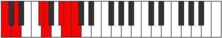
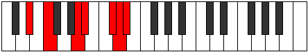
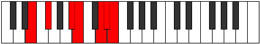

# Mode Lodimic

## Links

- [Documentation](index.md)
- [Scales Index](Scales.md)
- [Modes Index](Modes.md)
- [Chords Index](Chords.md)

## Parent Scale

[Thogimic](ScaleThogimic.md)

## Number

[3269](https://ianring.com/musictheory/scales/3269)

## Perfection

- 3 Perfect notes
- 3 Perfect notes

## Perfection Profile

[true false false true false true]

## Permutations

| Tonic | Notes | Signature | Illustration | Audio |
|-------|-------|-----------|--------------|-------|
| [C](ModeCNaturalLodimic.md) | C, **D**, **E##**, F##, **G###**, A##, C | C |  | [midi](ModeCNaturalLodimic.mid) [ogg](ModeCNaturalLodimic.ogg) |
| [C#](ModeCSharpLodimic.md) | C#, **D#**, **E###**, F###, **Cb**, Dbb, C# | C |  | [midi](ModeCSharpLodimic.mid) [ogg](ModeCSharpLodimic.ogg) |
| [Db](ModeDFlatLodimic.md) | Db, **Eb**, **F##**, G#, **A##**, B#, Db | C |  | [midi](ModeDFlatLodimic.mid) [ogg](ModeDFlatLodimic.ogg) |
| [D](ModeDNaturalLodimic.md) | D, **E**, **F###**, G##, **A###**, B##, D | C |  | [midi](ModeDNaturalLodimic.mid) [ogg](ModeDNaturalLodimic.ogg) |
| [D#](ModeDSharpLodimic.md) | D#, **E#**, **Cbbb**, Cbb, **Db**, Ebb, D# | C |  | [midi](ModeDSharpLodimic.mid) [ogg](ModeDSharpLodimic.ogg) |
| [Eb](ModeEFlatLodimic.md) | Eb, **F**, **G##**, A#, **B##**, C##, Eb | C |  | [midi](ModeEFlatLodimic.mid) [ogg](ModeEFlatLodimic.ogg) |
| [E](ModeENaturalLodimic.md) | E, **F#**, **G###**, A##, **B###**, C###, E | C |  | [midi](ModeENaturalLodimic.mid) [ogg](ModeENaturalLodimic.ogg) |
| [F](ModeFNaturalLodimic.md) | F, **G**, **A##**, B#, **C###**, D##, F | C |  | [midi](ModeFNaturalLodimic.mid) [ogg](ModeFNaturalLodimic.ogg) |
| [F#](ModeFSharpLodimic.md) | F#, **G#**, **A###**, B##, **D##**, E#, F# | C |  | [midi](ModeFSharpLodimic.mid) [ogg](ModeFSharpLodimic.ogg) |
| [Gb](ModeGFlatLodimic.md) | Gb, **Ab**, **B#**, C#, **D##**, E#, Gb | C |  | [midi](ModeGFlatLodimic.mid) [ogg](ModeGFlatLodimic.ogg) |
| [G](ModeGNaturalLodimic.md) | G, **A**, **B##**, C##, **D###**, E##, G | C |  | [midi](ModeGNaturalLodimic.mid) [ogg](ModeGNaturalLodimic.ogg) |
| [G#](ModeGSharpLodimic.md) | G#, **A#**, **B###**, C###, **E##**, F##, G# | C |  | [midi](ModeGSharpLodimic.mid) [ogg](ModeGSharpLodimic.ogg) |
| [Ab](ModeAFlatLodimic.md) | Ab, **Bb**, **C##**, D#, **E##**, F##, Ab | C |  | [midi](ModeAFlatLodimic.mid) [ogg](ModeAFlatLodimic.ogg) |
| [A](ModeANaturalLodimic.md) | A, **B**, **C###**, D##, **E###**, F###, A | C |  | [midi](ModeANaturalLodimic.mid) [ogg](ModeANaturalLodimic.ogg) |
| [A#](ModeASharpLodimic.md) | A#, **B#**, **D##**, E#, **F###**, G##, A# | C |  | [midi](ModeASharpLodimic.mid) [ogg](ModeASharpLodimic.ogg) |
| [Bb](ModeBFlatLodimic.md) | Bb, **C**, **D##**, E#, **F###**, G##, Bb | C |  | [midi](ModeBFlatLodimic.mid) [ogg](ModeBFlatLodimic.ogg) |
| [B](ModeBNaturalLodimic.md) | B, **C#**, **D###**, E##, **Cbbb**, Cbb, B | C |  | [midi](ModeBNaturalLodimic.mid) [ogg](ModeBNaturalLodimic.ogg) |
