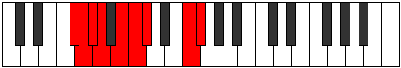
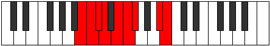

# Mode Lodyllic

## Links

- [Documentation](index.md)
- [Scales Index](Scales.md)
- [Modes Index](Modes.md)
- [Chords Index](Chords.md)

## Parent Scale

[Aeoladyllic](ScaleAeoladyllic.md)

## Number

[2287](https://ianring.com/musictheory/scales/2287)

## Perfection

- 5 Perfect notes
- 3 Perfect notes

## Perfection Profile

[true false false false true true true true]

## Permutations

| Tonic | Notes | Signature | Illustration | Audio |
|-------|-------|-----------|--------------|-------|
| [C](ModeCNaturalLodyllic.md) | C, **C#**, **D**, **D#**, F, F#, G, B, C | C |  | [midi](ModeCNaturalLodyllic.mid) [ogg](ModeCNaturalLodyllic.ogg) |
| [C#](ModeCSharpLodyllic.md) | C#, **D**, **D#**, **E**, F#, G, G#, C, C# | C |  | [midi](ModeCSharpLodyllic.mid) [ogg](ModeCSharpLodyllic.ogg) |
| [Db](ModeDFlatLodyllic.md) | Db, **D**, **Eb**, **E**, Gb, G, Ab, C, Db | C |  | [midi](ModeDFlatLodyllic.mid) [ogg](ModeDFlatLodyllic.ogg) |
| [D](ModeDNaturalLodyllic.md) | D, **D#**, **E**, **F**, G, G#, A, C#, D | C |  | [midi](ModeDNaturalLodyllic.mid) [ogg](ModeDNaturalLodyllic.ogg) |
| [D#](ModeDSharpLodyllic.md) | D#, **E**, **F**, **F#**, G#, A, A#, D, D# | C |  | [midi](ModeDSharpLodyllic.mid) [ogg](ModeDSharpLodyllic.ogg) |
| [Eb](ModeEFlatLodyllic.md) | Eb, **E**, **F**, **Gb**, Ab, A, Bb, D, Eb | C |  | [midi](ModeEFlatLodyllic.mid) [ogg](ModeEFlatLodyllic.ogg) |
| [E](ModeENaturalLodyllic.md) | E, **F**, **F#**, **G**, A, A#, B, D#, E | C |  | [midi](ModeENaturalLodyllic.mid) [ogg](ModeENaturalLodyllic.ogg) |
| [F](ModeFNaturalLodyllic.md) | F, **F#**, **G**, **G#**, A#, B, C, E, F | C |  | [midi](ModeFNaturalLodyllic.mid) [ogg](ModeFNaturalLodyllic.ogg) |
| [F#](ModeFSharpLodyllic.md) | F#, **G**, **G#**, **A**, B, C, C#, F, F# | C |  | [midi](ModeFSharpLodyllic.mid) [ogg](ModeFSharpLodyllic.ogg) |
| [Gb](ModeGFlatLodyllic.md) | Gb, **G**, **Ab**, **A**, B, C, Db, F, Gb | C |  | [midi](ModeGFlatLodyllic.mid) [ogg](ModeGFlatLodyllic.ogg) |
| [G](ModeGNaturalLodyllic.md) | G, **G#**, **A**, **A#**, C, C#, D, F#, G | C |  | [midi](ModeGNaturalLodyllic.mid) [ogg](ModeGNaturalLodyllic.ogg) |
| [G#](ModeGSharpLodyllic.md) | G#, **A**, **A#**, **B**, C#, D, D#, G, G# | C |  | [midi](ModeGSharpLodyllic.mid) [ogg](ModeGSharpLodyllic.ogg) |
| [Ab](ModeAFlatLodyllic.md) | Ab, **A**, **Bb**, **B**, Db, D, Eb, G, Ab | C |  | [midi](ModeAFlatLodyllic.mid) [ogg](ModeAFlatLodyllic.ogg) |
| [A](ModeANaturalLodyllic.md) | A, **A#**, **B**, **C**, D, D#, E, G#, A | C |  | [midi](ModeANaturalLodyllic.mid) [ogg](ModeANaturalLodyllic.ogg) |
| [A#](ModeASharpLodyllic.md) | A#, **B**, **C**, **C#**, D#, E, F, A, A# | C |  | [midi](ModeASharpLodyllic.mid) [ogg](ModeASharpLodyllic.ogg) |
| [Bb](ModeBFlatLodyllic.md) | Bb, **B**, **C**, **Db**, Eb, E, F, A, Bb | C |  | [midi](ModeBFlatLodyllic.mid) [ogg](ModeBFlatLodyllic.ogg) |
| [B](ModeBNaturalLodyllic.md) | B, **C**, **C#**, **D**, E, F, F#, A#, B | C |  | [midi](ModeBNaturalLodyllic.mid) [ogg](ModeBNaturalLodyllic.ogg) |
