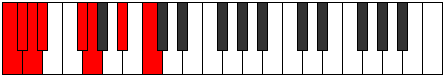
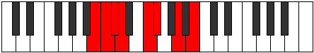

# Mode Logian

## Links

- [Documentation](index.md)
- [Scales Index](Scales.md)
- [Modes Index](Modes.md)
- [Chords Index](Chords.md)

## Parent Scale

[Laptian](ScaleLaptian.md)

## Number

[1231](https://ianring.com/musictheory/scales/1231)

## Interval Pattern

1, 1, 1, 3, 1, 3, 2

## Chord Pattern

III⁺, V

## Perfection

- 4 Perfect notes
- 3 Perfect notes

## Perfection Profile

[true false false true true true false]

## Permutations

| Tonic | Notes | Signature | Illustration | Audio |
|-------|-------|-----------|--------------|-------|
| [C](ModeCNaturalLogian.md) | C, **Db**, **Ebb**, Fbb, Gb, Abb, **Bb**, C | C |  | [midi](https://github.com/edipermadi/music/blob/main/docs/ModeCNaturalLogian.mid?raw=true) |
| [C#](ModeCSharpLogian.md) | C#, **D**, **Eb**, Fb, G, Ab, **B**, C# | C |  | [midi](https://github.com/edipermadi/music/blob/main/docs/ModeCSharpLogian.mid?raw=true) |
| [Db](ModeDFlatLogian.md) | Db, **Ebb**, **Fbb**, Gbbb, Abb, Bbbb, **Cb**, Db | C |  | [midi](https://github.com/edipermadi/music/blob/main/docs/ModeDFlatLogian.mid?raw=true) |
| [D](ModeDNaturalLogian.md) | D, **Eb**, **Fb**, Gbb, Ab, Bbb, **C**, D | C |  | [midi](https://github.com/edipermadi/music/blob/main/docs/ModeDNaturalLogian.mid?raw=true) |
| [D#](ModeDSharpLogian.md) | D#, **E**, **F**, Gb, A, Bb, **C#**, D# | C |  | [midi](https://github.com/edipermadi/music/blob/main/docs/ModeDSharpLogian.mid?raw=true) |
| [Eb](ModeEFlatLogian.md) | Eb, **Fb**, **Gbb**, Abbb, Bbb, Cbb, **Db**, Eb | C |  | [midi](https://github.com/edipermadi/music/blob/main/docs/ModeEFlatLogian.mid?raw=true) |
| [E](ModeENaturalLogian.md) | E, **F**, **Gb**, Abb, Bb, Cb, **D**, E | C |  | [midi](https://github.com/edipermadi/music/blob/main/docs/ModeENaturalLogian.mid?raw=true) |
| [F](ModeFNaturalLogian.md) | F, **Gb**, **Abb**, Bbbb, Cb, Dbb, **Eb**, F | C |  | [midi](https://github.com/edipermadi/music/blob/main/docs/ModeFNaturalLogian.mid?raw=true) |
| [F#](ModeFSharpLogian.md) | F#, **G**, **Ab**, Bbb, C, Db, **E**, F# | C |  | [midi](https://github.com/edipermadi/music/blob/main/docs/ModeFSharpLogian.mid?raw=true) |
| [Gb](ModeGFlatLogian.md) | Gb, **Abb**, **Bbbb**, Cbbb, Dbb, Ebbb, **Fb**, Gb | C |  | [midi](https://github.com/edipermadi/music/blob/main/docs/ModeGFlatLogian.mid?raw=true) |
| [G](ModeGNaturalLogian.md) | G, **Ab**, **Bbb**, Cbb, Db, Ebb, **F**, G | C |  | [midi](https://github.com/edipermadi/music/blob/main/docs/ModeGNaturalLogian.mid?raw=true) |
| [G#](ModeGSharpLogian.md) | G#, **A**, **Bb**, Cb, D, Eb, **F#**, G# | C |  | [midi](https://github.com/edipermadi/music/blob/main/docs/ModeGSharpLogian.mid?raw=true) |
| [Ab](ModeAFlatLogian.md) | Ab, **Bbb**, **Cbb**, Dbbb, Ebb, Fbb, **Gb**, Ab | C |  | [midi](https://github.com/edipermadi/music/blob/main/docs/ModeAFlatLogian.mid?raw=true) |
| [A](ModeANaturalLogian.md) | A, **Bb**, **Cb**, Dbb, Eb, Fb, **G**, A | C |  | [midi](https://github.com/edipermadi/music/blob/main/docs/ModeANaturalLogian.mid?raw=true) |
| [A#](ModeASharpLogian.md) | A#, **B**, **C**, Db, E, F, **G#**, A# | C |  | [midi](https://github.com/edipermadi/music/blob/main/docs/ModeASharpLogian.mid?raw=true) |
| [Bb](ModeBFlatLogian.md) | Bb, **Cb**, **Dbb**, Ebbb, Fb, Gbb, **Ab**, Bb | C |  | [midi](https://github.com/edipermadi/music/blob/main/docs/ModeBFlatLogian.mid?raw=true) |
| [B](ModeBNaturalLogian.md) | B, **C**, **Db**, Ebb, F, Gb, **A**, B | C |  | [midi](https://github.com/edipermadi/music/blob/main/docs/ModeBNaturalLogian.mid?raw=true) |
