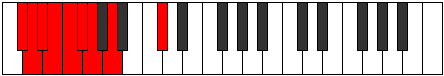
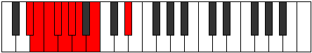

# Mode Logyllic

## Links

- [Documentation](README.md)
- [Scales Index](Scales.md)
- [Modes Index](Modes.md)
- [Chords Index](Chords.md)

## Parent Scale

[Stolyllic](ScaleStolyllic.md)

## Number

[383](https://ianring.com/musictheory/scales/383)

## Transposition

1, 1, 1, 1, 1, 1, 2, 4

## Chord Pattern

## Perfection

- 4 Perfect notes
- 4 Perfect notes

## Perfection Profile

[false true false false false true true true]

## Permutations

| Tonic | Notes | Signature | Illustration | Audio |
|-------|-------|-----------|--------------|-------|
| [C](ModeCNaturalLogyllic.md) | **C**, C#, **D**, **D#**, **E**, F, F#, G#, **C** | C |  | [midi](https://github.com/edipermadi/music/blob/main/docs/ModeCNaturalLogyllic.mid?raw=true) |
| [C#](ModeCSharpLogyllic.md) | **C#**, D, **D#**, **E**, **F**, F#, G, A, **C#** | C |  | [midi](https://github.com/edipermadi/music/blob/main/docs/ModeCSharpLogyllic.mid?raw=true) |
| [Db](ModeDFlatLogyllic.md) | **Db**, D, **Eb**, **E**, **F**, Gb, G, A, **Db** | C |  | [midi](https://github.com/edipermadi/music/blob/main/docs/ModeDFlatLogyllic.mid?raw=true) |
| [D](ModeDNaturalLogyllic.md) | **D**, D#, **E**, **F**, **F#**, G, G#, A#, **D** | C |  | [midi](https://github.com/edipermadi/music/blob/main/docs/ModeDNaturalLogyllic.mid?raw=true) |
| [D#](ModeDSharpLogyllic.md) | **D#**, E, **F**, **F#**, **G**, G#, A, B, **D#** | C |  | [midi](https://github.com/edipermadi/music/blob/main/docs/ModeDSharpLogyllic.mid?raw=true) |
| [Eb](ModeEFlatLogyllic.md) | **Eb**, E, **F**, **Gb**, **G**, Ab, A, B, **Eb** | C |  | [midi](https://github.com/edipermadi/music/blob/main/docs/ModeEFlatLogyllic.mid?raw=true) |
| [E](ModeENaturalLogyllic.md) | **E**, F, **F#**, **G**, **G#**, A, A#, C, **E** | C |  | [midi](https://github.com/edipermadi/music/blob/main/docs/ModeENaturalLogyllic.mid?raw=true) |
| [F](ModeFNaturalLogyllic.md) | **F**, F#, **G**, **G#**, **A**, A#, B, C#, **F** | C |  | [midi](https://github.com/edipermadi/music/blob/main/docs/ModeFNaturalLogyllic.mid?raw=true) |
| [F#](ModeFSharpLogyllic.md) | **F#**, G, **G#**, **A**, **A#**, B, C, D, **F#** | C |  | [midi](https://github.com/edipermadi/music/blob/main/docs/ModeFSharpLogyllic.mid?raw=true) |
| [Gb](ModeGFlatLogyllic.md) | **Gb**, G, **Ab**, **A**, **Bb**, B, C, D, **Gb** | C |  | [midi](https://github.com/edipermadi/music/blob/main/docs/ModeGFlatLogyllic.mid?raw=true) |
| [G](ModeGNaturalLogyllic.md) | **G**, G#, **A**, **A#**, **B**, C, C#, D#, **G** | C |  | [midi](https://github.com/edipermadi/music/blob/main/docs/ModeGNaturalLogyllic.mid?raw=true) |
| [G#](ModeGSharpLogyllic.md) | **G#**, A, **A#**, **B**, **C**, C#, D, E, **G#** | C |  | [midi](https://github.com/edipermadi/music/blob/main/docs/ModeGSharpLogyllic.mid?raw=true) |
| [Ab](ModeAFlatLogyllic.md) | **Ab**, A, **Bb**, **B**, **C**, Db, D, E, **Ab** | C |  | [midi](https://github.com/edipermadi/music/blob/main/docs/ModeAFlatLogyllic.mid?raw=true) |
| [A](ModeANaturalLogyllic.md) | **A**, A#, **B**, **C**, **C#**, D, D#, F, **A** | C |  | [midi](https://github.com/edipermadi/music/blob/main/docs/ModeANaturalLogyllic.mid?raw=true) |
| [A#](ModeASharpLogyllic.md) | **A#**, B, **C**, **C#**, **D**, D#, E, F#, **A#** | C |  | [midi](https://github.com/edipermadi/music/blob/main/docs/ModeASharpLogyllic.mid?raw=true) |
| [Bb](ModeBFlatLogyllic.md) | **Bb**, B, **C**, **Db**, **D**, Eb, E, Gb, **Bb** | C |  | [midi](https://github.com/edipermadi/music/blob/main/docs/ModeBFlatLogyllic.mid?raw=true) |
| [B](ModeBNaturalLogyllic.md) | **B**, C, **C#**, **D**, **D#**, E, F, G, **B** | C |  | [midi](https://github.com/edipermadi/music/blob/main/docs/ModeBNaturalLogyllic.mid?raw=true) |
