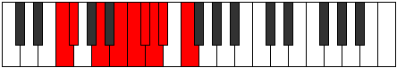

# Mode Lolyllic

## Links

- [Documentation](index.md)
- [Scales Index](Scales.md)
- [Modes Index](Modes.md)
- [Chords Index](Chords.md)

## Parent Scale

[Aeronyllic](ScaleAeronyllic.md)

## Number

[2003](https://ianring.com/musictheory/scales/2003)

## Perfection

- 4 Perfect notes
- 4 Perfect notes

## Perfection Profile

[true true false true false false true false]

## Permutations

| Tonic | Notes | Signature | Illustration | Audio |
|-------|-------|-----------|--------------|-------|
| [C](ModeCNaturalLolyllic.md) | C, C#, **E**, F#, **G**, **G#**, A, **A#**, C | C |  | [midi](ModeCNaturalLolyllic.mid) [ogg](ModeCNaturalLolyllic.ogg) |
| [C#](ModeCSharpLolyllic.md) | C#, D, **F**, G, **G#**, **A**, A#, **B**, C# | C |  | [midi](ModeCSharpLolyllic.mid) [ogg](ModeCSharpLolyllic.ogg) |
| [Db](ModeDFlatLolyllic.md) | Db, D, **F**, G, **Ab**, **A**, Bb, **B**, Db | C |  | [midi](ModeDFlatLolyllic.mid) [ogg](ModeDFlatLolyllic.ogg) |
| [D](ModeDNaturalLolyllic.md) | D, D#, **F#**, G#, **A**, **A#**, B, **C**, D | C |  | [midi](ModeDNaturalLolyllic.mid) [ogg](ModeDNaturalLolyllic.ogg) |
| [D#](ModeDSharpLolyllic.md) | D#, E, **G**, A, **A#**, **B**, C, **C#**, D# | C |  | [midi](ModeDSharpLolyllic.mid) [ogg](ModeDSharpLolyllic.ogg) |
| [Eb](ModeEFlatLolyllic.md) | Eb, E, **G**, A, **Bb**, **B**, C, **Db**, Eb | C |  | [midi](ModeEFlatLolyllic.mid) [ogg](ModeEFlatLolyllic.ogg) |
| [E](ModeENaturalLolyllic.md) | E, F, **G#**, A#, **B**, **C**, C#, **D**, E | C |  | [midi](ModeENaturalLolyllic.mid) [ogg](ModeENaturalLolyllic.ogg) |
| [F](ModeFNaturalLolyllic.md) | F, F#, **A**, B, **C**, **C#**, D, **D#**, F | C |  | [midi](ModeFNaturalLolyllic.mid) [ogg](ModeFNaturalLolyllic.ogg) |
| [F#](ModeFSharpLolyllic.md) | F#, G, **A#**, C, **C#**, **D**, D#, **E**, F# | C |  | [midi](ModeFSharpLolyllic.mid) [ogg](ModeFSharpLolyllic.ogg) |
| [Gb](ModeGFlatLolyllic.md) | Gb, G, **Bb**, C, **Db**, **D**, Eb, **E**, Gb | C |  | [midi](ModeGFlatLolyllic.mid) [ogg](ModeGFlatLolyllic.ogg) |
| [G](ModeGNaturalLolyllic.md) | G, G#, **B**, C#, **D**, **D#**, E, **F**, G | C |  | [midi](ModeGNaturalLolyllic.mid) [ogg](ModeGNaturalLolyllic.ogg) |
| [G#](ModeGSharpLolyllic.md) | G#, A, **C**, D, **D#**, **E**, F, **F#**, G# | C |  | [midi](ModeGSharpLolyllic.mid) [ogg](ModeGSharpLolyllic.ogg) |
| [Ab](ModeAFlatLolyllic.md) | Ab, A, **C**, D, **Eb**, **E**, F, **Gb**, Ab | C |  | [midi](ModeAFlatLolyllic.mid) [ogg](ModeAFlatLolyllic.ogg) |
| [A](ModeANaturalLolyllic.md) | A, A#, **C#**, D#, **E**, **F**, F#, **G**, A | C |  | [midi](ModeANaturalLolyllic.mid) [ogg](ModeANaturalLolyllic.ogg) |
| [A#](ModeASharpLolyllic.md) | A#, B, **D**, E, **F**, **F#**, G, **G#**, A# | C |  | [midi](ModeASharpLolyllic.mid) [ogg](ModeASharpLolyllic.ogg) |
| [Bb](ModeBFlatLolyllic.md) | Bb, B, **D**, E, **F**, **Gb**, G, **Ab**, Bb | C |  | [midi](ModeBFlatLolyllic.mid) [ogg](ModeBFlatLolyllic.ogg) |
| [B](ModeBNaturalLolyllic.md) | B, C, **D#**, F, **F#**, **G**, G#, **A**, B | C |  | [midi](ModeBNaturalLolyllic.mid) [ogg](ModeBNaturalLolyllic.ogg) |
