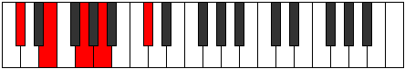

# Mode Lonic

## Links

- [Documentation](index.md)
- [Scales Index](Scales.md)
- [Modes Index](Modes.md)
- [Chords Index](Chords.md)

## Parent Scale

[Daric](ScaleDaric.md)

## Number

[329](https://ianring.com/musictheory/scales/329)

## Perfection

- 1 Perfect notes
- 3 Perfect notes

## Perfection Profile

[false false false true]

## Permutations

| Tonic | Notes | Signature | Illustration | Audio |
|-------|-------|-----------|--------------|-------|
| [C](ModeCNaturalLonic.md) | **C**, **D#**, **F#**, G#, **C** | C |  | [midi](ModeCNaturalLonic.mid) [ogg](ModeCNaturalLonic.ogg) |
| [C#](ModeCSharpLonic.md) | **C#**, **E**, **G**, A, **C#** | C |  | [midi](ModeCSharpLonic.mid) [ogg](ModeCSharpLonic.ogg) |
| [Db](ModeDFlatLonic.md) | **Db**, **E**, **G**, A, **Db** | C |  | [midi](ModeDFlatLonic.mid) [ogg](ModeDFlatLonic.ogg) |
| [D](ModeDNaturalLonic.md) | **D**, **F**, **G#**, A#, **D** | C |  | [midi](ModeDNaturalLonic.mid) [ogg](ModeDNaturalLonic.ogg) |
| [D#](ModeDSharpLonic.md) | **D#**, **F#**, **A**, B, **D#** | C |  | [midi](ModeDSharpLonic.mid) [ogg](ModeDSharpLonic.ogg) |
| [Eb](ModeEFlatLonic.md) | **Eb**, **Gb**, **A**, B, **Eb** | C |  | [midi](ModeEFlatLonic.mid) [ogg](ModeEFlatLonic.ogg) |
| [E](ModeENaturalLonic.md) | **E**, **G**, **A#**, C, **E** | C |  | [midi](ModeENaturalLonic.mid) [ogg](ModeENaturalLonic.ogg) |
| [F](ModeFNaturalLonic.md) | **F**, **G#**, **B**, C#, **F** | C |  | [midi](ModeFNaturalLonic.mid) [ogg](ModeFNaturalLonic.ogg) |
| [F#](ModeFSharpLonic.md) | **F#**, **A**, **C**, D, **F#** | C |  | [midi](ModeFSharpLonic.mid) [ogg](ModeFSharpLonic.ogg) |
| [Gb](ModeGFlatLonic.md) | **Gb**, **A**, **C**, D, **Gb** | C |  | [midi](ModeGFlatLonic.mid) [ogg](ModeGFlatLonic.ogg) |
| [G](ModeGNaturalLonic.md) | **G**, **A#**, **C#**, D#, **G** | C |  | [midi](ModeGNaturalLonic.mid) [ogg](ModeGNaturalLonic.ogg) |
| [G#](ModeGSharpLonic.md) | **G#**, **B**, **D**, E, **G#** | C |  | [midi](ModeGSharpLonic.mid) [ogg](ModeGSharpLonic.ogg) |
| [Ab](ModeAFlatLonic.md) | **Ab**, **B**, **D**, E, **Ab** | C |  | [midi](ModeAFlatLonic.mid) [ogg](ModeAFlatLonic.ogg) |
| [A](ModeANaturalLonic.md) | **A**, **C**, **D#**, F, **A** | C |  | [midi](ModeANaturalLonic.mid) [ogg](ModeANaturalLonic.ogg) |
| [A#](ModeASharpLonic.md) | **A#**, **C#**, **E**, F#, **A#** | C |  | [midi](ModeASharpLonic.mid) [ogg](ModeASharpLonic.ogg) |
| [Bb](ModeBFlatLonic.md) | **Bb**, **Db**, **E**, Gb, **Bb** | C |  | [midi](ModeBFlatLonic.mid) [ogg](ModeBFlatLonic.ogg) |
| [B](ModeBNaturalLonic.md) | **B**, **D**, **F**, G, **B** | C |  | [midi](ModeBNaturalLonic.mid) [ogg](ModeBNaturalLonic.ogg) |
