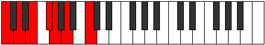
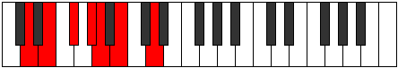
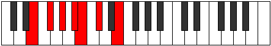
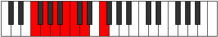
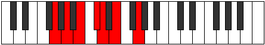
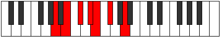
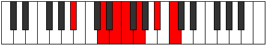
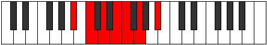
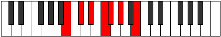

# Mode Lonimic

## Links

- [Documentation](README.md)
- [Scales Index](Scales.md)
- [Modes Index](Modes.md)
- [Chords Index](Chords.md)

## Parent Scale

[Darmic](ScaleDarmic.md)

## Number

[725](https://ianring.com/musictheory/scales/725)

## Transposition

2, 2, 2, 1, 2, 3

## Chord Pattern

I, II

## Perfection

- 4 Perfect notes
- 2 Perfect notes

## Perfection Profile

true, true, false, false, true, true

## Permutations

| Tonic | Notes | Signature | Illustration | Audio |
|-------|-------|-----------|--------------|-------|
| [C](ModeCNaturalLonimic.md) | C, D, **E**, **F#**, G, A, C | C |  | [midi](https://github.com/edipermadi/music/blob/main/docs/ModeCNaturalLonimic.mid?raw=true) |
| [C#](ModeCSharpLonimic.md) | C#, D#, **E#**, **F##**, G#, A#, C# | C |  | [midi](https://github.com/edipermadi/music/blob/main/docs/ModeCSharpLonimic.mid?raw=true) |
| [Db](ModeDFlatLonimic.md) | Db, Eb, **F**, **G**, Ab, Bb, Db | C |  | [midi](https://github.com/edipermadi/music/blob/main/docs/ModeDFlatLonimic.mid?raw=true) |
| [D](ModeDNaturalLonimic.md) | D, E, **F#**, **G#**, A, B, D | C |  | [midi](https://github.com/edipermadi/music/blob/main/docs/ModeDNaturalLonimic.mid?raw=true) |
| [D#](ModeDSharpLonimic.md) | D#, E#, **F##**, **G##**, A#, B#, D# | C |  | [midi](https://github.com/edipermadi/music/blob/main/docs/ModeDSharpLonimic.mid?raw=true) |
| [Eb](ModeEFlatLonimic.md) | Eb, F, **G**, **A**, Bb, C, Eb | C |  | [midi](https://github.com/edipermadi/music/blob/main/docs/ModeEFlatLonimic.mid?raw=true) |
| [E](ModeENaturalLonimic.md) | E, F#, **G#**, **A#**, B, C#, E | C |  | [midi](https://github.com/edipermadi/music/blob/main/docs/ModeENaturalLonimic.mid?raw=true) |
| [F](ModeFNaturalLonimic.md) | F, G, **A**, **B**, C, D, F | C |  | [midi](https://github.com/edipermadi/music/blob/main/docs/ModeFNaturalLonimic.mid?raw=true) |
| [F#](ModeFSharpLonimic.md) | F#, G#, **A#**, **B#**, C#, D#, F# | C |  | [midi](https://github.com/edipermadi/music/blob/main/docs/ModeFSharpLonimic.mid?raw=true) |
| [Gb](ModeGFlatLonimic.md) | Gb, Ab, **Bb**, **C**, Db, Eb, Gb | C |  | [midi](https://github.com/edipermadi/music/blob/main/docs/ModeGFlatLonimic.mid?raw=true) |
| [G](ModeGNaturalLonimic.md) | G, A, **B**, **C#**, D, E, G | C |  | [midi](https://github.com/edipermadi/music/blob/main/docs/ModeGNaturalLonimic.mid?raw=true) |
| [G#](ModeGSharpLonimic.md) | G#, A#, **B#**, **C##**, D#, E#, G# | C |  | [midi](https://github.com/edipermadi/music/blob/main/docs/ModeGSharpLonimic.mid?raw=true) |
| [Ab](ModeAFlatLonimic.md) | Ab, Bb, **C**, **D**, Eb, F, Ab | C |  | [midi](https://github.com/edipermadi/music/blob/main/docs/ModeAFlatLonimic.mid?raw=true) |
| [A](ModeANaturalLonimic.md) | A, B, **C#**, **D#**, E, F#, A | C |  | [midi](https://github.com/edipermadi/music/blob/main/docs/ModeANaturalLonimic.mid?raw=true) |
| [A#](ModeASharpLonimic.md) | A#, B#, **C##**, **D##**, E#, F##, A# | C |  | [midi](https://github.com/edipermadi/music/blob/main/docs/ModeASharpLonimic.mid?raw=true) |
| [Bb](ModeBFlatLonimic.md) | Bb, C, **D**, **E**, F, G, Bb | C |  | [midi](https://github.com/edipermadi/music/blob/main/docs/ModeBFlatLonimic.mid?raw=true) |
| [B](ModeBNaturalLonimic.md) | B, C#, **D#**, **E#**, F#, G#, B | C |  | [midi](https://github.com/edipermadi/music/blob/main/docs/ModeBNaturalLonimic.mid?raw=true) |
