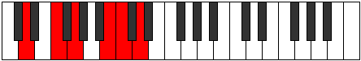
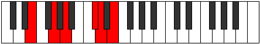

# Mode Lonitonic

## Links

- [Documentation](README.md)
- [Scales Index](Scales.md)
- [Modes Index](Modes.md)
- [Chords Index](Chords.md)

## Parent Scale

[Aeracritonic](ScaleAeracritonic.md)

## Number

[1577](https://ianring.com/musictheory/scales/1577)

## Interval Pattern

3, 2, 4, 1, 2

## Chord Pattern

## Perfection

- 3 Perfect notes
- 2 Perfect notes

## Perfection Profile

[false true true false true]

## Permutations

| Tonic | Notes | Signature | Illustration | Audio |
|-------|-------|-----------|--------------|-------|
| [C](ModeCNaturalLonitonic.md) | **C**, D#, F, **A**, A#, **C** | C |  | [midi](https://github.com/edipermadi/music/blob/main/docs/ModeCNaturalLonitonic.mid?raw=true) |
| [C#](ModeCSharpLonitonic.md) | **C#**, E, F#, **A#**, B, **C#** | C |  | [midi](https://github.com/edipermadi/music/blob/main/docs/ModeCSharpLonitonic.mid?raw=true) |
| [Db](ModeDFlatLonitonic.md) | **Db**, E, Gb, **Bb**, B, **Db** | C |  | [midi](https://github.com/edipermadi/music/blob/main/docs/ModeDFlatLonitonic.mid?raw=true) |
| [D](ModeDNaturalLonitonic.md) | **D**, F, G, **B**, C, **D** | C |  | [midi](https://github.com/edipermadi/music/blob/main/docs/ModeDNaturalLonitonic.mid?raw=true) |
| [D#](ModeDSharpLonitonic.md) | **D#**, F#, G#, **C**, C#, **D#** | C |  | [midi](https://github.com/edipermadi/music/blob/main/docs/ModeDSharpLonitonic.mid?raw=true) |
| [Eb](ModeEFlatLonitonic.md) | **Eb**, Gb, Ab, **C**, Db, **Eb** | C |  | [midi](https://github.com/edipermadi/music/blob/main/docs/ModeEFlatLonitonic.mid?raw=true) |
| [E](ModeENaturalLonitonic.md) | **E**, G, A, **C#**, D, **E** | C |  | [midi](https://github.com/edipermadi/music/blob/main/docs/ModeENaturalLonitonic.mid?raw=true) |
| [F](ModeFNaturalLonitonic.md) | **F**, G#, A#, **D**, D#, **F** | C |  | [midi](https://github.com/edipermadi/music/blob/main/docs/ModeFNaturalLonitonic.mid?raw=true) |
| [F#](ModeFSharpLonitonic.md) | **F#**, A, B, **D#**, E, **F#** | C |  | [midi](https://github.com/edipermadi/music/blob/main/docs/ModeFSharpLonitonic.mid?raw=true) |
| [Gb](ModeGFlatLonitonic.md) | **Gb**, A, B, **Eb**, E, **Gb** | C |  | [midi](https://github.com/edipermadi/music/blob/main/docs/ModeGFlatLonitonic.mid?raw=true) |
| [G](ModeGNaturalLonitonic.md) | **G**, A#, C, **E**, F, **G** | C |  | [midi](https://github.com/edipermadi/music/blob/main/docs/ModeGNaturalLonitonic.mid?raw=true) |
| [G#](ModeGSharpLonitonic.md) | **G#**, B, C#, **F**, F#, **G#** | C |  | [midi](https://github.com/edipermadi/music/blob/main/docs/ModeGSharpLonitonic.mid?raw=true) |
| [Ab](ModeAFlatLonitonic.md) | **Ab**, B, Db, **F**, Gb, **Ab** | C |  | [midi](https://github.com/edipermadi/music/blob/main/docs/ModeAFlatLonitonic.mid?raw=true) |
| [A](ModeANaturalLonitonic.md) | **A**, C, D, **F#**, G, **A** | C |  | [midi](https://github.com/edipermadi/music/blob/main/docs/ModeANaturalLonitonic.mid?raw=true) |
| [A#](ModeASharpLonitonic.md) | **A#**, C#, D#, **G**, G#, **A#** | C |  | [midi](https://github.com/edipermadi/music/blob/main/docs/ModeASharpLonitonic.mid?raw=true) |
| [Bb](ModeBFlatLonitonic.md) | **Bb**, Db, Eb, **G**, Ab, **Bb** | C |  | [midi](https://github.com/edipermadi/music/blob/main/docs/ModeBFlatLonitonic.mid?raw=true) |
| [B](ModeBNaturalLonitonic.md) | **B**, D, E, **G#**, A, **B** | C |  | [midi](https://github.com/edipermadi/music/blob/main/docs/ModeBNaturalLonitonic.mid?raw=true) |
