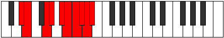

# Mode Lonygic

## Links

- [Documentation](index.md)
- [Scales Index](Scales.md)
- [Modes Index](Modes.md)
- [Chords Index](Chords.md)

## Parent Scale

[Phrygic](ScalePhrygic.md)

## Number

[4019](https://ianring.com/musictheory/scales/4019)

## Perfection

- 6 Perfect notes
- 3 Perfect notes

## Perfection Profile

[true true true true false false true true false]

## Permutations

| Tonic | Notes | Signature | Illustration | Audio |
|-------|-------|-----------|--------------|-------|
| [C](ModeCNaturalLonygic.md) | C, C#, E, F, **G**, **G#**, A, A#, **B**, C | C |  | [midi](ModeCNaturalLonygic.mid) [ogg](ModeCNaturalLonygic.ogg) |
| [C#](ModeCSharpLonygic.md) | C#, D, F, F#, **G#**, **A**, A#, B, **C**, C# | C |  | [midi](ModeCSharpLonygic.mid) [ogg](ModeCSharpLonygic.ogg) |
| [Db](ModeDFlatLonygic.md) | Db, D, F, Gb, **Ab**, **A**, Bb, B, **C**, Db | C |  | [midi](ModeDFlatLonygic.mid) [ogg](ModeDFlatLonygic.ogg) |
| [D](ModeDNaturalLonygic.md) | D, D#, F#, G, **A**, **A#**, B, C, **C#**, D | C |  | [midi](ModeDNaturalLonygic.mid) [ogg](ModeDNaturalLonygic.ogg) |
| [D#](ModeDSharpLonygic.md) | D#, E, G, G#, **A#**, **B**, C, C#, **D**, D# | C |  | [midi](ModeDSharpLonygic.mid) [ogg](ModeDSharpLonygic.ogg) |
| [Eb](ModeEFlatLonygic.md) | Eb, E, G, Ab, **Bb**, **B**, C, Db, **D**, Eb | C |  | [midi](ModeEFlatLonygic.mid) [ogg](ModeEFlatLonygic.ogg) |
| [E](ModeENaturalLonygic.md) | E, F, G#, A, **B**, **C**, C#, D, **D#**, E | C |  | [midi](ModeENaturalLonygic.mid) [ogg](ModeENaturalLonygic.ogg) |
| [F](ModeFNaturalLonygic.md) | F, F#, A, A#, **C**, **C#**, D, D#, **E**, F | C |  | [midi](ModeFNaturalLonygic.mid) [ogg](ModeFNaturalLonygic.ogg) |
| [F#](ModeFSharpLonygic.md) | F#, G, A#, B, **C#**, **D**, D#, E, **F**, F# | C |  | [midi](ModeFSharpLonygic.mid) [ogg](ModeFSharpLonygic.ogg) |
| [Gb](ModeGFlatLonygic.md) | Gb, G, Bb, B, **Db**, **D**, Eb, E, **F**, Gb | C |  | [midi](ModeGFlatLonygic.mid) [ogg](ModeGFlatLonygic.ogg) |
| [G](ModeGNaturalLonygic.md) | G, G#, B, C, **D**, **D#**, E, F, **F#**, G | C |  | [midi](ModeGNaturalLonygic.mid) [ogg](ModeGNaturalLonygic.ogg) |
| [G#](ModeGSharpLonygic.md) | G#, A, C, C#, **D#**, **E**, F, F#, **G**, G# | C |  | [midi](ModeGSharpLonygic.mid) [ogg](ModeGSharpLonygic.ogg) |
| [Ab](ModeAFlatLonygic.md) | Ab, A, C, Db, **Eb**, **E**, F, Gb, **G**, Ab | C |  | [midi](ModeAFlatLonygic.mid) [ogg](ModeAFlatLonygic.ogg) |
| [A](ModeANaturalLonygic.md) | A, A#, C#, D, **E**, **F**, F#, G, **G#**, A | C |  | [midi](ModeANaturalLonygic.mid) [ogg](ModeANaturalLonygic.ogg) |
| [A#](ModeASharpLonygic.md) | A#, B, D, D#, **F**, **F#**, G, G#, **A**, A# | C |  | [midi](ModeASharpLonygic.mid) [ogg](ModeASharpLonygic.ogg) |
| [Bb](ModeBFlatLonygic.md) | Bb, B, D, Eb, **F**, **Gb**, G, Ab, **A**, Bb | C |  | [midi](ModeBFlatLonygic.mid) [ogg](ModeBFlatLonygic.ogg) |
| [B](ModeBNaturalLonygic.md) | B, C, D#, E, **F#**, **G**, G#, A, **A#**, B | C |  | [midi](ModeBNaturalLonygic.mid) [ogg](ModeBNaturalLonygic.ogg) |
