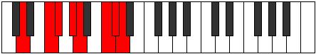

# Mode Loptian

## Links

- [Documentation](index.md)
- [Scales Index](Scales.md)
- [Modes Index](Modes.md)
- [Chords Index](Chords.md)

## Parent Scale

[Loptian](ScaleLoptian.md)

## Number

[3289](https://ianring.com/musictheory/scales/3289)

## Perfection

- 4 Perfect notes
- 3 Perfect notes

## Perfection Profile

[true true true false false false true]

## Permutations

| Tonic | Notes | Signature | Illustration | Audio |
|-------|-------|-----------|--------------|-------|
| [C](ModeCNaturalLoptian.md) | C, D#, E, **F#**, **G**, **A#**, B, C | C |  | [midi](ModeCNaturalLoptian.mid) [ogg](ModeCNaturalLoptian.ogg) |
| [C#](ModeCSharpLoptian.md) | C#, D##, E#, **F##**, **G#**, **A##**, B#, C# | C |  | [midi](ModeCSharpLoptian.mid) [ogg](ModeCSharpLoptian.ogg) |
| [Db](ModeDFlatLoptian.md) | Db, E, F, **G**, **Ab**, **B**, C, Db | C |  | [midi](ModeDFlatLoptian.mid) [ogg](ModeDFlatLoptian.ogg) |
| [D](ModeDNaturalLoptian.md) | D, E#, F#, **G#**, **A**, **B#**, C#, D | C |  | [midi](ModeDNaturalLoptian.mid) [ogg](ModeDNaturalLoptian.ogg) |
| [D#](ModeDSharpLoptian.md) | D#, E##, F##, **G##**, **A#**, **B##**, C##, D# | C |  | [midi](ModeDSharpLoptian.mid) [ogg](ModeDSharpLoptian.ogg) |
| [Eb](ModeEFlatLoptian.md) | Eb, F#, G, **A**, **Bb**, **C#**, D, Eb | C |  | [midi](ModeEFlatLoptian.mid) [ogg](ModeEFlatLoptian.ogg) |
| [E](ModeENaturalLoptian.md) | E, F##, G#, **A#**, **B**, **C##**, D#, E | C |  | [midi](ModeENaturalLoptian.mid) [ogg](ModeENaturalLoptian.ogg) |
| [F](ModeFNaturalLoptian.md) | F, G#, A, **B**, **C**, **D#**, E, F | C |  | [midi](ModeFNaturalLoptian.mid) [ogg](ModeFNaturalLoptian.ogg) |
| [F#](ModeFSharpLoptian.md) | F#, G##, A#, **B#**, **C#**, **D##**, E#, F# | C |  | [midi](ModeFSharpLoptian.mid) [ogg](ModeFSharpLoptian.ogg) |
| [Gb](ModeGFlatLoptian.md) | Gb, A, Bb, **C**, **Db**, **E**, F, Gb | C |  | [midi](ModeGFlatLoptian.mid) [ogg](ModeGFlatLoptian.ogg) |
| [G](ModeGNaturalLoptian.md) | G, A#, B, **C#**, **D**, **E#**, F#, G | C |  | [midi](ModeGNaturalLoptian.mid) [ogg](ModeGNaturalLoptian.ogg) |
| [G#](ModeGSharpLoptian.md) | G#, A##, B#, **C##**, **D#**, **E##**, F##, G# | C |  | [midi](ModeGSharpLoptian.mid) [ogg](ModeGSharpLoptian.ogg) |
| [Ab](ModeAFlatLoptian.md) | Ab, B, C, **D**, **Eb**, **F#**, G, Ab | C |  | [midi](ModeAFlatLoptian.mid) [ogg](ModeAFlatLoptian.ogg) |
| [A](ModeANaturalLoptian.md) | A, B#, C#, **D#**, **E**, **F##**, G#, A | C |  | [midi](ModeANaturalLoptian.mid) [ogg](ModeANaturalLoptian.ogg) |
| [A#](ModeASharpLoptian.md) | A#, B##, C##, **D##**, **E#**, **F###**, G##, A# | C |  | [midi](ModeASharpLoptian.mid) [ogg](ModeASharpLoptian.ogg) |
| [Bb](ModeBFlatLoptian.md) | Bb, C#, D, **E**, **F**, **G#**, A, Bb | C |  | [midi](ModeBFlatLoptian.mid) [ogg](ModeBFlatLoptian.ogg) |
| [B](ModeBNaturalLoptian.md) | B, C##, D#, **E#**, **F#**, **G##**, A#, B | C |  | [midi](ModeBNaturalLoptian.mid) [ogg](ModeBNaturalLoptian.ogg) |
