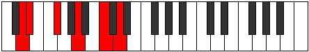
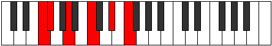

# Mode Loptitonic

## Links

- [Documentation](index.md)
- [Scales Index](Scales.md)
- [Modes Index](Modes.md)
- [Chords Index](Chords.md)

## Parent Scale

[Mixitonic](ScaleMixitonic.md)

## Number

[1171](https://ianring.com/musictheory/scales/1171)

## Perfection

- 1 Perfect notes
- 4 Perfect notes

## Perfection Profile

[true false false false false]

## Permutations

| Tonic | Notes | Signature | Illustration | Audio |
|-------|-------|-----------|--------------|-------|
| [C](ModeCNaturalLoptitonic.md) | C, **C#**, **E**, **G**, **A#**, C | C |  | [midi](ModeCNaturalLoptitonic.mid) [ogg](ModeCNaturalLoptitonic.ogg) |
| [C#](ModeCSharpLoptitonic.md) | C#, **D**, **F**, **G#**, **B**, C# | C |  | [midi](ModeCSharpLoptitonic.mid) [ogg](ModeCSharpLoptitonic.ogg) |
| [Db](ModeDFlatLoptitonic.md) | Db, **D**, **F**, **Ab**, **B**, Db | C |  | [midi](ModeDFlatLoptitonic.mid) [ogg](ModeDFlatLoptitonic.ogg) |
| [D](ModeDNaturalLoptitonic.md) | D, **D#**, **F#**, **A**, **C**, D | C |  | [midi](ModeDNaturalLoptitonic.mid) [ogg](ModeDNaturalLoptitonic.ogg) |
| [D#](ModeDSharpLoptitonic.md) | D#, **E**, **G**, **A#**, **C#**, D# | C |  | [midi](ModeDSharpLoptitonic.mid) [ogg](ModeDSharpLoptitonic.ogg) |
| [Eb](ModeEFlatLoptitonic.md) | Eb, **E**, **G**, **Bb**, **Db**, Eb | C |  | [midi](ModeEFlatLoptitonic.mid) [ogg](ModeEFlatLoptitonic.ogg) |
| [E](ModeENaturalLoptitonic.md) | E, **F**, **G#**, **B**, **D**, E | C |  | [midi](ModeENaturalLoptitonic.mid) [ogg](ModeENaturalLoptitonic.ogg) |
| [F](ModeFNaturalLoptitonic.md) | F, **F#**, **A**, **C**, **D#**, F | C |  | [midi](ModeFNaturalLoptitonic.mid) [ogg](ModeFNaturalLoptitonic.ogg) |
| [F#](ModeFSharpLoptitonic.md) | F#, **G**, **A#**, **C#**, **E**, F# | C |  | [midi](ModeFSharpLoptitonic.mid) [ogg](ModeFSharpLoptitonic.ogg) |
| [Gb](ModeGFlatLoptitonic.md) | Gb, **G**, **Bb**, **Db**, **E**, Gb | C |  | [midi](ModeGFlatLoptitonic.mid) [ogg](ModeGFlatLoptitonic.ogg) |
| [G](ModeGNaturalLoptitonic.md) | G, **G#**, **B**, **D**, **F**, G | C |  | [midi](ModeGNaturalLoptitonic.mid) [ogg](ModeGNaturalLoptitonic.ogg) |
| [G#](ModeGSharpLoptitonic.md) | G#, **A**, **C**, **D#**, **F#**, G# | C |  | [midi](ModeGSharpLoptitonic.mid) [ogg](ModeGSharpLoptitonic.ogg) |
| [Ab](ModeAFlatLoptitonic.md) | Ab, **A**, **C**, **Eb**, **Gb**, Ab | C |  | [midi](ModeAFlatLoptitonic.mid) [ogg](ModeAFlatLoptitonic.ogg) |
| [A](ModeANaturalLoptitonic.md) | A, **A#**, **C#**, **E**, **G**, A | C |  | [midi](ModeANaturalLoptitonic.mid) [ogg](ModeANaturalLoptitonic.ogg) |
| [A#](ModeASharpLoptitonic.md) | A#, **B**, **D**, **F**, **G#**, A# | C |  | [midi](ModeASharpLoptitonic.mid) [ogg](ModeASharpLoptitonic.ogg) |
| [Bb](ModeBFlatLoptitonic.md) | Bb, **B**, **D**, **F**, **Ab**, Bb | C |  | [midi](ModeBFlatLoptitonic.mid) [ogg](ModeBFlatLoptitonic.ogg) |
| [B](ModeBNaturalLoptitonic.md) | B, **C**, **D#**, **F#**, **A**, B | C |  | [midi](ModeBNaturalLoptitonic.mid) [ogg](ModeBNaturalLoptitonic.ogg) |
