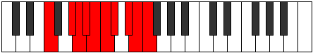

# Mode Loptygic

## Links

- [Documentation](index.md)
- [Scales Index](Scales.md)
- [Modes Index](Modes.md)
- [Chords Index](Chords.md)

## Parent Scale

[Loptygic](ScaleLoptygic.md)

## Number

[3577](https://ianring.com/musictheory/scales/3577)

## Perfection

- 7 Perfect notes
- 2 Perfect notes

## Perfection Profile

[true true true true false false true true true]

## Permutations

| Tonic | Notes | Signature | Illustration | Audio |
|-------|-------|-----------|--------------|-------|
| [C](ModeCNaturalLoptygic.md) | C, D#, E, F, **F#**, **G**, G#, A#, B, C | C |  | [midi](ModeCNaturalLoptygic.mid) [ogg](ModeCNaturalLoptygic.ogg) |
| [C#](ModeCSharpLoptygic.md) | C#, E, F, F#, **G**, **G#**, A, B, C, C# | C |  | [midi](ModeCSharpLoptygic.mid) [ogg](ModeCSharpLoptygic.ogg) |
| [Db](ModeDFlatLoptygic.md) | Db, E, F, Gb, **G**, **Ab**, A, B, C, Db | C |  | [midi](ModeDFlatLoptygic.mid) [ogg](ModeDFlatLoptygic.ogg) |
| [D](ModeDNaturalLoptygic.md) | D, F, F#, G, **G#**, **A**, A#, C, C#, D | C |  | [midi](ModeDNaturalLoptygic.mid) [ogg](ModeDNaturalLoptygic.ogg) |
| [D#](ModeDSharpLoptygic.md) | D#, F#, G, G#, **A**, **A#**, B, C#, D, D# | C |  | [midi](ModeDSharpLoptygic.mid) [ogg](ModeDSharpLoptygic.ogg) |
| [Eb](ModeEFlatLoptygic.md) | Eb, Gb, G, Ab, **A**, **Bb**, B, Db, D, Eb | C |  | [midi](ModeEFlatLoptygic.mid) [ogg](ModeEFlatLoptygic.ogg) |
| [E](ModeENaturalLoptygic.md) | E, G, G#, A, **A#**, **B**, C, D, D#, E | C |  | [midi](ModeENaturalLoptygic.mid) [ogg](ModeENaturalLoptygic.ogg) |
| [F](ModeFNaturalLoptygic.md) | F, G#, A, A#, **B**, **C**, C#, D#, E, F | C |  | [midi](ModeFNaturalLoptygic.mid) [ogg](ModeFNaturalLoptygic.ogg) |
| [F#](ModeFSharpLoptygic.md) | F#, A, A#, B, **C**, **C#**, D, E, F, F# | C |  | [midi](ModeFSharpLoptygic.mid) [ogg](ModeFSharpLoptygic.ogg) |
| [Gb](ModeGFlatLoptygic.md) | Gb, A, Bb, B, **C**, **Db**, D, E, F, Gb | C |  | [midi](ModeGFlatLoptygic.mid) [ogg](ModeGFlatLoptygic.ogg) |
| [G](ModeGNaturalLoptygic.md) | G, A#, B, C, **C#**, **D**, D#, F, F#, G | C |  | [midi](ModeGNaturalLoptygic.mid) [ogg](ModeGNaturalLoptygic.ogg) |
| [G#](ModeGSharpLoptygic.md) | G#, B, C, C#, **D**, **D#**, E, F#, G, G# | C |  | [midi](ModeGSharpLoptygic.mid) [ogg](ModeGSharpLoptygic.ogg) |
| [Ab](ModeAFlatLoptygic.md) | Ab, B, C, Db, **D**, **Eb**, E, Gb, G, Ab | C |  | [midi](ModeAFlatLoptygic.mid) [ogg](ModeAFlatLoptygic.ogg) |
| [A](ModeANaturalLoptygic.md) | A, C, C#, D, **D#**, **E**, F, G, G#, A | C |  | [midi](ModeANaturalLoptygic.mid) [ogg](ModeANaturalLoptygic.ogg) |
| [A#](ModeASharpLoptygic.md) | A#, C#, D, D#, **E**, **F**, F#, G#, A, A# | C |  | [midi](ModeASharpLoptygic.mid) [ogg](ModeASharpLoptygic.ogg) |
| [Bb](ModeBFlatLoptygic.md) | Bb, Db, D, Eb, **E**, **F**, Gb, Ab, A, Bb | C |  | [midi](ModeBFlatLoptygic.mid) [ogg](ModeBFlatLoptygic.ogg) |
| [B](ModeBNaturalLoptygic.md) | B, D, D#, E, **F**, **F#**, G, A, A#, B | C |  | [midi](ModeBNaturalLoptygic.mid) [ogg](ModeBNaturalLoptygic.ogg) |
