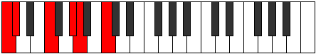
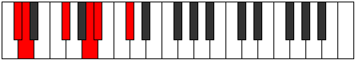
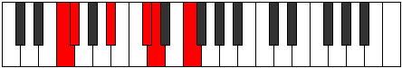
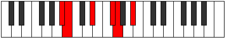

# Mode Loritonic

## Links

- [Documentation](index.md)
- [Scales Index](Scales.md)
- [Modes Index](Modes.md)
- [Chords Index](Chords.md)

## Parent Scale

[Zacritonic](ScaleZacritonic.md)

## Number

[803](https://ianring.com/musictheory/scales/803)

## Perfection

- 2 Perfect notes
- 3 Perfect notes

## Perfection Profile

[false true true false false]

## Permutations

| Tonic | Notes | Signature | Illustration | Audio |
|-------|-------|-----------|--------------|-------|
| [C](ModeCNaturalLoritonic.md) | **C**, C#, F, **G#**, **A**, **C** | C |  | [midi](ModeCNaturalLoritonic.mid) [ogg](ModeCNaturalLoritonic.ogg) |
| [C#](ModeCSharpLoritonic.md) | **C#**, D, F#, **A**, **A#**, **C#** | C |  | [midi](ModeCSharpLoritonic.mid) [ogg](ModeCSharpLoritonic.ogg) |
| [Db](ModeDFlatLoritonic.md) | **Db**, D, Gb, **A**, **Bb**, **Db** | C |  | [midi](ModeDFlatLoritonic.mid) [ogg](ModeDFlatLoritonic.ogg) |
| [D](ModeDNaturalLoritonic.md) | **D**, D#, G, **A#**, **B**, **D** | C |  | [midi](ModeDNaturalLoritonic.mid) [ogg](ModeDNaturalLoritonic.ogg) |
| [D#](ModeDSharpLoritonic.md) | **D#**, E, G#, **B**, **C**, **D#** | C |  | [midi](ModeDSharpLoritonic.mid) [ogg](ModeDSharpLoritonic.ogg) |
| [Eb](ModeEFlatLoritonic.md) | **Eb**, E, Ab, **B**, **C**, **Eb** | C |  | [midi](ModeEFlatLoritonic.mid) [ogg](ModeEFlatLoritonic.ogg) |
| [E](ModeENaturalLoritonic.md) | **E**, F, A, **C**, **C#**, **E** | C |  | [midi](ModeENaturalLoritonic.mid) [ogg](ModeENaturalLoritonic.ogg) |
| [F](ModeFNaturalLoritonic.md) | **F**, F#, A#, **C#**, **D**, **F** | C |  | [midi](ModeFNaturalLoritonic.mid) [ogg](ModeFNaturalLoritonic.ogg) |
| [F#](ModeFSharpLoritonic.md) | **F#**, G, B, **D**, **D#**, **F#** | C |  | [midi](ModeFSharpLoritonic.mid) [ogg](ModeFSharpLoritonic.ogg) |
| [Gb](ModeGFlatLoritonic.md) | **Gb**, G, B, **D**, **Eb**, **Gb** | C |  | [midi](ModeGFlatLoritonic.mid) [ogg](ModeGFlatLoritonic.ogg) |
| [G](ModeGNaturalLoritonic.md) | **G**, G#, C, **D#**, **E**, **G** | C |  | [midi](ModeGNaturalLoritonic.mid) [ogg](ModeGNaturalLoritonic.ogg) |
| [G#](ModeGSharpLoritonic.md) | **G#**, A, C#, **E**, **F**, **G#** | C |  | [midi](ModeGSharpLoritonic.mid) [ogg](ModeGSharpLoritonic.ogg) |
| [Ab](ModeAFlatLoritonic.md) | **Ab**, A, Db, **E**, **F**, **Ab** | C |  | [midi](ModeAFlatLoritonic.mid) [ogg](ModeAFlatLoritonic.ogg) |
| [A](ModeANaturalLoritonic.md) | **A**, A#, D, **F**, **F#**, **A** | C |  | [midi](ModeANaturalLoritonic.mid) [ogg](ModeANaturalLoritonic.ogg) |
| [A#](ModeASharpLoritonic.md) | **A#**, B, D#, **F#**, **G**, **A#** | C |  | [midi](ModeASharpLoritonic.mid) [ogg](ModeASharpLoritonic.ogg) |
| [Bb](ModeBFlatLoritonic.md) | **Bb**, B, Eb, **Gb**, **G**, **Bb** | C |  | [midi](ModeBFlatLoritonic.mid) [ogg](ModeBFlatLoritonic.ogg) |
| [B](ModeBNaturalLoritonic.md) | **B**, C, E, **G**, **G#**, **B** | C |  | [midi](ModeBNaturalLoritonic.mid) [ogg](ModeBNaturalLoritonic.ogg) |
