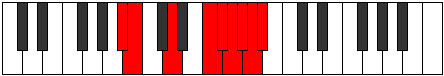

# Mode Loryllic

## Links

- [Documentation](README.md)
- [Scales Index](Scales.md)
- [Modes Index](Modes.md)
- [Chords Index](Chords.md)

## Parent Scale

[Zaryllic](ScaleZaryllic.md)

## Number

[3987](https://ianring.com/musictheory/scales/3987)

## Luminosity

-1

## Transposition

1, 3, 3, 1, 1, 1, 1, 1

## Chord Pattern

I⁺, IIIb5, vii⁰b3

## Perfection

- 4 Perfect notes
- 4 Perfect notes

## Perfection Profile

true, true, true, false, false, true, false, false

## Permutations

| Tonic | Notes | Signature | Illustration | Audio |
|-------|-------|-----------|--------------|-------|
| [C](ModeCNaturalLoryllic.md) | C, C#, E, **G**, **G#**, A, **A#**, **B**, C | C |  | [midi](https://github.com/edipermadi/music/blob/main/docs/ModeCNaturalLoryllic.mid?raw=true) |
| [C#](ModeCSharpLoryllic.md) | C#, D, F, **G#**, **A**, A#, **B**, **C**, C# | C |  | [midi](https://github.com/edipermadi/music/blob/main/docs/ModeCSharpLoryllic.mid?raw=true) |
| [Db](ModeDFlatLoryllic.md) | Db, D, F, **Ab**, **A**, Bb, **B**, **C**, Db | C |  | [midi](https://github.com/edipermadi/music/blob/main/docs/ModeDFlatLoryllic.mid?raw=true) |
| [D](ModeDNaturalLoryllic.md) | D, D#, F#, **A**, **A#**, B, **C**, **C#**, D | C |  | [midi](https://github.com/edipermadi/music/blob/main/docs/ModeDNaturalLoryllic.mid?raw=true) |
| [D#](ModeDSharpLoryllic.md) | D#, E, G, **A#**, **B**, C, **C#**, **D**, D# | C |  | [midi](https://github.com/edipermadi/music/blob/main/docs/ModeDSharpLoryllic.mid?raw=true) |
| [Eb](ModeEFlatLoryllic.md) | Eb, E, G, **Bb**, **B**, C, **Db**, **D**, Eb | C |  | [midi](https://github.com/edipermadi/music/blob/main/docs/ModeEFlatLoryllic.mid?raw=true) |
| [E](ModeENaturalLoryllic.md) | E, F, G#, **B**, **C**, C#, **D**, **D#**, E | C |  | [midi](https://github.com/edipermadi/music/blob/main/docs/ModeENaturalLoryllic.mid?raw=true) |
| [F](ModeFNaturalLoryllic.md) | F, F#, A, **C**, **C#**, D, **D#**, **E**, F | C |  | [midi](https://github.com/edipermadi/music/blob/main/docs/ModeFNaturalLoryllic.mid?raw=true) |
| [F#](ModeFSharpLoryllic.md) | F#, G, A#, **C#**, **D**, D#, **E**, **F**, F# | C |  | [midi](https://github.com/edipermadi/music/blob/main/docs/ModeFSharpLoryllic.mid?raw=true) |
| [Gb](ModeGFlatLoryllic.md) | Gb, G, Bb, **Db**, **D**, Eb, **E**, **F**, Gb | C |  | [midi](https://github.com/edipermadi/music/blob/main/docs/ModeGFlatLoryllic.mid?raw=true) |
| [G](ModeGNaturalLoryllic.md) | G, G#, B, **D**, **D#**, E, **F**, **F#**, G | C |  | [midi](https://github.com/edipermadi/music/blob/main/docs/ModeGNaturalLoryllic.mid?raw=true) |
| [G#](ModeGSharpLoryllic.md) | G#, A, C, **D#**, **E**, F, **F#**, **G**, G# | C |  | [midi](https://github.com/edipermadi/music/blob/main/docs/ModeGSharpLoryllic.mid?raw=true) |
| [Ab](ModeAFlatLoryllic.md) | Ab, A, C, **Eb**, **E**, F, **Gb**, **G**, Ab | C |  | [midi](https://github.com/edipermadi/music/blob/main/docs/ModeAFlatLoryllic.mid?raw=true) |
| [A](ModeANaturalLoryllic.md) | A, A#, C#, **E**, **F**, F#, **G**, **G#**, A | C |  | [midi](https://github.com/edipermadi/music/blob/main/docs/ModeANaturalLoryllic.mid?raw=true) |
| [A#](ModeASharpLoryllic.md) | A#, B, D, **F**, **F#**, G, **G#**, **A**, A# | C |  | [midi](https://github.com/edipermadi/music/blob/main/docs/ModeASharpLoryllic.mid?raw=true) |
| [Bb](ModeBFlatLoryllic.md) | Bb, B, D, **F**, **Gb**, G, **Ab**, **A**, Bb | C |  | [midi](https://github.com/edipermadi/music/blob/main/docs/ModeBFlatLoryllic.mid?raw=true) |
| [B](ModeBNaturalLoryllic.md) | B, C, D#, **F#**, **G**, G#, **A**, **A#**, B | C |  | [midi](https://github.com/edipermadi/music/blob/main/docs/ModeBNaturalLoryllic.mid?raw=true) |
