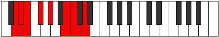
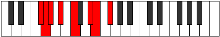

# Mode Lothian

## Links

- [Documentation](index.md)
- [Scales Index](Scales.md)
- [Modes Index](Modes.md)
- [Chords Index](Chords.md)

## Parent Scale

[Ionanian](ScaleIonanian.md)

## Number

[1623](https://ianring.com/musictheory/scales/1623)

## Perfection

- 3 Perfect notes
- 4 Perfect notes

## Perfection Profile

[false false true false true true false]

## Permutations

| Tonic | Notes | Signature | Illustration | Audio |
|-------|-------|-----------|--------------|-------|
| [C](ModeCNaturalLothian.md) | **C**, **Db**, Ebb, **Fb**, Gb, A, **Bb**, **C** | C |  | [midi](ModeCNaturalLothian.mid) [ogg](ModeCNaturalLothian.ogg) |
| [C#](ModeCSharpLothian.md) | **C#**, **D**, Eb, **F**, G, A#, **B**, **C#** | C |  | [midi](ModeCSharpLothian.mid) [ogg](ModeCSharpLothian.ogg) |
| [Db](ModeDFlatLothian.md) | **Db**, **Ebb**, Fbb, **Gbb**, Abb, Bb, **Cb**, **Db** | C |  | [midi](ModeDFlatLothian.mid) [ogg](ModeDFlatLothian.ogg) |
| [D](ModeDNaturalLothian.md) | **D**, **Eb**, Fb, **Gb**, Ab, B, **C**, **D** | C |  | [midi](ModeDNaturalLothian.mid) [ogg](ModeDNaturalLothian.ogg) |
| [D#](ModeDSharpLothian.md) | **D#**, **E**, F, **G**, A, B#, **C#**, **D#** | C |  | [midi](ModeDSharpLothian.mid) [ogg](ModeDSharpLothian.ogg) |
| [Eb](ModeEFlatLothian.md) | **Eb**, **Fb**, Gbb, **Abb**, Bbb, C, **Db**, **Eb** | C |  | [midi](ModeEFlatLothian.mid) [ogg](ModeEFlatLothian.ogg) |
| [E](ModeENaturalLothian.md) | **E**, **F**, Gb, **Ab**, Bb, C#, **D**, **E** | C |  | [midi](ModeENaturalLothian.mid) [ogg](ModeENaturalLothian.ogg) |
| [F](ModeFNaturalLothian.md) | **F**, **Gb**, Abb, **Bbb**, Cb, D, **Eb**, **F** | C |  | [midi](ModeFNaturalLothian.mid) [ogg](ModeFNaturalLothian.ogg) |
| [F#](ModeFSharpLothian.md) | **F#**, **G**, Ab, **Bb**, C, D#, **E**, **F#** | C |  | [midi](ModeFSharpLothian.mid) [ogg](ModeFSharpLothian.ogg) |
| [Gb](ModeGFlatLothian.md) | **Gb**, **Abb**, Bbbb, **Cbb**, Dbb, Eb, **Fb**, **Gb** | C |  | [midi](ModeGFlatLothian.mid) [ogg](ModeGFlatLothian.ogg) |
| [G](ModeGNaturalLothian.md) | **G**, **Ab**, Bbb, **Cb**, Db, E, **F**, **G** | C |  | [midi](ModeGNaturalLothian.mid) [ogg](ModeGNaturalLothian.ogg) |
| [G#](ModeGSharpLothian.md) | **G#**, **A**, Bb, **C**, D, E#, **F#**, **G#** | C |  | [midi](ModeGSharpLothian.mid) [ogg](ModeGSharpLothian.ogg) |
| [Ab](ModeAFlatLothian.md) | **Ab**, **Bbb**, Cbb, **Dbb**, Ebb, F, **Gb**, **Ab** | C |  | [midi](ModeAFlatLothian.mid) [ogg](ModeAFlatLothian.ogg) |
| [A](ModeANaturalLothian.md) | **A**, **Bb**, Cb, **Db**, Eb, F#, **G**, **A** | C |  | [midi](ModeANaturalLothian.mid) [ogg](ModeANaturalLothian.ogg) |
| [A#](ModeASharpLothian.md) | **A#**, **B**, C, **D**, E, F##, **G#**, **A#** | C |  | [midi](ModeASharpLothian.mid) [ogg](ModeASharpLothian.ogg) |
| [Bb](ModeBFlatLothian.md) | **Bb**, **Cb**, Dbb, **Ebb**, Fb, G, **Ab**, **Bb** | C |  | [midi](ModeBFlatLothian.mid) [ogg](ModeBFlatLothian.ogg) |
| [B](ModeBNaturalLothian.md) | **B**, **C**, Db, **Eb**, F, G#, **A**, **B** | C |  | [midi](ModeBNaturalLothian.mid) [ogg](ModeBNaturalLothian.ogg) |
