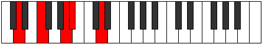
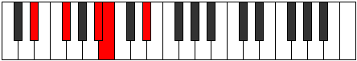
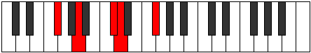

# Mode Lothic

## Links

- [Documentation](index.md)
- [Scales Index](Scales.md)
- [Modes Index](Modes.md)
- [Chords Index](Chords.md)

## Parent Scale

[Thaptic](ScaleThaptic.md)

## Number

[393](https://ianring.com/musictheory/scales/393)

## Perfection

- 2 Perfect notes
- 2 Perfect notes

## Perfection Profile

[true false false true]

## Permutations

| Tonic | Notes | Signature | Illustration | Audio |
|-------|-------|-----------|--------------|-------|
| [C](ModeCNaturalLothic.md) | C, **D#**, **G**, G#, C | C |  | [midi](ModeCNaturalLothic.mid) [ogg](ModeCNaturalLothic.ogg) |
| [C#](ModeCSharpLothic.md) | C#, **E**, **G#**, A, C# | C |  | [midi](ModeCSharpLothic.mid) [ogg](ModeCSharpLothic.ogg) |
| [Db](ModeDFlatLothic.md) | Db, **E**, **Ab**, A, Db | C |  | [midi](ModeDFlatLothic.mid) [ogg](ModeDFlatLothic.ogg) |
| [D](ModeDNaturalLothic.md) | D, **F**, **A**, A#, D | C |  | [midi](ModeDNaturalLothic.mid) [ogg](ModeDNaturalLothic.ogg) |
| [D#](ModeDSharpLothic.md) | D#, **F#**, **A#**, B, D# | C |  | [midi](ModeDSharpLothic.mid) [ogg](ModeDSharpLothic.ogg) |
| [Eb](ModeEFlatLothic.md) | Eb, **Gb**, **Bb**, B, Eb | C |  | [midi](ModeEFlatLothic.mid) [ogg](ModeEFlatLothic.ogg) |
| [E](ModeENaturalLothic.md) | E, **G**, **B**, C, E | C |  | [midi](ModeENaturalLothic.mid) [ogg](ModeENaturalLothic.ogg) |
| [F](ModeFNaturalLothic.md) | F, **G#**, **C**, C#, F | C |  | [midi](ModeFNaturalLothic.mid) [ogg](ModeFNaturalLothic.ogg) |
| [F#](ModeFSharpLothic.md) | F#, **A**, **C#**, D, F# | C |  | [midi](ModeFSharpLothic.mid) [ogg](ModeFSharpLothic.ogg) |
| [Gb](ModeGFlatLothic.md) | Gb, **A**, **Db**, D, Gb | C |  | [midi](ModeGFlatLothic.mid) [ogg](ModeGFlatLothic.ogg) |
| [G](ModeGNaturalLothic.md) | G, **A#**, **D**, D#, G | C |  | [midi](ModeGNaturalLothic.mid) [ogg](ModeGNaturalLothic.ogg) |
| [G#](ModeGSharpLothic.md) | G#, **B**, **D#**, E, G# | C |  | [midi](ModeGSharpLothic.mid) [ogg](ModeGSharpLothic.ogg) |
| [Ab](ModeAFlatLothic.md) | Ab, **B**, **Eb**, E, Ab | C |  | [midi](ModeAFlatLothic.mid) [ogg](ModeAFlatLothic.ogg) |
| [A](ModeANaturalLothic.md) | A, **C**, **E**, F, A | C |  | [midi](ModeANaturalLothic.mid) [ogg](ModeANaturalLothic.ogg) |
| [A#](ModeASharpLothic.md) | A#, **C#**, **F**, F#, A# | C |  | [midi](ModeASharpLothic.mid) [ogg](ModeASharpLothic.ogg) |
| [Bb](ModeBFlatLothic.md) | Bb, **Db**, **F**, Gb, Bb | C |  | [midi](ModeBFlatLothic.mid) [ogg](ModeBFlatLothic.ogg) |
| [B](ModeBNaturalLothic.md) | B, **D**, **F#**, G, B | C |  | [midi](ModeBNaturalLothic.mid) [ogg](ModeBNaturalLothic.ogg) |
