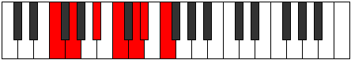
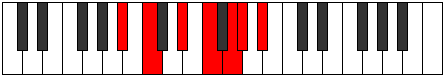

# Mode Lothimic

## Links

- [Documentation](index.md)
- [Scales Index](Scales.md)
- [Modes Index](Modes.md)
- [Chords Index](Chords.md)

## Parent Scale

[Epathimic](ScaleEpathimic.md)

## Number

[1701](https://ianring.com/musictheory/scales/1701)

## Perfection

- 5 Perfect notes
- 1 Perfect notes

## Perfection Profile

[true true true true false true]

## Permutations

| Tonic | Notes | Signature | Illustration | Audio |
|-------|-------|-----------|--------------|-------|
| [C](ModeCNaturalLothimic.md) | C, D, E#, F##, **G##**, A#, C | C |  | [midi](ModeCNaturalLothimic.mid) [ogg](ModeCNaturalLothimic.ogg) |
| [C#](ModeCSharpLothimic.md) | C#, D#, E##, F###, **G###**, A##, C# | C |  | [midi](ModeCSharpLothimic.mid) [ogg](ModeCSharpLothimic.ogg) |
| [Db](ModeDFlatLothimic.md) | Db, Eb, F#, G#, **A#**, B, Db | C |  | [midi](ModeDFlatLothimic.mid) [ogg](ModeDFlatLothimic.ogg) |
| [D](ModeDNaturalLothimic.md) | D, E, F##, G##, **A##**, B#, D | C |  | [midi](ModeDNaturalLothimic.mid) [ogg](ModeDNaturalLothimic.ogg) |
| [D#](ModeDSharpLothimic.md) | D#, E#, F###, G###, **A###**, B##, D# | C |  | [midi](ModeDSharpLothimic.mid) [ogg](ModeDSharpLothimic.ogg) |
| [Eb](ModeEFlatLothimic.md) | Eb, F, G#, A#, **B#**, C#, Eb | C |  | [midi](ModeEFlatLothimic.mid) [ogg](ModeEFlatLothimic.ogg) |
| [E](ModeENaturalLothimic.md) | E, F#, G##, A##, **B##**, C##, E | C |  | [midi](ModeENaturalLothimic.mid) [ogg](ModeENaturalLothimic.ogg) |
| [F](ModeFNaturalLothimic.md) | F, G, A#, B#, **C##**, D#, F | C |  | [midi](ModeFNaturalLothimic.mid) [ogg](ModeFNaturalLothimic.ogg) |
| [F#](ModeFSharpLothimic.md) | F#, G#, A##, B##, **C###**, D##, F# | C |  | [midi](ModeFSharpLothimic.mid) [ogg](ModeFSharpLothimic.ogg) |
| [Gb](ModeGFlatLothimic.md) | Gb, Ab, B, C#, **D#**, E, Gb | C |  | [midi](ModeGFlatLothimic.mid) [ogg](ModeGFlatLothimic.ogg) |
| [G](ModeGNaturalLothimic.md) | G, A, B#, C##, **D##**, E#, G | C |  | [midi](ModeGNaturalLothimic.mid) [ogg](ModeGNaturalLothimic.ogg) |
| [G#](ModeGSharpLothimic.md) | G#, A#, B##, C###, **D###**, E##, G# | C |  | [midi](ModeGSharpLothimic.mid) [ogg](ModeGSharpLothimic.ogg) |
| [Ab](ModeAFlatLothimic.md) | Ab, Bb, C#, D#, **E#**, F#, Ab | C |  | [midi](ModeAFlatLothimic.mid) [ogg](ModeAFlatLothimic.ogg) |
| [A](ModeANaturalLothimic.md) | A, B, C##, D##, **E##**, F##, A | C |  | [midi](ModeANaturalLothimic.mid) [ogg](ModeANaturalLothimic.ogg) |
| [A#](ModeASharpLothimic.md) | A#, B#, C###, D###, **E###**, F###, A# | C |  | [midi](ModeASharpLothimic.mid) [ogg](ModeASharpLothimic.ogg) |
| [Bb](ModeBFlatLothimic.md) | Bb, C, D#, E#, **F##**, G#, Bb | C |  | [midi](ModeBFlatLothimic.mid) [ogg](ModeBFlatLothimic.ogg) |
| [B](ModeBNaturalLothimic.md) | B, C#, D##, E##, **F###**, G##, B | C |  | [midi](ModeBNaturalLothimic.mid) [ogg](ModeBNaturalLothimic.ogg) |
