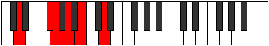
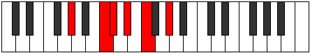

# Mode Lothitonic

## Links

- [Documentation](index.md)
- [Scales Index](Scales.md)
- [Modes Index](Modes.md)
- [Chords Index](Chords.md)

## Parent Scale

[Lothitonic](ScaleLothitonic.md)

## Number

[689](https://ianring.com/musictheory/scales/689)

## Interval Pattern

4, 1, 2, 2, 3

## Chord Pattern

## Perfection

- 3 Perfect notes
- 2 Perfect notes

## Perfection Profile

[true false true false true]

## Permutations

| Tonic | Notes | Signature | Illustration | Audio |
|-------|-------|-----------|--------------|-------|
| [C](ModeCNaturalLothitonic.md) | C, **E**, F, **G**, A, C | C |  | [midi](https://github.com/edipermadi/music/blob/main/docs/ModeCNaturalLothitonic.mid?raw=true) |
| [C#](ModeCSharpLothitonic.md) | C#, **F**, F#, **G#**, A#, C# | C |  | [midi](https://github.com/edipermadi/music/blob/main/docs/ModeCSharpLothitonic.mid?raw=true) |
| [Db](ModeDFlatLothitonic.md) | Db, **F**, Gb, **Ab**, Bb, Db | C |  | [midi](https://github.com/edipermadi/music/blob/main/docs/ModeDFlatLothitonic.mid?raw=true) |
| [D](ModeDNaturalLothitonic.md) | D, **F#**, G, **A**, B, D | C |  | [midi](https://github.com/edipermadi/music/blob/main/docs/ModeDNaturalLothitonic.mid?raw=true) |
| [D#](ModeDSharpLothitonic.md) | D#, **G**, G#, **A#**, C, D# | C |  | [midi](https://github.com/edipermadi/music/blob/main/docs/ModeDSharpLothitonic.mid?raw=true) |
| [Eb](ModeEFlatLothitonic.md) | Eb, **G**, Ab, **Bb**, C, Eb | C |  | [midi](https://github.com/edipermadi/music/blob/main/docs/ModeEFlatLothitonic.mid?raw=true) |
| [E](ModeENaturalLothitonic.md) | E, **G#**, A, **B**, C#, E | C |  | [midi](https://github.com/edipermadi/music/blob/main/docs/ModeENaturalLothitonic.mid?raw=true) |
| [F](ModeFNaturalLothitonic.md) | F, **A**, A#, **C**, D, F | C |  | [midi](https://github.com/edipermadi/music/blob/main/docs/ModeFNaturalLothitonic.mid?raw=true) |
| [F#](ModeFSharpLothitonic.md) | F#, **A#**, B, **C#**, D#, F# | C |  | [midi](https://github.com/edipermadi/music/blob/main/docs/ModeFSharpLothitonic.mid?raw=true) |
| [Gb](ModeGFlatLothitonic.md) | Gb, **Bb**, B, **Db**, Eb, Gb | C |  | [midi](https://github.com/edipermadi/music/blob/main/docs/ModeGFlatLothitonic.mid?raw=true) |
| [G](ModeGNaturalLothitonic.md) | G, **B**, C, **D**, E, G | C |  | [midi](https://github.com/edipermadi/music/blob/main/docs/ModeGNaturalLothitonic.mid?raw=true) |
| [G#](ModeGSharpLothitonic.md) | G#, **C**, C#, **D#**, F, G# | C |  | [midi](https://github.com/edipermadi/music/blob/main/docs/ModeGSharpLothitonic.mid?raw=true) |
| [Ab](ModeAFlatLothitonic.md) | Ab, **C**, Db, **Eb**, F, Ab | C |  | [midi](https://github.com/edipermadi/music/blob/main/docs/ModeAFlatLothitonic.mid?raw=true) |
| [A](ModeANaturalLothitonic.md) | A, **C#**, D, **E**, F#, A | C |  | [midi](https://github.com/edipermadi/music/blob/main/docs/ModeANaturalLothitonic.mid?raw=true) |
| [A#](ModeASharpLothitonic.md) | A#, **D**, D#, **F**, G, A# | C |  | [midi](https://github.com/edipermadi/music/blob/main/docs/ModeASharpLothitonic.mid?raw=true) |
| [Bb](ModeBFlatLothitonic.md) | Bb, **D**, Eb, **F**, G, Bb | C |  | [midi](https://github.com/edipermadi/music/blob/main/docs/ModeBFlatLothitonic.mid?raw=true) |
| [B](ModeBNaturalLothitonic.md) | B, **D#**, E, **F#**, G#, B | C |  | [midi](https://github.com/edipermadi/music/blob/main/docs/ModeBNaturalLothitonic.mid?raw=true) |
