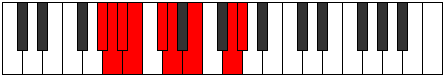

# Mode Lothyllic

## Links

- [Documentation](README.md)
- [Scales Index](Scales.md)
- [Modes Index](Modes.md)
- [Chords Index](Chords.md)

## Parent Scale

[Tharyllic](ScaleTharyllic.md)

## Number

[2415](https://ianring.com/musictheory/scales/2415)

## Transposition

1, 1, 1, 2, 1, 2, 3, 1

## Chord Pattern

iii⁰, v, VIIb5

## Perfection

- 5 Perfect notes
- 3 Perfect notes

## Perfection Profile

false, true, false, false, true, true, true, true

## Permutations

| Tonic | Notes | Signature | Illustration | Audio |
|-------|-------|-----------|--------------|-------|
| [C](ModeCNaturalLothyllic.md) | **C**, C#, **D**, **D#**, F, F#, G#, B, **C** | C |  | [midi](https://github.com/edipermadi/music/blob/main/docs/ModeCNaturalLothyllic.mid?raw=true) |
| [C#](ModeCSharpLothyllic.md) | **C#**, D, **D#**, **E**, F#, G, A, C, **C#** | C |  | [midi](https://github.com/edipermadi/music/blob/main/docs/ModeCSharpLothyllic.mid?raw=true) |
| [Db](ModeDFlatLothyllic.md) | **Db**, D, **Eb**, **E**, Gb, G, A, C, **Db** | C |  | [midi](https://github.com/edipermadi/music/blob/main/docs/ModeDFlatLothyllic.mid?raw=true) |
| [D](ModeDNaturalLothyllic.md) | **D**, D#, **E**, **F**, G, G#, A#, C#, **D** | C |  | [midi](https://github.com/edipermadi/music/blob/main/docs/ModeDNaturalLothyllic.mid?raw=true) |
| [D#](ModeDSharpLothyllic.md) | **D#**, E, **F**, **F#**, G#, A, B, D, **D#** | C |  | [midi](https://github.com/edipermadi/music/blob/main/docs/ModeDSharpLothyllic.mid?raw=true) |
| [Eb](ModeEFlatLothyllic.md) | **Eb**, E, **F**, **Gb**, Ab, A, B, D, **Eb** | C |  | [midi](https://github.com/edipermadi/music/blob/main/docs/ModeEFlatLothyllic.mid?raw=true) |
| [E](ModeENaturalLothyllic.md) | **E**, F, **F#**, **G**, A, A#, C, D#, **E** | C |  | [midi](https://github.com/edipermadi/music/blob/main/docs/ModeENaturalLothyllic.mid?raw=true) |
| [F](ModeFNaturalLothyllic.md) | **F**, F#, **G**, **G#**, A#, B, C#, E, **F** | C |  | [midi](https://github.com/edipermadi/music/blob/main/docs/ModeFNaturalLothyllic.mid?raw=true) |
| [F#](ModeFSharpLothyllic.md) | **F#**, G, **G#**, **A**, B, C, D, F, **F#** | C |  | [midi](https://github.com/edipermadi/music/blob/main/docs/ModeFSharpLothyllic.mid?raw=true) |
| [Gb](ModeGFlatLothyllic.md) | **Gb**, G, **Ab**, **A**, B, C, D, F, **Gb** | C |  | [midi](https://github.com/edipermadi/music/blob/main/docs/ModeGFlatLothyllic.mid?raw=true) |
| [G](ModeGNaturalLothyllic.md) | **G**, G#, **A**, **A#**, C, C#, D#, F#, **G** | C |  | [midi](https://github.com/edipermadi/music/blob/main/docs/ModeGNaturalLothyllic.mid?raw=true) |
| [G#](ModeGSharpLothyllic.md) | **G#**, A, **A#**, **B**, C#, D, E, G, **G#** | C |  | [midi](https://github.com/edipermadi/music/blob/main/docs/ModeGSharpLothyllic.mid?raw=true) |
| [Ab](ModeAFlatLothyllic.md) | **Ab**, A, **Bb**, **B**, Db, D, E, G, **Ab** | C |  | [midi](https://github.com/edipermadi/music/blob/main/docs/ModeAFlatLothyllic.mid?raw=true) |
| [A](ModeANaturalLothyllic.md) | **A**, A#, **B**, **C**, D, D#, F, G#, **A** | C |  | [midi](https://github.com/edipermadi/music/blob/main/docs/ModeANaturalLothyllic.mid?raw=true) |
| [A#](ModeASharpLothyllic.md) | **A#**, B, **C**, **C#**, D#, E, F#, A, **A#** | C |  | [midi](https://github.com/edipermadi/music/blob/main/docs/ModeASharpLothyllic.mid?raw=true) |
| [Bb](ModeBFlatLothyllic.md) | **Bb**, B, **C**, **Db**, Eb, E, Gb, A, **Bb** | C |  | [midi](https://github.com/edipermadi/music/blob/main/docs/ModeBFlatLothyllic.mid?raw=true) |
| [B](ModeBNaturalLothyllic.md) | **B**, C, **C#**, **D**, E, F, G, A#, **B** | C |  | [midi](https://github.com/edipermadi/music/blob/main/docs/ModeBNaturalLothyllic.mid?raw=true) |
