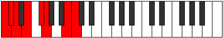
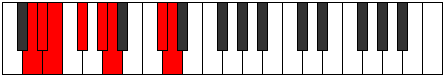
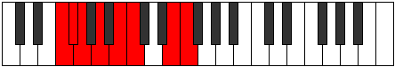
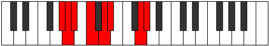
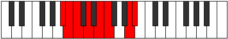

# Mode Lycrian

## Links

- [Documentation](README.md)
- [Scales Index](Scales.md)
- [Modes Index](Modes.md)
- [Chords Index](Chords.md)

## Parent Scale

[Zogian](ScaleZogian.md)

## Number

[2263](https://ianring.com/musictheory/scales/2263)

## Luminosity

-1

## Transposition

1, 1, 2, 2, 1, 4, 1

## Chord Pattern

i⁰b3, ii⁰

## Perfection

- 5 Perfect notes
- 2 Perfect notes

## Perfection Profile

true, false, false, true, true, true, true

## Permutations

| Tonic | Notes | Signature | Illustration | Audio |
|-------|-------|-----------|--------------|-------|
| [C](ModeCNaturalLycrian.md) | C, **Db**, **Ebb**, Fb, Gb, Abb, B, C | C |  | [midi](https://github.com/edipermadi/music/blob/main/docs/ModeCNaturalLycrian.mid?raw=true) |
| [C#](ModeCSharpLycrian.md) | C#, **D**, **Eb**, F, G, Ab, B#, C# | C |  | [midi](https://github.com/edipermadi/music/blob/main/docs/ModeCSharpLycrian.mid?raw=true) |
| [Db](ModeDFlatLycrian.md) | Db, **Ebb**, **Fbb**, Gbb, Abb, Bbbb, C, Db | C |  | [midi](https://github.com/edipermadi/music/blob/main/docs/ModeDFlatLycrian.mid?raw=true) |
| [D](ModeDNaturalLycrian.md) | D, **Eb**, **Fb**, Gb, Ab, Bbb, C#, D | C |  | [midi](https://github.com/edipermadi/music/blob/main/docs/ModeDNaturalLycrian.mid?raw=true) |
| [D#](ModeDSharpLycrian.md) | D#, **E**, **F**, G, A, Bb, C##, D# | C |  | [midi](https://github.com/edipermadi/music/blob/main/docs/ModeDSharpLycrian.mid?raw=true) |
| [Eb](ModeEFlatLycrian.md) | Eb, **Fb**, **Gbb**, Abb, Bbb, Cbb, D, Eb | C |  | [midi](https://github.com/edipermadi/music/blob/main/docs/ModeEFlatLycrian.mid?raw=true) |
| [E](ModeENaturalLycrian.md) | E, **F**, **Gb**, Ab, Bb, Cb, D#, E | C |  | [midi](https://github.com/edipermadi/music/blob/main/docs/ModeENaturalLycrian.mid?raw=true) |
| [F](ModeFNaturalLycrian.md) | F, **Gb**, **Abb**, Bbb, Cb, Dbb, E, F | C |  | [midi](https://github.com/edipermadi/music/blob/main/docs/ModeFNaturalLycrian.mid?raw=true) |
| [F#](ModeFSharpLycrian.md) | F#, **G**, **Ab**, Bb, C, Db, E#, F# | C |  | [midi](https://github.com/edipermadi/music/blob/main/docs/ModeFSharpLycrian.mid?raw=true) |
| [Gb](ModeGFlatLycrian.md) | Gb, **Abb**, **Bbbb**, Cbb, Dbb, Ebbb, F, Gb | C |  | [midi](https://github.com/edipermadi/music/blob/main/docs/ModeGFlatLycrian.mid?raw=true) |
| [G](ModeGNaturalLycrian.md) | G, **Ab**, **Bbb**, Cb, Db, Ebb, F#, G | C |  | [midi](https://github.com/edipermadi/music/blob/main/docs/ModeGNaturalLycrian.mid?raw=true) |
| [G#](ModeGSharpLycrian.md) | G#, **A**, **Bb**, C, D, Eb, F##, G# | C |  | [midi](https://github.com/edipermadi/music/blob/main/docs/ModeGSharpLycrian.mid?raw=true) |
| [Ab](ModeAFlatLycrian.md) | Ab, **Bbb**, **Cbb**, Dbb, Ebb, Fbb, G, Ab | C |  | [midi](https://github.com/edipermadi/music/blob/main/docs/ModeAFlatLycrian.mid?raw=true) |
| [A](ModeANaturalLycrian.md) | A, **Bb**, **Cb**, Db, Eb, Fb, G#, A | C |  | [midi](https://github.com/edipermadi/music/blob/main/docs/ModeANaturalLycrian.mid?raw=true) |
| [A#](ModeASharpLycrian.md) | A#, **B**, **C**, D, E, F, G##, A# | C |  | [midi](https://github.com/edipermadi/music/blob/main/docs/ModeASharpLycrian.mid?raw=true) |
| [Bb](ModeBFlatLycrian.md) | Bb, **Cb**, **Dbb**, Ebb, Fb, Gbb, A, Bb | C |  | [midi](https://github.com/edipermadi/music/blob/main/docs/ModeBFlatLycrian.mid?raw=true) |
| [B](ModeBNaturalLycrian.md) | B, **C**, **Db**, Eb, F, Gb, A#, B | C |  | [midi](https://github.com/edipermadi/music/blob/main/docs/ModeBNaturalLycrian.mid?raw=true) |
