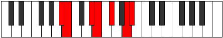

# Mode Lycrimic

## Links

- [Documentation](index.md)
- [Scales Index](Scales.md)
- [Modes Index](Modes.md)
- [Chords Index](Chords.md)

## Parent Scale

[Epygimic](ScaleEpygimic.md)

## Number

[2403](https://ianring.com/musictheory/scales/2403)

## Perfection

- 4 Perfect notes
- 2 Perfect notes

## Perfection Profile

[false true true true false true]

## Permutations

| Tonic | Notes | Signature | Illustration | Audio |
|-------|-------|-----------|--------------|-------|
| [C](ModeCNaturalLycrimic.md) | **C**, Db, E#, F#, **G#**, A##, **C** | C |  | [midi](https://github.com/edipermadi/music/blob/main/docs/ModeCNaturalLycrimic.mid?raw=true) |
| [C#](ModeCSharpLycrimic.md) | **C#**, D, E##, F##, **G##**, A###, **C#** | C |  | [midi](https://github.com/edipermadi/music/blob/main/docs/ModeCSharpLycrimic.mid?raw=true) |
| [Db](ModeDFlatLycrimic.md) | **Db**, Ebb, F#, G, **A**, B#, **Db** | C |  | [midi](https://github.com/edipermadi/music/blob/main/docs/ModeDFlatLycrimic.mid?raw=true) |
| [D](ModeDNaturalLycrimic.md) | **D**, Eb, F##, G#, **A#**, B##, **D** | C |  | [midi](https://github.com/edipermadi/music/blob/main/docs/ModeDNaturalLycrimic.mid?raw=true) |
| [D#](ModeDSharpLycrimic.md) | **D#**, E, F###, G##, **A##**, B###, **D#** | C |  | [midi](https://github.com/edipermadi/music/blob/main/docs/ModeDSharpLycrimic.mid?raw=true) |
| [Eb](ModeEFlatLycrimic.md) | **Eb**, Fb, G#, A, **B**, C##, **Eb** | C |  | [midi](https://github.com/edipermadi/music/blob/main/docs/ModeEFlatLycrimic.mid?raw=true) |
| [E](ModeENaturalLycrimic.md) | **E**, F, G##, A#, **B#**, C###, **E** | C |  | [midi](https://github.com/edipermadi/music/blob/main/docs/ModeENaturalLycrimic.mid?raw=true) |
| [F](ModeFNaturalLycrimic.md) | **F**, Gb, A#, B, **C#**, D##, **F** | C |  | [midi](https://github.com/edipermadi/music/blob/main/docs/ModeFNaturalLycrimic.mid?raw=true) |
| [F#](ModeFSharpLycrimic.md) | **F#**, G, A##, B#, **C##**, D###, **F#** | C |  | [midi](https://github.com/edipermadi/music/blob/main/docs/ModeFSharpLycrimic.mid?raw=true) |
| [Gb](ModeGFlatLycrimic.md) | **Gb**, Abb, B, C, **D**, E#, **Gb** | C |  | [midi](https://github.com/edipermadi/music/blob/main/docs/ModeGFlatLycrimic.mid?raw=true) |
| [G](ModeGNaturalLycrimic.md) | **G**, Ab, B#, C#, **D#**, E##, **G** | C |  | [midi](https://github.com/edipermadi/music/blob/main/docs/ModeGNaturalLycrimic.mid?raw=true) |
| [G#](ModeGSharpLycrimic.md) | **G#**, A, B##, C##, **D##**, E###, **G#** | C |  | [midi](https://github.com/edipermadi/music/blob/main/docs/ModeGSharpLycrimic.mid?raw=true) |
| [Ab](ModeAFlatLycrimic.md) | **Ab**, Bbb, C#, D, **E**, F##, **Ab** | C |  | [midi](https://github.com/edipermadi/music/blob/main/docs/ModeAFlatLycrimic.mid?raw=true) |
| [A](ModeANaturalLycrimic.md) | **A**, Bb, C##, D#, **E#**, F###, **A** | C |  | [midi](https://github.com/edipermadi/music/blob/main/docs/ModeANaturalLycrimic.mid?raw=true) |
| [A#](ModeASharpLycrimic.md) | **A#**, B, C###, D##, **E##**, Cbbb, **A#** | C |  | [midi](https://github.com/edipermadi/music/blob/main/docs/ModeASharpLycrimic.mid?raw=true) |
| [Bb](ModeBFlatLycrimic.md) | **Bb**, Cb, D#, E, **F#**, G##, **Bb** | C |  | [midi](https://github.com/edipermadi/music/blob/main/docs/ModeBFlatLycrimic.mid?raw=true) |
| [B](ModeBNaturalLycrimic.md) | **B**, C, D##, E#, **F##**, G###, **B** | C |  | [midi](https://github.com/edipermadi/music/blob/main/docs/ModeBNaturalLycrimic.mid?raw=true) |
